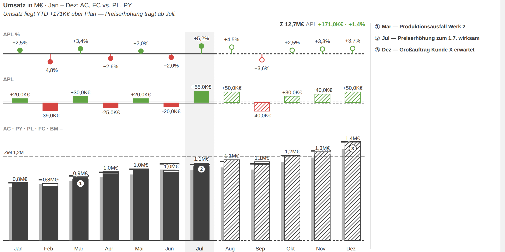
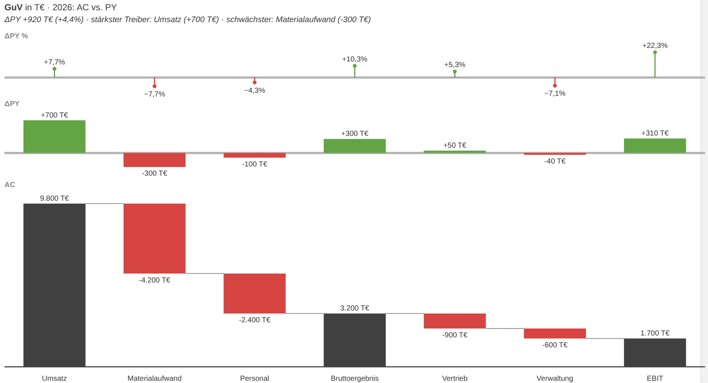
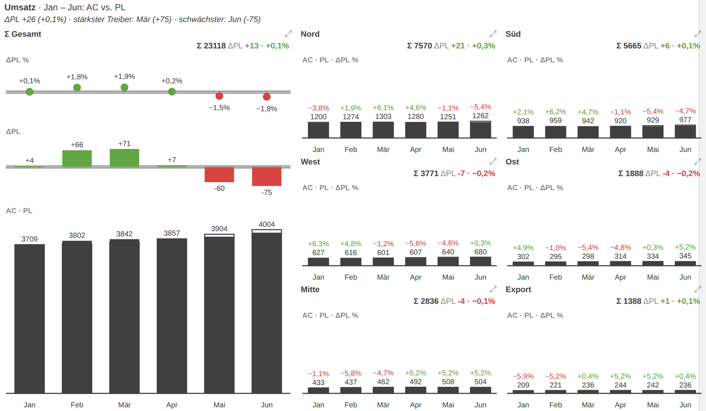
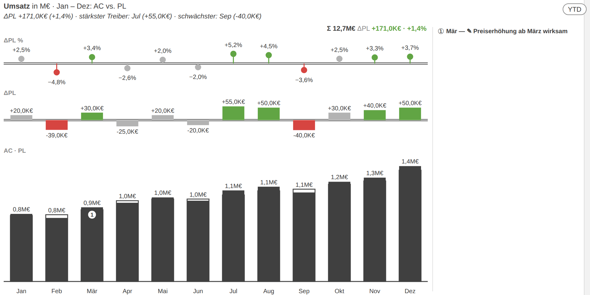

# IBCS-Berichte in Power BI: Standard statt Bauchgefühl im Reporting

**Meta-Title:** IBCS in Power BI umsetzen: Wege, Grenzen, Praxisbeispiel | Daten-WG
**Meta-Description:** IBCS-konforme Berichte in Power BI: Was der Notationsstandard bringt, welche drei Umsetzungswege es gibt — und wo ihre Grenzen liegen. Mit Praxisbeispielen.

---

Zehn Berichte, zehn Farbwelten, zehn Interpretationen davon, was ein grüner Balken bedeutet — so sieht das Berichtswesen in vielen Unternehmen aus, obwohl alle dieselbe Plattform nutzen. **Das Problem ist selten Power BI, sondern die fehlende gemeinsame Sprache.** Genau dafür gibt es die International Business Communication Standards (IBCS): einen offenen Notationsstandard, der Geschäftszahlen so darstellt, dass jeder Bericht auf den ersten Blick gleich gelesen wird. Wer Monatsberichte, Forecasts und Management-Dashboards in Power BI baut, bekommt mit IBCS ein Regelwerk, das Diskussionen über Optik beendet und Zeit für Diskussionen über Inhalte freimacht. Wie sich das in Power BI konkret umsetzen lässt, welche drei Wege es gibt und wo jeder davon an Grenzen stößt — dazu eine ehrliche Einordnung mit Beispielen.

## Was hinter IBCS steckt — und warum Controlling-Teams darauf schwören

IBCS geht auf die SUCCESS-Regeln von Prof. Dr. Rolf Hichert zurück und wird heute von der IBCS Association als offener Standard unter Creative-Commons-Lizenz gepflegt. Die sieben Themen — Say, Unify, Condense, Check, Express, Simplify, Structure — bündeln knapp **hundert konkrete Regeln für Berichte, Präsentationen und Dashboards**. Seit Juli 2024 arbeitet zudem ein ISO-Komitee (ISO/AWI 24896) an einer internationalen Norm für Berichtsnotation auf IBCS-Basis — der Standard ist also kein Nischenthema mehr, sondern auf dem Weg zur Industrienorm.

Der im Alltag wirksamste Teil ist die **semantische Notation (Unify)**. Sie legt fest, wie Szenarien und Abweichungen aussehen — immer, überall, in jedem Bericht:

- **Ist (AC)**: volle, dunkle Fläche
- **Vorjahr (PY)**: helle graue Fläche
- **Plan (PL)**: Umriss — die „leere" Fläche füllt sich, wenn der Plan Realität wird
- **Forecast (FC)**: schraffiert
- **Abweichungen**: absolut als Balken, relativ als Nadeln — grün ist gut, rot ist schlecht, und zwar nach **Geschäftswirkung**: steigende Kosten sind rot, auch wenn das Vorzeichen positiv ist

Dazu kommen Regeln, die Manipulation verhindern: Balken beginnen bei null, gleiche Kennzahlen auf einer Seite nutzen **gleiche Skalen**, kein 3D, keine Tortendiagramme, keine Ampeln ohne Größeninformation. Wer einmal einen IBCS-Bericht lesen gelernt hat, liest jeden — das ist der eigentliche Effizienzgewinn.

## Warum Power BI das nicht von Haus aus kann

Power BI ist ein hervorragendes Werkzeug für Datenmodellierung und Self-Service-Analysen — aber die Standardvisuals kennen keine Szenario-Notation. **Ein Säulendiagramm mit AC, PY und PL zeigt drei bunte Säulen nebeneinander**, keine Umriss-Logik, keine Schraffur, keine Abweichungs-Panels mit korrekter Referenzachse. Auch identische Skalen über Small Multiples hinweg oder ein Varianz-Wasserfall mit sum/delta-Zeilen sind mit Bordmitteln mühsam bis unmöglich.

Das ist keine Nachlässigkeit von Microsoft, sondern eine Zielgruppenfrage: Die Core-Visuals sollen universell sein. IBCS ist ein Fachstandard aus dem Controlling — und genau dafür gibt es in Power BI den Mechanismus der **Custom Visuals**: als `.pbiviz`-Datei importierbare Visuals, die eigene Darstellungslogik mitbringen ([Microsoft Learn: Power BI custom visuals](https://learn.microsoft.com/power-bi/developer/visuals/power-bi-custom-visuals)).

## Drei Wege zu IBCS in Power BI

### 1. Bordmittel plus Disziplin

Mit Bar Charts, bedingter Formatierung, sauberem Theme-JSON und viel Sorgfalt lässt sich eine IBCS-**Annäherung** bauen. Für einzelne, stabile Berichte kann das reichen.

**Ehrlich eingeordnet:** Der Pflegeaufwand ist hoch, die Notation bleibt unvollständig (keine Schraffur, keine Umriss-Säulen, keine Varianz-Pins), und jede Berichtsänderung gefährdet die Konsistenz. Als unternehmensweiter Standard skaliert dieser Weg nicht.

### 2. Kommerzielle IBCS-Visuals

Zebra BI und Inforiver sind die bekanntesten zertifizierten IBCS-Suiten im AppSource. Sie sind ausgereift, gut supportet und decken Tabellen, Charts und Kommentierung ab.

**Ehrlich eingeordnet:** Die Lizenzkosten skalieren pro Nutzer und Jahr — bei größeren Empfängerkreisen wird das schnell fünfstellig. Man bindet sich an einen Anbieter, und der Funktionsumfang geht oft weit über das hinaus, was ein standardisierter Monatsbericht braucht. Für Unternehmen, die schnell und mit Support-Anspruch starten wollen, bleibt das trotzdem der bequemste Weg.

### 3. Eigene Visuals: Deneb oder ein maßgeschneidertes .pbiviz

Wer die Notation exakt und ohne Lizenzkosten pro Empfänger will, baut selbst: entweder deklarativ mit **Deneb/Vega-Lite** (ein zertifiziertes Visual, in dem IBCS-Templates als JSON-Spezifikationen leben) oder als **eigenes Custom Visual**, das die Fachlogik — Szenario-Notation, Varianz-Panels, gleiche Skalen, Wasserfälle — fest eingebaut mitbringt.

**Ehrlich eingeordnet:** Das ist ein Entwicklungsprojekt. Es braucht jemanden, der TypeScript bzw. Vega-Lite beherrscht, Rendering-Tests aufsetzt und das Visual pflegt. Dafür gehört das Ergebnis dem Unternehmen, kostet keine Empfänger-Lizenzen und lässt sich exakt auf die eigenen Berichtsprozesse zuschneiden — bis hin zu Funktionen, die kein Standardprodukt bietet.

## Wie das konkret aussieht: vier Beispiele aus der Praxis

Die folgenden Beispiele stammen aus einem Custom Visual, das die Daten-WG als eigenes `.pbiviz` entwickelt hat — sie zeigen, was mit Weg 3 erreichbar ist.

**Der Grundbaustein jedes IBCS-Berichts** ist das Säulenchart mit Varianz-Stufen: unten AC (dunkel) gegen PL (Umriss), darüber die absolute Abweichung als Balken und die relative als Nadeln — mit der Doppellinien-Achse, die den Plan als Referenz ausweist. Kommentar-Marker verweisen auf nummerierte Fußnoten:

**Für die GuV** verlangt der Standard einen Wasserfall mit Zwischensummen — hier mit ΔPY-Balken und ΔPY-%-Nadeln je Rechenzeile darüber, sodass Ergebnisrechnung und Vorjahresvergleich in einem Chart lesbar sind:

**Small Multiples mit Gesamt-Kachel** setzen die IBCS-Regel „gleiche Skalen" konsequent um: Die Σ-Kachel links definiert den Maßstab, die Regionen daneben bleiben proportional vergleichbar — wer die größte Säule sucht, findet sie ohne Skalen-Kleingedrucktes:

**Und weil Notation allein keinen Monatsabschluss macht**, gehören Workflow-Funktionen dazu: Wesentlichkeits-Schwellen stellen unwesentliche Abweichungen grau (im Beispiel bleibt +30K€ grau, weil es relativ unter der Schwelle liegt), Kommentare werden per Klick direkt im Bericht erfasst, und der YTD-Umschalter sitzt als Button im Chart:

## Governance nicht vergessen: Custom Visuals sauber ausrollen

Egal ob gekauft oder selbst gebaut — Custom Visuals führen JavaScript aus und haben Zugriff auf die Daten, die sie visualisieren. Microsoft empfiehlt deshalb, sie **zentral über den Organizational Store** zu verteilen: Ein Fabric-Administrator prüft und genehmigt das Visual einmal, alle Berichtsautoren bekommen automatisch dieselbe geprüfte Version, und ein nicht mehr vertrauenswürdiges Visual lässt sich zentral deaktivieren ([Microsoft Learn: Organizational visuals](https://learn.microsoft.com/fabric/admin/organizational-visuals)).

Drei Punkte gehören in jede Einführungsentscheidung:

- **Tenant-Settings klären:** Wer darf `.pbiviz`-Dateien hochladen? Gilt „nur zertifizierte Visuals"? Diese Einstellungen greifen im Service — für Power BI Desktop braucht es zusätzlich Gruppenrichtlinien.
- **Versionsstand steuern:** Ohne zentrale Verteilung entstehen Versions-Wildwuchs und abweichende Darstellungen — das Gegenteil dessen, was ein Notationsstandard erreichen soll.
- **Datenschutz bewerten:** Zertifizierte Visuals dürfen keine externen Dienste aufrufen. Bei intern entwickelten Visuals lässt sich das per Code-Review belegen — ein Vorteil von Weg 3, der oft übersehen wird.

## Wo IBCS an Grenzen stößt

Ein Standard ist ein Werkzeug, kein Selbstzweck. Drei Einschränkungen gehören zur ehrlichen Beratung dazu:

- **IBCS ersetzt keine Datenqualität und keine Botschaft.** Ein normgerechtes Chart über falschen Zahlen ist ein normgerecht falsches Chart. Die Say-Regel — jeder Bericht braucht eine Kernaussage — ist die am häufigsten ignorierte.
- **Nicht jede Analyse ist ein IBCS-Fall.** Explorative Analysen, Geodaten oder Streudiagramme für Portfolio-Fragen folgen anderen Gesetzen. IBCS glänzt im wiederkehrenden Berichtswesen, nicht in der Ad-hoc-Analyse.
- **Die Umstellung ist ein Change-Projekt.** Empfänger müssen die Notation lesen lernen, Berichtsautoren sie anwenden. Ohne kurzes Enablement — eine Legende, eine Schulungsstunde, ein Spickzettel — produziert der schönste Standard Rückfragen statt Klarheit.

## Fazit: Erst die Sprache vereinbaren, dann die Berichte bauen

IBCS in Power BI ist kein Tool-Thema, sondern eine Reihenfolge-Frage: **Erst den Notationsstandard als gemeinsame Sprache vereinbaren, dann den Umsetzungsweg wählen** — Bordmittel für den Einzelfall, kommerzielle Visuals für den schnellen Start mit Support, eigene Visuals für volle Kontrolle ohne Empfänger-Lizenzen. Und in jedem Fall: die Verteilung über den Organizational Store regeln, bevor der erste Bericht live geht.

Wer den Einstieg testen will, kann mit dem [Business-Chart-Builder der Daten-WG](https://datenwgknowledgekitchen.com/business-chart-builder.html) IBCS-Charts direkt im Browser konfigurieren und als Power-BI-Template exportieren. Für alles darüber hinaus — von der Berichtsstandard-Definition über [Reporting- und Governance-Konzepte](/leistungen/reporting-governance) bis zum maßgeschneiderten Custom Visual im Rahmen einer [Power-BI-Beratung](/leistungen/power-bi-beratung) — sprechen Sie uns an: Ein einstündiger Berichts-Review zeigt meist schon, wo der größte Hebel liegt.

---

### Quellen

- [IBCS Association — Standards und Templates](https://www.ibcs.com/) (Creative-Commons-Standard, Chart-/Tabellen-Templates)
- [Hichert SUCCESS-Regeln — Überblick](https://www.controlling-strategy.com/hichert-success-regeln.html)
- [Wikipedia: International Business Communication Standards](https://en.wikipedia.org/wiki/International_Business_Communication_Standards) (inkl. ISO/AWI 24896)
- [Microsoft Learn: Power BI custom visuals](https://learn.microsoft.com/power-bi/developer/visuals/power-bi-custom-visuals)
- [Microsoft Learn: Import a visual file](https://learn.microsoft.com/power-bi/developer/visuals/import-visual)
- [Microsoft Learn: Manage Power BI visuals admin settings / Organizational visuals](https://learn.microsoft.com/fabric/admin/organizational-visuals)
- [Microsoft Learn: Implementation planning — Tenant administration (Custom-Visual-Governance)](https://learn.microsoft.com/power-bi/guidance/powerbi-implementation-planning-tenant-administration)
