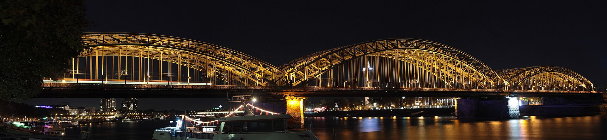
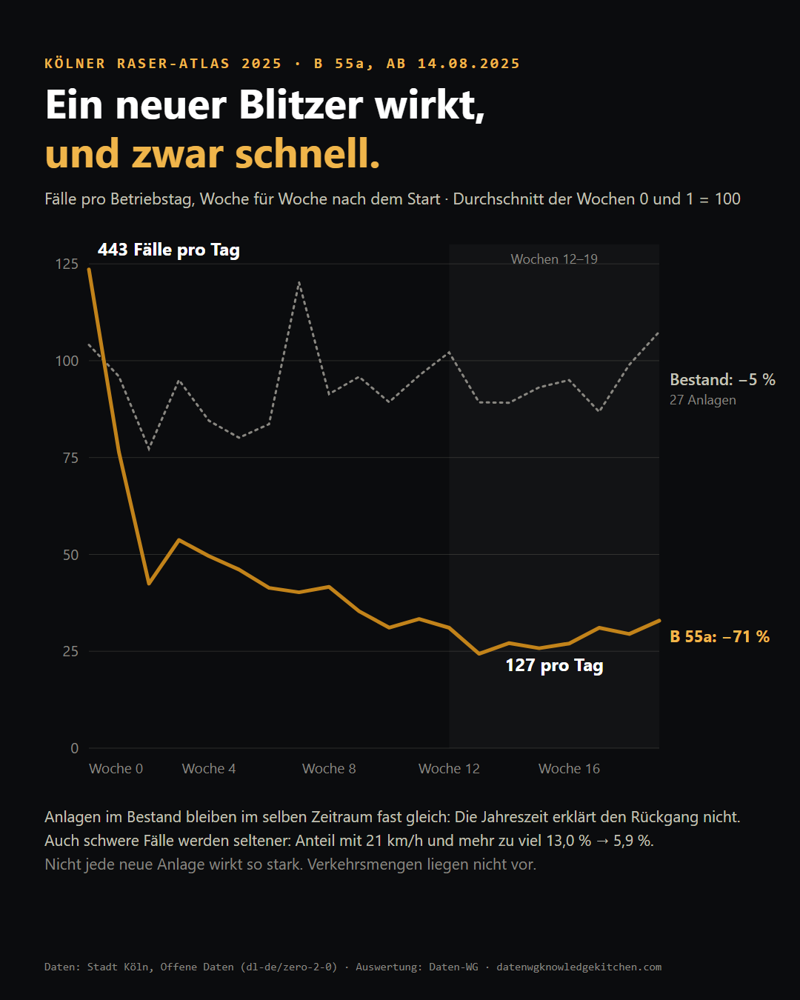
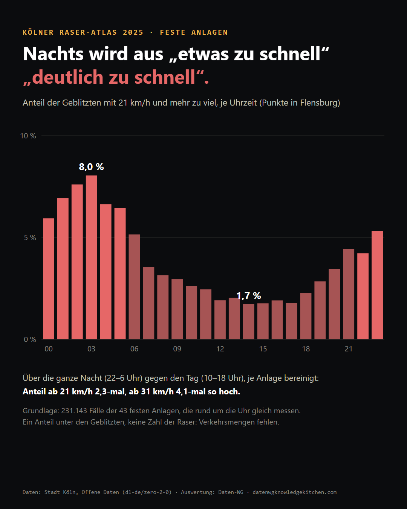
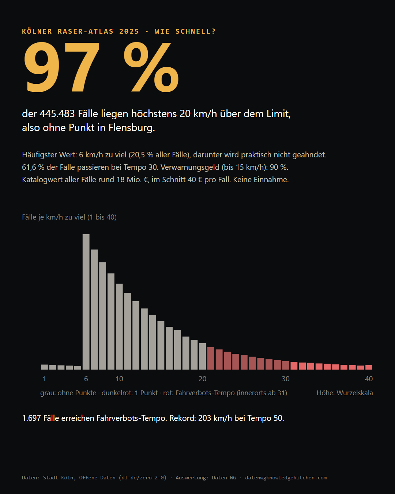
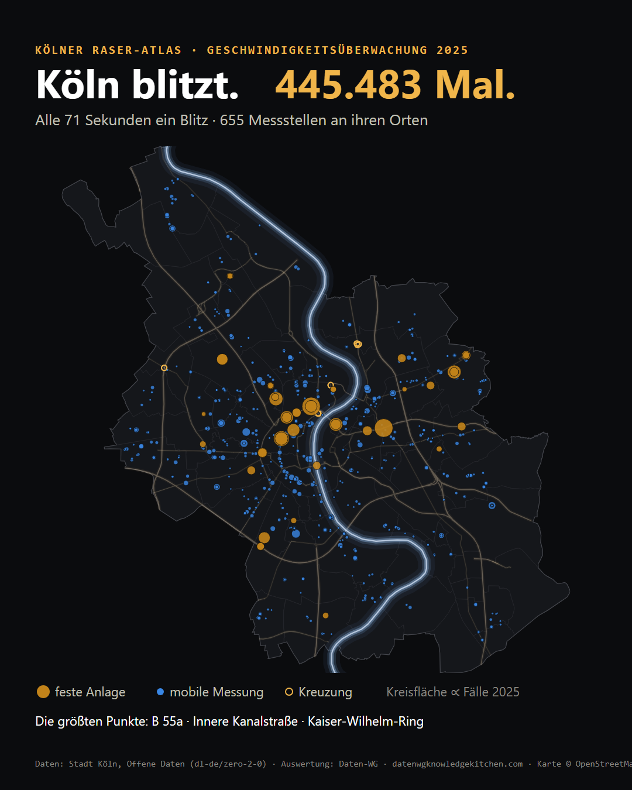
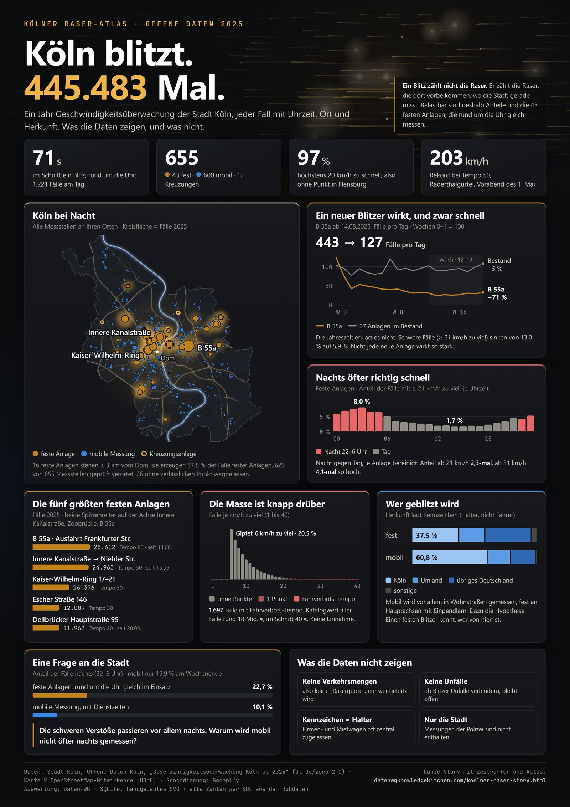

# Alle 71 Sekunden ein Blitz: Was ein Jahr Kölner Blitzerdaten zeigt

> Post · Köln blitzt, Raser-Atlas 2025 · Von Michael Tenner · Stand September 2026
> HTML-Fassung: https://datenwgknowledgekitchen.com/koelner-raser-post.html
> Interaktive Story mit Karte und Atlas aller Messstellen: https://datenwgknowledgekitchen.com/koelner-raser-story.html


*Hohenzollernbrücke bei Nacht, im Hintergrund die Zoobrücke. Foto: Detlef Huhn, CC BY-SA 4.0, via Wikimedia Commons*

14. August 2025, B 55a stadtauswärts, zwischen Ab- und Auffahrt Frankfurter Straße. Die Stadt Köln nimmt einen neuen Blitzer in Betrieb. In seinen ersten zwei Wochen löst er im Schnitt 443-mal am Tag aus. Drei Monate später sind es 127.

Das ist die interessanteste Zahl in einem Datensatz, den die Stadt offen ins Netz stellt: jede Verwarnung und jedes Bußgeldverfahren der städtischen Geschwindigkeitsüberwachung 2025 als eigene Zeile, mit Datum, Uhrzeit, Messstelle, gemessener Geschwindigkeit, Überschreitung und dem Kürzel des Zulassungsbezirks. Wir haben die Datei in eine kleine SQLite-Datenbank geladen, bereinigt und befragt. Heraus kam eine Datenstory in sieben Akten, mit Karte und einem Atlas aller 655 Messstellen. Hier die wichtigsten Befunde, und was die Daten nicht können.

## Die Zahl vorneweg, und warum sie wenig sagt

451.676 Zeilen, davon **445.483 Tempofälle**. Das sind 1.221 am Tag, im Schnitt alle 71 Sekunden ein Blitz. Nicht enthalten sind die Messungen der Polizei, etwa auf Autobahnen, und die Rotlichtverstöße der Kreuzungsanlagen.

Die Summe klingt nach Schlagzeile, ist aber das schwächste Maß im ganzen Datensatz. Denn ein Blitz zählt nicht die Raser. Er zählt die Raser, die dort vorbeikommen, wo die Stadt gerade misst. Die 43 festen Anlagen messen rund um die Uhr, die mobile Messung arbeitet mit Dienstzeiten: 90 % ihrer Fälle entstehen tagsüber, 80 % werktags, und vom 20. bis 31. Dezember gab es gar keine. Wer nur die Summe liest, liest vor allem heraus, wann und wo gemessen wird. Die belastbaren Befunde stecken in den Verhältnissen.

## Ein neuer Blitzer wirkt, und zwar schnell



Zurück zur B 55a. Von 443 auf 127 Fälle am Tag sind **−71 %**, gerechnet zwischen den ersten zwei Wochen und dem Plateau in den Wochen 12 bis 19. Ist das nur die Jahreszeit, das Ende der Sommerferien, weniger Verkehr im Herbst? Zum Vergleich haben wir 27 feste Anlagen genommen, die das ganze Jahr messen. Im selben Zeitraum bleiben sie fast gleich (−5 %). Der Rückgang an der B 55a hat also mit der neuen Anlage zu tun.

Und nicht nur die Menge sinkt. Der Anteil der Fälle mit 21 km/h und mehr zu viel fällt dort von 13,0 % auf 5,9 %. Es wird also nicht bloß seltener geblitzt, es wird auch seltener richtig schnell gefahren.

Zwei Einschränkungen gehören dazu. Erstens: Was hinter dem Kasten passiert, zeigen die Daten nicht. Ob danach wieder beschleunigt wird oder ob Leute auf andere Strecken ausweichen, bleibt offen. Zweitens wirkt nicht jede neue Anlage so. An der Inneren Kanalstraße fallen die Fälle ebenfalls deutlich (−59 %), der größte Teil aber abrupt Mitte August, was eher nach einem äußeren Anlass aussieht als nach Lernen. Bei den kleineren neuen Anlagen 2025 liegt die Veränderung zwischen −22 % und +29 %.

Eine Beobachtung, die uns beschäftigt hat: Fahrzeuge mit K-Kennzeichen verschwinden an der B 55a schneller (−78 %) als alle anderen (−66 %). Eine mögliche Deutung ist, dass man einen Kasten auf dem täglichen Weg eben kennt. Genauso denkbar sind Blitzer-Apps. Und das Kennzeichen nennt den Halter, nicht den Fahrer.

## Nachts wird aus „etwas zu schnell“ „deutlich zu schnell“



Für den Tagesgang taugen nur die festen Anlagen, weil sie rund um die Uhr gleich messen. Tagsüber blitzt es am häufigsten, nachts fährt schlicht weniger Verkehr. Interessanter ist, wie nachts gefahren wird. Um 14 Uhr haben 1,7 % der Geblitzten 21 km/h oder mehr zu viel auf dem Tacho, um 3 Uhr nachts 8,0 %.

Zwei Einzelstunden sind allerdings ein Extremvergleich. Robuster ist die ganze Nacht (22 bis 6 Uhr) gegen den Tag (10 bis 18 Uhr), je Anlage bereinigt: Der Anteil ab 21 km/h ist nachts **2,3-mal**, der Anteil ab 31 km/h, ab dem innerorts ein Fahrverbot droht, **4,1-mal** so hoch. Wichtig beim Lesen: Das ist ein Anteil unter den Geblitzten. Wie viele Autos insgesamt unterwegs waren, steht nicht in den Daten.

## Die große Masse ist knapp dran



97 % aller Fälle liegen höchstens 20 km/h über dem Limit, also ohne Punkt in Flensburg. Der häufigste Wert ist 6 km/h zu viel nach Abzug der Messtoleranz, darunter gibt es praktisch keine Fälle. Bei Tempo 30 heißt das: erst ab 39 km/h gemessen. Ein Freibrief ist das nicht, die Schwelle ist gelebte Praxis, kein Recht. Tempo 30 ist ohnehin der Normalfall: 61,6 % aller Fälle passieren dort.

Was das kostet? Legt man den Bußgeldkatalog an jeden Fall, kommt man auf einen Katalogwert von rund 18 Mio. €, im Schnitt 40 € pro Fall. Das ist keine Einnahme: Gebühren, Einstellungen und Einsprüche fehlen, und neun von zehn Fällen sind Verwarnungsgelder.

| zu viel (innerorts) | Bußgeld | Punkte | Fahrverbot |
|---|---:|---:|---|
| bis 10 km/h | 30 € | – | – |
| 11 bis 15 km/h | 50 € | – | – |
| 16 bis 20 km/h | 70 € | – | – |
| 21 bis 25 km/h | 115 € | 1 | – |
| 26 bis 30 km/h | 180 € | 1 | nur bei Wiederholung |
| 31 bis 40 km/h | 260 € | 2 | 1 Monat |

*Bußgeldkatalog für Pkw, Stand seit 09.11.2021. Außerorts gelten niedrigere Sätze, das Regelfahrverbot erst ab 41 km/h.*

Am anderen Ende: 1.697 Fälle erreichen Fahrverbots-Tempo. Der Rekord des Jahres ist ein Pkw mit 203 km/h bei erlaubten 50, am Raderthalgürtel, am Vorabend des 1. Mai um 19:20 Uhr.

## Wo geblitzt wird



Für die Karte mussten aus den Ortsangaben der Stadt erst Punkte werden. 629 der 655 Messstellen haben jetzt einen verlässlichen Ort. Die festen Anlagen ballen sich im Zentrum: 16 von 43 stehen höchstens 3 km vom Dom entfernt und erzeugen 57,8 % aller Fälle fester Anlagen. Die beiden Spitzenreiter liegen auf derselben Achse, Innere Kanalstraße, Zoobrücke, B 55a, beide in Fahrtrichtung Osten. An der Inneren Kanalstraße stehen gleich sechs Anlagen.

| feste Anlage | Tempo | Fälle 2025 | pro Betriebstag |
|---|---:|---:|---:|
| B 55a, Ausfahrt Frankfurter Straße, Richtung Olpe (ab 14.08.) | 80 | 25.612 | 186,9 |
| Innere Kanalstraße, Höhe Lentstraße, Richtung Niehler Straße | 50 | 24.963 | 107,6 |
| Kaiser-Wilhelm-Ring 17–21, Richtung Christophstraße | 30 | 16.376 | 45,0 |
| Escher Straße 146, Richtung Geldernstraße | 30 | 12.009 | 34,7 |
| Dellbrücker Hauptstraße 95, Richtung Bergisch Gladbacher Straße | 20 | 11.962 | 71,6 |

Die mobile Messung verteilt sich über 78 von 86 Stadtteilen. Wo die Messungen die Schnellsten erwischen, hängt allerdings oft an einer einzigen Stelle. In Merkenich kommen 85 % der schweren Fälle von einer Tempo-10-Strecke, dort heißt 21 km/h zu viel: 34 km/h gemessen. Die Story zeigt deshalb Stadtteilwerte nur ab 30 schweren Fällen an mindestens drei Messstellen, in drei groben Klassen und ohne Rangliste. Die Werte beschreiben Messstellen, nicht die Menschen, die dort wohnen.

## Hinter den Kulissen: Aus „Lat. 177“ wird ein Punkt

Für alle, die mit Daten arbeiten, war das der aufwendigste Teil. Die Standorttabellen der Stadt nennen keine Koordinaten, sondern Einträge wie „Innere Kanalstr. zw. Lat. 177-176“, „Friedrich-Schmidtstr. ggü70-72“ oder „Ber.Gl.Str. 1135-1129“. Laternennummern sind keine Hausnummern, Abkürzungen und Tippfehler kommen dazu.

Der erste Geocoder-Lauf mit Geoapify hatte eine überraschende Fehlerklasse: gleichnamige Straßen. Aus „Hauptstraße 55“ in Widdersdorf wurde mit hoher Konfidenz die Kalker Hauptstraße 55. Seitdem zählt ein Treffer nur, wenn Straße und Stadtteil zur Anfrage passen. Danach kam ein zweiter, unabhängiger Punkt aus OpenStreetMap (167.551 Adresspunkte), und bei Abweichungen gilt der besser belegte. Alle 43 festen Anlagen und 12 Kreuzungsanlagen haben wir einzeln geprüft, für die B 55a mit der Pressemitteilung der Stadt. 26 mobile Stellen, deren Angabe nur eine lange Straße nennt, fehlen lieber auf der Karte, als falsch zu stehen.

Ein Nebenbefund aus dem Peer-Review: 177 Zeilen der Kreuzungsanlagen hatten genau 0 km/h Überschreitung und zählten fälschlich als Tempofall. Sie sind jetzt raus. Zudem prüft ein kleines Skript bei jedem Build, ob die Zahlen im Text noch zu den Daten passen. Die ganze Pipeline liegt offen im Repository: Rohdaten, SQL, Geocodierung, Prüflisten.

## Was die Daten nicht können

- **Keine Verkehrsmengen.** Ohne sie gibt es keine „Raserquote“, nur die Zusammensetzung der Geblitzten.
- **Keine Unfälle.** Ob Blitzer Unfälle verhindern, lässt sich hier nicht zeigen.
- **Kennzeichen = Halter.** Firmen-, Miet- und Leasingwagen sind oft zentral zugelassen.
- **Tempolimit abgeleitet.** Es steht nicht in den Falldaten, sondern wird aus Messwert, Überschreitung und Toleranz zurückgerechnet. Mit dem Limit der Standorttabellen stimmt es zu 98,2 % überein.

## Eine Frage an die Stadt

Mobil wird zu 90 % tagsüber und zu 80 % werktags gemessen. Die schweren Verstöße passieren aber vor allem nachts. Warum wird mobil nicht öfter nachts gemessen? Die Daten können die Frage stellen, beantworten kann sie nur die Verwaltung. Dafür fehlen uns auch Einschätzungen zu Personal, Standortkriterien und dazu, ob die Anlagen nach der Unfalllage ausgewählt werden.

## Alles auf einer Seite

Die wichtigsten Befunde als Infografik, A4 hochkant: Karte, Lernkurve, Nacht gegen Tag, die fünf größten Anlagen und die Herkunft der Geblitzten. Zum Ausdrucken, Teilen oder Weiterschicken.

[](assets/raser-infografik.jpg)
*Klick aufs Bild öffnet die volle Auflösung (4960 × 7016 px). [Infografik als PDF herunterladen](assets/raser-infografik.pdf), eine Seite A4.*

## Selbst bauen

Die Story ist kein Einzelstück. Gebaut haben wir sie mit Claude Code, einem KI-Agenten im Terminal, einem offenen Datensatz und zwei Geodaten-Schnittstellen. Das Rezept funktioniert mit fast jedem Open-Data-Datensatz, der Ort und Zeit enthält: Parkverstöße, Baustellen, Unfälle, Radzählstellen.

1. **Datensatz finden.** Auf offenedaten-koeln.de, für ganz Deutschland auf GovData.de, nach Daten mit Ort und Zeit suchen und die Lizenz prüfen. Die Datenlizenz Deutschland Zero 2.0 erlaubt jede Nutzung, auch ohne Namensnennung. Die Metadaten gibt es maschinenlesbar im DCAT-AP.de-Format, so liest ein Agent Download-Link und Lizenz selbst aus. Unser Datensatz: [Geschwindigkeitsüberwachung Köln ab 2025](https://offenedaten-koeln.de/distribution/f4b74707075a593c779024dd0ffd0a50).
2. **In eine Datenbank laden.** Claude schreibt das Ladeskript, du prüfst das Ergebnis. SQLite reicht, ganz ohne Server. Wichtig ist der Abgleich mit der Quelle: Die Kölner CSV enthält je Monat eine Kontrollsumme, und das Skript prüft jede davon.
3. **Fragen stellen, nicht Charts bestellen.** Lass Claude zuerst aufschreiben, was die Daten beantworten können und was nicht. Jede Zahl kommt per SQL aus der Datenbank, nie aus dem Gedächtnis des Modells.
4. **Verorten mit einer API.** Angaben wie „Innere Kanalstr. zw. Lat. 177-176“ werden mit der Geocoding-API von Geoapify zu Koordinaten, der kostenlose Plan reicht für unsere 655 Messstellen. Stadtteile, Straßen und den Rhein liefert OpenStreetMap über die Overpass-API. Jeden Treffer prüfen: Passen Straße und Stadtteil? Was nicht passt, landet auf einer Prüfliste statt auf der Karte.
5. **Story bauen.** Eine HTML-Vorlage, die Daten als JSON eingesetzt, Diagramme als handgebautes SVG. Kein Framework, keine Build-Kette. Claude baut, du schaust im Browser nach, am Desktop und am Handy.
6. **Gegenlesen lassen.** Lass Claude den Text aus mehreren Rollen kritisieren, bei uns waren es sieben: vom eiligen Leser über den Lokalreporter bis zum Statistiker. Das hat echte Fehler gefunden, etwa 177 Zeilen ohne Überschreitung. Dazu prüft ein Skript bei jedem Build, ob die Zahlen im Text noch zur Datenbank passen.
7. **Veröffentlichen.** Aus denselben Daten entstehen per Skript Blogbeitrag, LinkedIn-Karussell und Infografik. Die Seite läuft als statisches HTML auf GitHub Pages.

So kann der erste Prompt an Claude Code aussehen, wenn die CSV im Ordner `data/raw` liegt:

```
Lade die CSV aus data/raw in eine SQLite-Datenbank. Prüfe Zeilenzahl und Kontrollsummen gegen die Quelle. Schreib mir dann zehn Fragen, die diese Daten beantworten können, und fünf, die sie nicht beantworten können. Jede Zahl, die du nennst, kommt per SQL aus der Datenbank.
```

Und so der Schritt mit der API:

```
Verorte die Messstellen aus der Standorttabelle mit der Geoapify-API. Der Key steht in der Umgebungsvariable GEOAPIFY_KEY. Gib ihn nie aus und schreib ihn in keine Datei. Prüfe jeden Treffer gegen Straße und Stadtteil und schreib alles, was nicht passt, in eine Prüfliste.
```

Zwei Regeln haben uns am meisten geholfen:

- **API-Keys nur als Umgebungsvariable.** Nie in den Chat, nie in eine Datei, nie in einen Commit. Wer einen Key doch einmal irgendwo eingefügt hat, erneuert ihn beim Anbieter.
- **Jede Zahl hat eine Quelle.** Eine SQL-Abfrage, ein Prüfskript, ein Link. Was sich nicht belegen lässt, steht nicht im Text.

Zum Nachschauen und Nachbauen:

- **Die Story** mit Karte „Köln bei Nacht“, 24-Stunden-Zeitraffer und Lernkurve: https://datenwgknowledgekitchen.com/koelner-raser-story.html
- **Der Atlas**: alle 655 Messstellen durchsuchbar, mit Tagesprofil, und ein Klick zeigt die Stelle auf der Karte: https://datenwgknowledgekitchen.com/koelner-raser-story.html#atlas
- **Daten und Code**: [`koeln-raser/` auf GitHub](https://github.com/Losveratos/PowerBI-Kitchen-/tree/main/koeln-raser), alle Skripte von den Rohdaten bis zum HTML. Die Rohdaten liegen gepackt dabei, die jeweils aktuelle Fassung gibt es beim Portal der Stadt.

Daten: Stadt Köln, Offene Daten Köln, „Geschwindigkeitsüberwachung Köln ab 2025“ (Datenlizenz Deutschland Zero 2.0). Karte © OpenStreetMap-Mitwirkende (ODbL). Geocodierung: Geoapify. Titelfoto: Detlef Huhn, CC BY-SA 4.0, via Wikimedia Commons.
