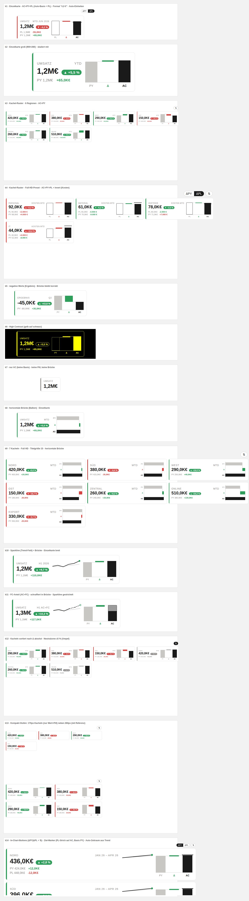

# IBCS KPI Card — Custom Visual für Power BI

KPI-Karte mit Mini-Brücke (Basis → Δ → AC) nach IBCS-Notation. Ohne Kategorie-Feld
eine Einzelkarte, mit Kategorie-Feld ein Kachel-Raster mit Crossfilter je Kachel.



v2 ist der komplette Neubau des v1.1-Prototyps als sauberes Quellcode-Projekt —
Schwerpunkte **Lesbarkeit** und **Flexibilität**:

## Features

- **Mini-Brücke** Basis → Δ → AC in IBCS-Notation: PY grau, **PL als Outline**,
  AC solide dunkel — abschaltbar (KPI card → Mini bridge), negativ-sicher
  (auch Ergebnis-KPIs unter null brechen das Layout nicht mehr).
  **Ausrichtung wählbar**: vertikal (Säulen) oder horizontal (Balken)
- **Sparkline** (Trend-Feld, z. B. Monat): Mini-Trend je Karte — AC solide,
  FC gestrichelt, PY dünn grau; Kennzahlen werden über die Perioden summiert
- **Forecast (FC)**: füllt fehlende AC-Perioden (AC+FC), FC-Anteil schraffiert
  in der Brücke und gestrichelt in der Sparkline
- **Kacheln sortieren**: Original / Δ absolut / Δ % / Größe (AC)
- **Neutralzone ± %** (Ampel): Abweichungen innerhalb der Toleranz bleiben
  grau statt grün/rot — verhindert Alles-rot/grün-Rauschen, 0 = aus
- **Kompakt-Stufen**: schmale Kacheln reduzieren sich automatisch auf
  Wert + Pill (+ Referenzzeile), statt gequetscht zu rendern
- **Ziel-Marker**: die zweite Referenz (PL bzw. PY) als Strich quer über der
  AC-Säule der Brücke — über Vorjahr, aber unter Plan? Auf einen Blick
- **In-Chart-Buttons** (abschaltbar): ΔPY|ΔPL-Umschalter + ⇅ Kachel-Sortierung
  oben rechts, persistiert — der Enduser stellt direkt im Bericht um
- **Auto-Zeitraum**: leeres Zeitraum-Label wird aus dem Trend-Feld gebaut
  („Jan 26 – Apr 26")
- **Variance basis Auto/PY/PL**: die Δ-Pill, die Akzentleiste und die Brücke
  rechnen gegen PL, wenn vorhanden (Auto), sonst PY — umstellbar. Die jeweils
  andere Basis erscheint als **zweite Referenzzeile** (abschaltbar)
- **Lesbare Zahlen**: Measure-Formatstring wird übernommen (€, %, …),
  Auto-Einheiten k/M/B nach Größenordnung (1.245.000 → „1,2 M€"),
  Dezimalstellen einstellbar, Formatierung folgt dem Berichts-Locale
  (v1 formatierte hart als en-US)
- **Schriftgrößen-Preset** (Number format → Size preset): Kompakt ×1 ·
  **Full HD ×1,5** · Präsentation ×2 — zusätzlich skaliert die Einzelkarte
  weiter automatisch mit der Visual-Größe
- **Invert** für Kosten-KPIs: Mehrwert = schlecht = rot — wirkt auf Pill,
  Referenzzeilen, Akzentleiste und Δ-Säule
- **Kachel-Raster**: Mindest-Kachelbreite einstellbar (steuert die Spaltenzahl),
  Crossfilter per Klick (Strg = Mehrfachauswahl), Kontextmenü per Rechtsklick,
  Keyboard-Navigation (Tab + Enter/Space)
- **Tooltips** (nativ): AC, PY, PL, ΔBasis absolut + %
- **High-Contrast-Modus**: nur Vorder-/Hintergrundfarbe, PY gestrichelt,
  PL als Outline, Pill als Umriss

## Felder

| Feld | Rolle | Pflicht |
| --- | --- | --- |
| Category | ohne Feld: Einzelkarte · mit Feld: Kachel je Kategorie | optional |
| Actual (AC) | Ist-Measure | ✔ |
| Previous Year (PY) | Vorjahres-Measure | optional |
| Plan / Budget (PL) | Plan-Measure | optional |
| Forecast (FC) | füllt fehlende AC-Perioden (AC+FC), schraffiert | optional |
| Trend | Perioden-Spalte → Sparkline je Karte | optional |

## Formatbereich

- **KPI card**: Titel (leer = Measure-Name), **Titelgröße**, Zeitraum-Label,
  Variance basis (Auto/PY/PL), Mini bridge an/aus + **Ausrichtung
  vertikal/horizontal**, Sparkline an/aus, zweite Referenzzeile an/aus,
  Invert, **Neutralzone ± %**, **Kacheln sortieren**, In-chart buttons, Mindest-Kachelbreite
- **Number format**: Größen-Preset (Kompakt/Full HD/Präsentation),
  Dezimalstellen, Einheiten (Auto/k/M/B)
- **Colors**: Good/Bad

## Installation

1. Fertiges Paket: [`dist/`](dist/) (`ibcsKpiCard….pbiviz`)
2. Power BI Desktop: **Visualisierungen → ⋯ → Visual aus Datei importieren**.
   Gleiche GUID wie v1.1 — der Import ersetzt die alte Karte in place.

## Selbst bauen

```bash
cd ibcsKpiCard
npm install
npx pbiviz package        # erzeugt dist/*.pbiviz
npm run test:render       # Render-Harness (14 Szenarien) in headless Chromium
```
