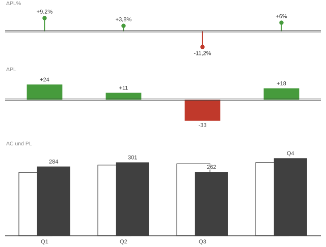
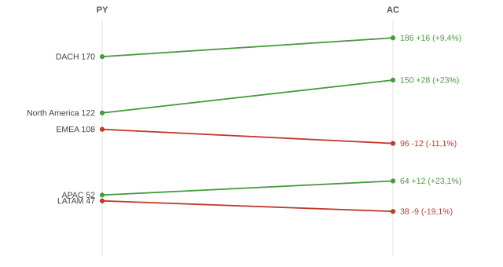
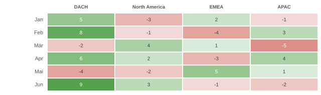

# Business Chart Builder — Anleitung

> Markdown-Fassung von [business-chart-builder-anleitung.html](../business-chart-builder-anleitung.html) · https://datenwgknowledgekitchen.com/business-chart-builder-anleitung.html · generiert mit scripts/build_md.py — bei Abweichungen gilt die HTML-Fassung.

Der Business Chart Builder baut IBCS-orientierte Charts im Browser und exportiert sie als sauberes **Deneb-Template** für Power BI. Dazu PNG, SVG, HTML und zusammensetzbare Dashboards. Diese Seite zeigt die wichtigsten Funktionen — mit Beispielen, die du direkt live öffnen kannst.

[▶ Tool öffnen](../business-chart-builder.html)

## In 60 Sekunden zum ersten Chart

1. **Diagrammtyp wählen** (links). Unsicher? `🧭 Welcher Typ passt?` stellt drei kurze Fragen.
2. **Daten eingeben** in der Tabelle (oder CSV einfügen). Unter dem Typ-Picker zeigt **„Benötigte Daten"** genau, welche Spalten/Szenarien der Typ braucht.
3. **Szenarien setzen**: Primär (z. B. `AC`) und Referenz (`PL`/`PY`).
4. Fertig — die Vorschau aktualisiert sich live.

## Abweichungen & Szenarien — das Herzstück

Der Builder denkt in IBCS-Szenarien: `AC` Ist, `PY` Vorjahr, `PL` Plan, `FC` Forecast. Für Zeit-Charts schaltest du **Abweichungs-Ebenen** dazu:

- **Δ absolut** und **Δ% relativ** als eigene Tiers, grün/rot eingefärbt.
- **Forecast** wird über ein **FC-Flag (Zahl 1/0)** markiert und automatisch schraffiert dargestellt.

**Live-Beispiel:** Säulen mit ΔPL und ΔPL% — https://datenwgknowledgekitchen.com/business-chart-builder.html (Konfiguration steckt im Permalink der HTML-Fassung)

## Die wichtigsten Chart-Typen

**Klassiker:** Säulen, Balken, Linie, Wasserfall, Szenario-Brücke (PL → AC), Varianzanalyse, KPI-Karten (Stile IBCS / Status / Trend), Tabelle, Z-Chart, Sparklines, Bullet, Pareto, Scatter.

### Integrierte Varianz — die „große" IBCS-Komposition

Vier Tiers auf einer Zeitachse: ΔPL%_YTD (kumuliert) · ΔPL% je Periode · Δ-Brücke · Säulen mit AC/FC-Gesamtsäule und Endvergleichs-Pins. Exportiert auch als dynamisches Deneb-Template.

**Live-Beispiel:** Integrierte Varianzanalyse — https://datenwgknowledgekitchen.com/business-chart-builder.html (Konfiguration steckt im Permalink der HTML-Fassung)

### Neu — inspiriert von der FT Visual Vocabulary

**Slope** — Vorher/Nachher über zwei Szenarien (PY → AC), Δ inhärent.

**Live-Beispiel:** Slope — https://datenwgknowledgekitchen.com/business-chart-builder.html (Konfiguration steckt im Permalink der HTML-Fassung)

**Heatmap-Matrix** — Perioden × Serien, divergierend `+`/`−` (Abweichungs-Sicht).

**Live-Beispiel:** Heatmap — https://datenwgknowledgekitchen.com/business-chart-builder.html (Konfiguration steckt im Permalink der HTML-Fassung)

**Marimekko** — Anteil × Größe (variable Säulenbreite).

**Live-Beispiel:** Marimekko — https://datenwgknowledgekitchen.com/business-chart-builder.html (Konfiguration steckt im Permalink der HTML-Fassung)

**Fan** — Ist solide + Forecast gestrichelt mit Unsicherheits-Korridor (im Builder unter „Fan · Forecast-Korridor").

### Bonus: fertige Gantt-Vorlage (Power BI / Deneb)

Ein interaktiver Vega-Gantt (Pan/Zoom, Phasen ein-/ausklappen, Dependencies, Meilensteine) aus dem [PMO Toolkit](https://github.com/DL0K-pbi/PMO_toolkit) von Devon Locher (MIT). Spec herunterladen und in ein Deneb-Visual (Provider Vega) einfügen. Felder: phase, task, start, end, completion, id (plus optional assignee, status, milestone, dependencies, hyperlink).

**Download:** [Gantt-Deneb-Spec laden](../assets/gantt/pmo-gantt.deneb.json)

## IBCS-Check (eingebauter Linter)

Der Button `✓ IBCS-Check` prüft deine Konfiguration gegen die wichtigsten IBCS-Regeln (klare Botschaft im Titel, ≤ 5 Segmente, einheitliche Skala, Nulllinie …) und gibt konkrete Hinweise mit Lösungsvorschlag.

## Export — der eigentliche Trick

`⚡ Vega / Deneb` öffnet den Export mit drei Modi:

1. **Power BI · Deneb-Template** — der Hauptanwendungsfall: eine `.json`, in Power BI per Deneb *Aus Vorlage erstellen → Importieren*, dann nur die gelisteten Felder zuordnen.
2. **Vega / Vega-Lite** — zum Ausprobieren im Vega-Editor.
3. **PNG / SVG / HTML** — für Folien, Doku, Web (SVG = gestochen scharf).

> **Warum Deneb?** Mit Deneb bringst du **beliebige** Charts nach Power BI — pixelgenau, voll IBCS-konform, datengetrieben — ganz ohne ein Custom-Visual zu programmieren. Genau das Spec-Schreiben nimmt dir dieser Builder ab: ein Klick, Felder zuordnen, fertig. Das ist der eigentliche Hebel.

> **Zwei Stolpersteine, die Zeit sparen:**
>
> • Das **FC-Flag ist eine Zahl** (1 = Forecast, 0/leer = Ist) — keine Boolean-Spalte nötig.
>
> • In Power BI das Visual auf **ein Berichtsjahr filtern**, sonst summieren sich AC/PL/PY/FC über mehrere Jahre.

## Zusammensetzen, Teilen, Sichern

- **+ Dashboard** / **+ Bericht**: mehrere Charts in ein Layout — der Dashboard-Export geht ebenfalls als ein Deneb-Template.
- **Link teilen**: die komplette Konfiguration steckt in der URL (genau das nutzen die Live-Beispiele oben).
- **Sichern / Laden**, Undo/Redo (`Strg+Z`), und **DE/EN** (Oberfläche und Chart-Sprache getrennt).

## Auch ohne Power BI: schnell starten, annotieren, ausgeben 😉

- **⚄ Demo-Daten**: plausible Beispieldaten für den aktuellen Diagrammtyp per Klick würfeln — ideal zum schnellen Ausprobieren von Layouts (ohne erst Zahlen einzutippen).
- **Kommentare & Annotationen**: nummerierte Kommentar-Referenzen (①) und freie Text-Notizen direkt im Chart platzieren — auch für die Botschaft.
- **Export als PNG / SVG / HTML-Report** — fertig für Folien, Doku und Web, völlig unabhängig von Power BI.

[▶ Jetzt selbst ausprobieren](../business-chart-builder.html)

Gebaut von [Michael Tenner](https://www.linkedin.com/in/michael-tenner-5b885970/) · [Daten-WG](https://www.daten-wg.com) · Teil der [Daten-WG Knowledge Kitchen](../daten_wg_learn_buckets.html)

Unabhängiges Projekt, IBCS-orientiert (nicht IBCS-zertifiziert).

---

## Weitere Fassungen dieser Seite

- HTML (maßgeblich, mit DE/EN-Umschalter und allen Live-Permalinks): https://datenwgknowledgekitchen.com/business-chart-builder-anleitung.html
- Das Werkzeug selbst: [business-chart-builder.html](../business-chart-builder.html)
