# ChartKitchen byDatenWG — Dokumentation

> Markdown-Fassung von [chartkitchen-doku.html](../chartkitchen-doku.html) · https://datenwgknowledgekitchen.com/chartkitchen-doku.html · generiert mit scripts/build_md.py — bei Abweichungen gilt die HTML-Fassung.

Power-BI-Visual · Enddokumentation

Ein IBCS-inspiriertes Chart-Deck für Power BI: 13 Diagramm-Modi in einem einzigen Visual, mit einheitlicher Szenario-Notation (AC ausgefüllt, PY grau, PL umrandet, FC schraffiert) und mitgedachten Varianzen. Diese Dokumentation führt vom Import über die 13 Modi und die wichtigsten Funktionen bis zur vollständigen Einstellungs-Referenz.

Version · **1.38.0.0** · Stand · **2026-07-19** · IBCS-inspired

## Inhalt

1. [Was ist ChartKitchen?](#intro)
2. [Schnellstart](#quickstart)
3. [Die 13 Modi](#modes)
4. [ChartKitchen im Einsatz](#inaction)
5. [Funktionen im Detail](#features)
6. [Einstellungs-Referenz](#settings)
7. [FAQ & Troubleshooting](#faq)

## 01 · Was ist ChartKitchen?

**ChartKitchen byDatenWG** ist ein einzelnes Power-BI-Custom-Visual, das 13 Diagramm-Modi vereint — von Säulen, Balken und Linien über Wasserfall- und Brücken-Darstellungen bis zu IBCS-Tabelle, Matrix, KPI-Karten und einem vollständigen GuV-Statement. Statt für jede Fragestellung ein eigenes Visual zu wählen, stellst du die Ausrichtung um und behältst dieselbe Notation, Farbwelt und Skalenlogik bei.

Die Gestaltung ist von den **IBCS®-Prinzipien** (International Business Communication Standards) inspiriert: eine einheitliche Szenario-Notation — **AC** (Ist) ausgefüllt, **PY** (Vorjahr) grau, **PL** (Plan) umrandet, **FC** (Forecast) schraffiert — und Abweichungen, die immer mitgedacht sind: absolute und relative Varianz-Panels stehen automatisch neben oder über dem Basis-Chart. So liest sich jede Grafik nach denselben Regeln, egal welcher Modus.

Diese Anleitung beschreibt den Stand der Version **1.38.0.0**.

## 02 · Schnellstart

### 1 · Visual importieren

1. Besorge die Datei `ChartKitchen byDatenWG` (Endung `.pbiviz`).
2. In Power BI Desktop: im Bereich *Visualisierungen* auf *… (Weitere Optionen)* → *Visual aus Datei importieren* klicken und die `.pbiviz` auswählen.
3. Das ChartKitchen-Icon erscheint im Visualisierungsbereich. Ziehe es auf die Berichtsseite.

### 2 · Minimal-Setup

1. Weise der Rolle **Kategorie** deine Achse zu — eine Zeitachse (Monate, Quartale) oder eine Struktur (Regionen, Produkte, Konten).
2. Weise der Rolle **Ist (AC)** deine Hauptkennzahl zu. Mit nur diesen beiden Feldern zeichnet das Visual bereits Säulen mit Beschriftung, Titel und Σ-Kopfzeile.
3. Solange Felder fehlen, zeigt ChartKitchen eine Startseite mit Kachel-Vorschauen aller Modi und den je Modus benötigten Feldern — ein Klick auf eine Kachel wählt die passende Ausrichtung.

### Feldrollen

| Feldrolle | Typ | Wofür |
| --- | --- | --- |
| Kategorie | Gruppierung | Zeitachse (Monate) oder Struktur (z. B. Länder, Produkte). Pflichtfeld; eine zweite Kategorie bildet eine Hierarchie in der Tabelle. |
| Ist (AC) | Kennzahl | Ist-Wert — die Hauptkennzahl, ausgefüllt gezeichnet. Pflichtfeld. |
| Vorjahr (PY) | Kennzahl | Vorjahreswert, grau gezeichnet. Basis für die ΔPY-Varianz-Panels. |
| Plan / Budget (PL) | Kennzahl | Plan- oder Budgetwert, als Umriss gezeichnet. Basis für die ΔPL-Varianz-Panels. |
| Forecast (FC) | Kennzahl | Forecast-Wert — wird automatisch schraffiert dargestellt. |
| Benchmark (BM) | Kennzahl | Vergleichswert je Kategorie (z. B. Marktdurchschnitt, Ziel) — als Querstrich-Marker; Basis für die KPI-Karten-Ampel und das Bullet. |
| FC Vormonat (Revision) | Kennzahl | Forecast des vorherigen Zyklus — als Abweichungsbasis wählbar (FC-Revision: was hat sich seit dem letzten Forecast verschoben?). |
| Linie (Kombi) | Kennzahl | Zweite Kennzahl als Linie über den Säulen (z. B. Marge %) mit eigener Skala rechts. Nur im Columns-Modus. |
| Stack-Serie (Gestapelt) | Gruppierung | Feld gefüllt = Säulen/Balken stapeln sich nach dieser Serie (AC je Serie, mit Legende und Summen-Label). |
| Spalten (Matrix) | Gruppierung | Nur Tabelle: pivotiert die Werte in Spaltengruppen (z. B. Quartal → Monat, max. 2 Ebenen) — mit klappbarer Spalten-Hierarchie wie in der Power-BI-Matrix. |
| Filter-Info (Fußzeile) | Kennzahl | Text-Measure mit dem aktuellen Filterkontext (z. B. via CONCATENATEX/SELECTEDVALUE) — erscheint als zweite Fußzeile, wenn die Filter-Fußzeile aktiv ist. |
| Kommentare | Kennzahl | Text-Measure: Kategorien mit Kommentar bekommen einen nummerierten Marker, der Text steht im Tooltip und in der Kommentarliste. |
| Small Multiples | Gruppierung | Teilt das Chart in kleine Kacheln pro Gruppe — mit identischer Skalierung (IBCS Small Multiples). |
| Waterfall-Typ (sum/delta) | Gruppierung | Nur Wasserfall/GuV: „sum“ = absolute Zwischensumme, „delta“ = Bewegung (GuV-Wasserfall). |
| Forecast-Flag (0=Ist · 1=FC · 2=vorläufig) | Gruppierung | Alternative zur FC-Measure: eine 1/0-Spalte — Zeilen mit 1 werden als Forecast (schraffiert) dargestellt, die AC-Measure läuft durch. |

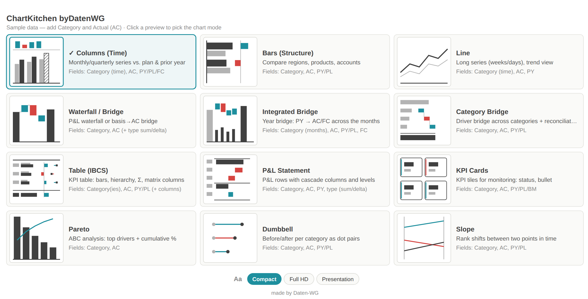

### 3 · Erster Vergleich mit PY

1. Füge der Rolle **Vorjahr (PY)** die entsprechende Kennzahl hinzu. Sofort erscheinen über dem Basis-Chart die Varianz-Panels *ΔPY absolut* und *ΔPY %* — grün, wenn besser, rot, wenn schlechter.
2. Für einen Plan-Vergleich bindest du zusätzlich **Plan / Budget (PL)**; über *Chart → Layout → Abweichungsbasis* wählst du, wogegen die Panels rechnen (Auto nimmt PL, sonst PY).
3. Von hier aus änderst du unter *Chart → Layout → Ausrichtung* den Modus — alle folgenden Kapitel bauen darauf auf.

## 03 · Die 13 Modi

### 01 · Säulen

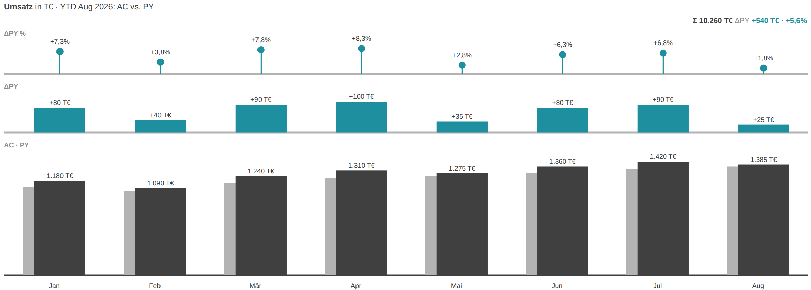

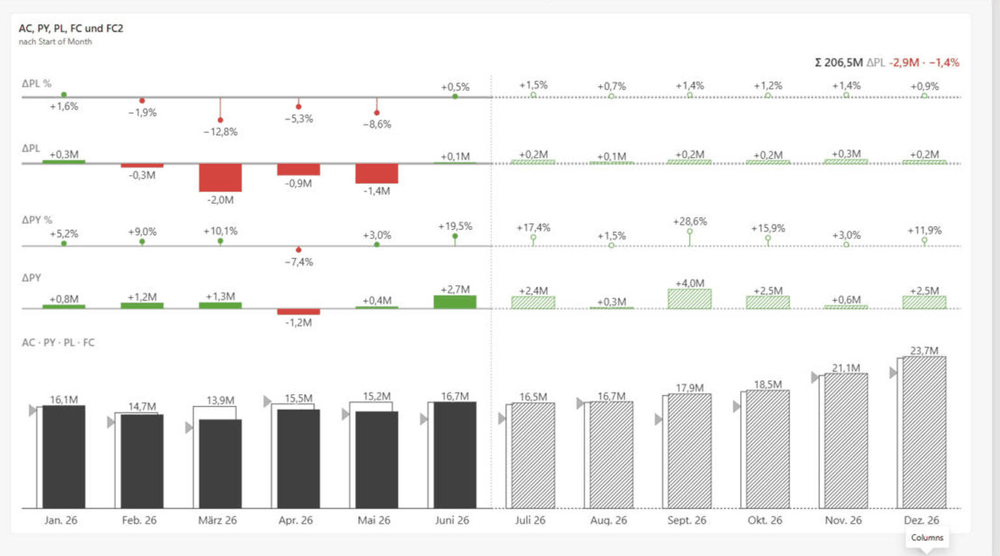

Der Standard für Zeitreihen: Monate oder Quartale als Säulen, AC ausgefüllt, PY grau (oder als Dreieck, wenn zusätzlich PL gebunden ist). Über den Säulen liegen die Varianz-Panels ΔPY absolut und in Prozent. Nimm diesen Modus, wenn die Zeitachse überschaubar ist (bis etwa 24 Punkte) und die Abweichung je Periode zählt.

### 02 · Balken

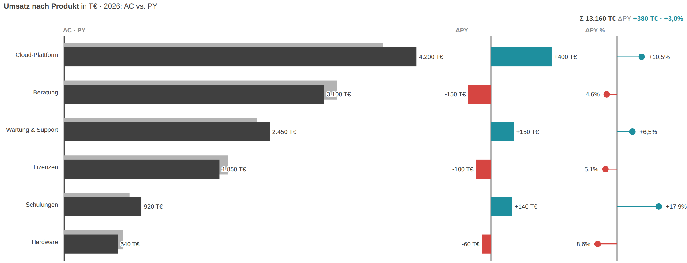

Für Strukturvergleiche ohne Zeitbezug — Produkte, Regionen, Konten. Die Kategorien stehen als waagerechte Balken untereinander, standardmäßig nach AC absteigend, mit seitlichen ΔPY- und ΔPY-%-Panels. Ideal, wenn Kategorienamen lang sind oder es viele Ausprägungen gibt.

### 03 · Linie

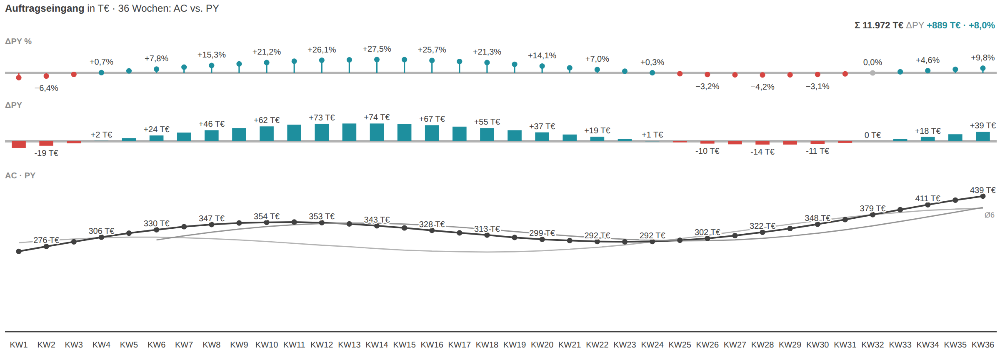

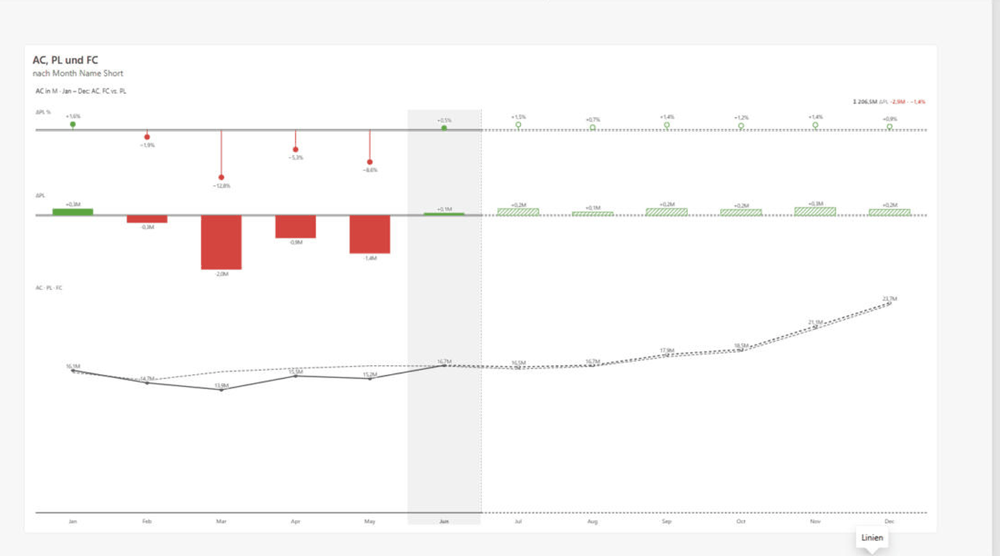

Für lange Zeitreihen mit vielen Datenpunkten (Wochen, Tage), bei denen Säulen zu dicht würden. AC als kräftige Linie, PY dünn und grau; optional ein gleitender Durchschnitt über N Perioden für den Trend. Der Fokus liegt auf Verlauf und Wendepunkten, nicht auf der Einzelperiode.

### 04 · Wasserfall

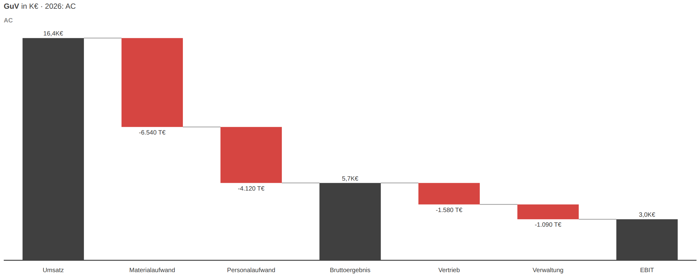

Die klassische GuV-Kaskade: über die Rolle „Waterfall-Typ“ (sum/delta) werden Zwischensummen als volle Säulen und Bewegungen als schwebende Brückenglieder gezeichnet — von Umsatz bis EBIT. Auch als reine Basis→AC-Brücke nutzbar. Nimm ihn, wenn sich ein Ergebnis additiv aus Beiträgen zusammensetzt.

### 05 · Integrierte Brücke

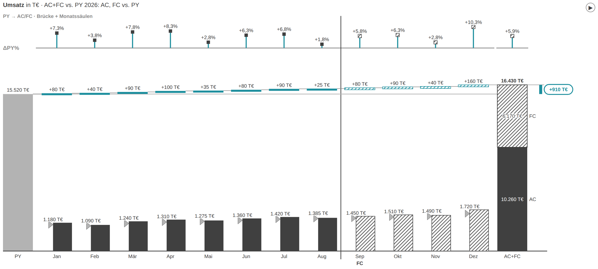

Die Jahresbrücke: links die PY-Totalsäule, in der Mitte die ΔPY-Kaskade über die Monate, rechts die gestapelte AC+FC-Totalsäule. Sie beantwortet „Wie kommen wir vom Vorjahr zum aktuellen Stand?“ über die Zeit. Braucht PY oder PL als Basis und verträgt keine rein negativen Werte.

### 06 · Kategorie-Brücke

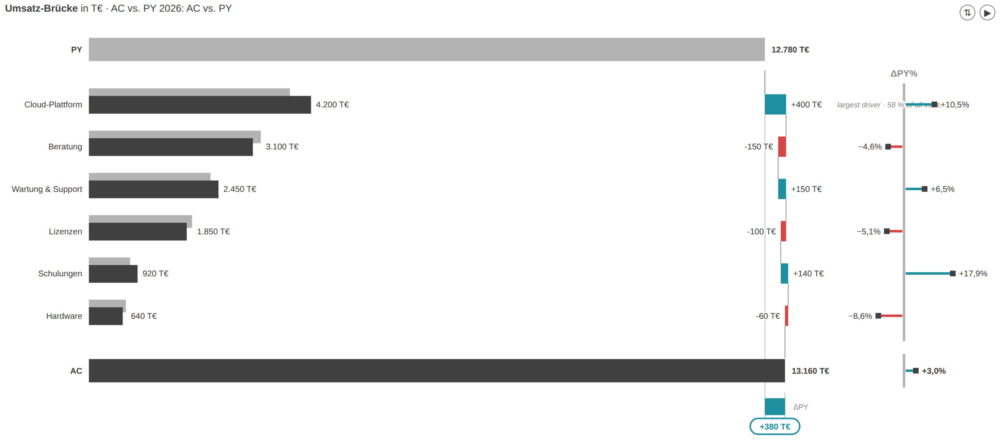

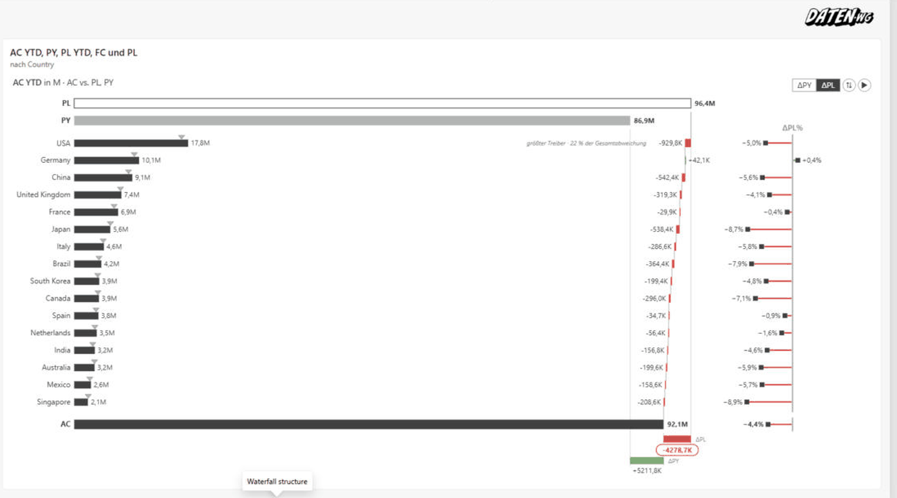

Die Treiber-Brücke über Kategorien: PY-Zeile oben, je Treiber ein AC-PY-Balken plus Kaskadenglied und ΔPY-%-Pin, AC-Zeile als Überleitung unten. So sieht man auf einen Blick, welche Kategorie die Gesamtabweichung treibt. Der größte Treiber wird automatisch mit einer Notiz markiert.

### 07 · Tabelle

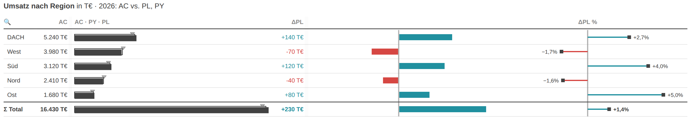

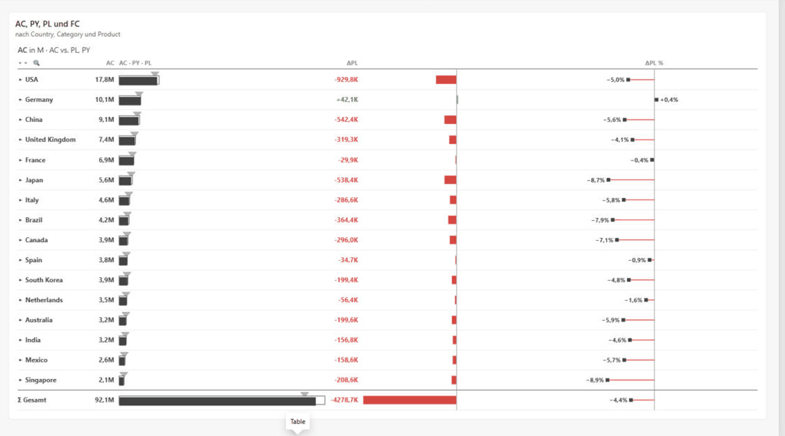

Die flache IBCS-Wertetabelle: je Zeile der AC-PY-Balken, eine ΔBasis-Balkenspalte, ΔBasis-%-Pins und eine Σ-Gesamtzeile. Sie verbindet Zahlengenauigkeit mit IBCS-Grafik in der Zelle und ist die Grundlage für Hierarchien, Ergebnis-/Skip-Zeilen und die Matrix. Ideal für board- und drucktaugliche Kennzahlenblätter.

### 08 · Matrix

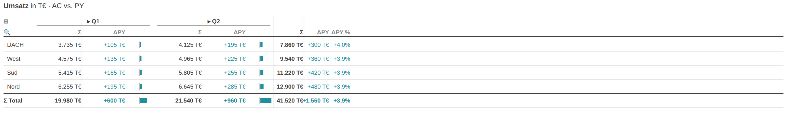

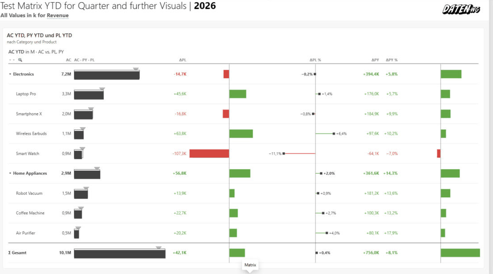

Die Tabelle mit gefüllter Spalten-Rolle: Zeilen-Kategorien gegen eine Spaltenhierarchie (z. B. Quartal → Monat, max. 2 Ebenen), je Block Wert und ΔBasis, rechts ein fixierter Σ-Block. Spaltengruppen lassen sich auf- und zuklappen, breite Matrizen horizontal scrollen. Für Kennzahlen über zwei Dimensionen gleichzeitig.

### 09 · Pareto

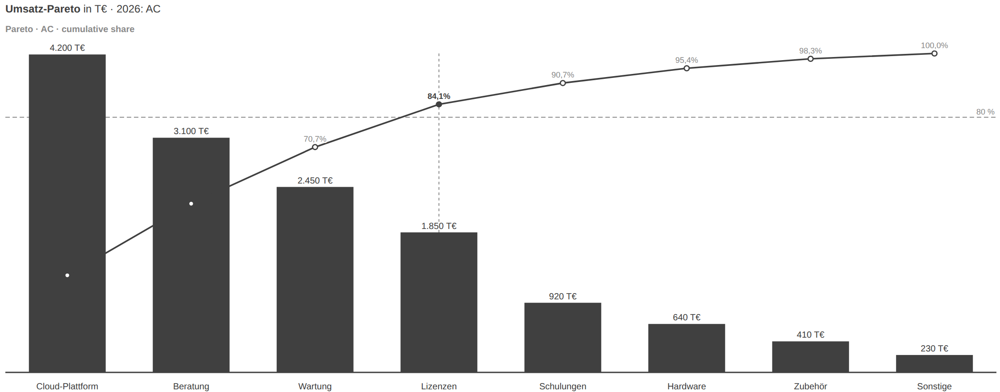

Die ABC-Analyse: AC-Säulen absteigend mit kumulierter Prozentlinie und 80-%-Referenzmarke. Man erkennt sofort, welche wenigen Kategorien den Großteil ausmachen. Nimm ihn für Sortiments-, Kunden- oder Fehlerursachen-Analysen.

### 10 · Dumbbell

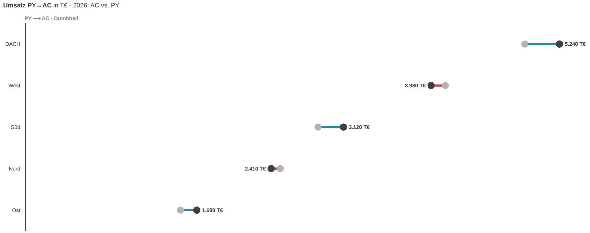

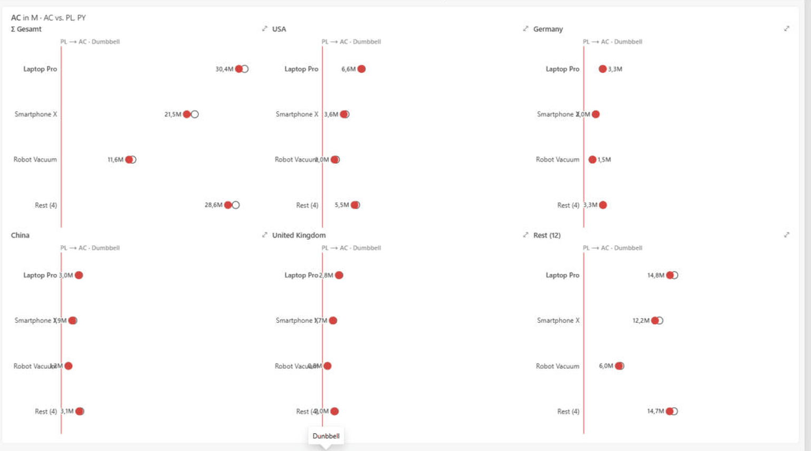

Vorher/Nachher je Kategorie als Punktpaar: ein PY- und ein AC-Punkt, der farbige Verbinder zeigt Richtung und Größe der Veränderung. Ruhiger als zwei Balkenreihen, wenn nur zwei Szenarien verglichen werden. Braucht AC und PY/PL je Kategorie.

### 11 · Slope

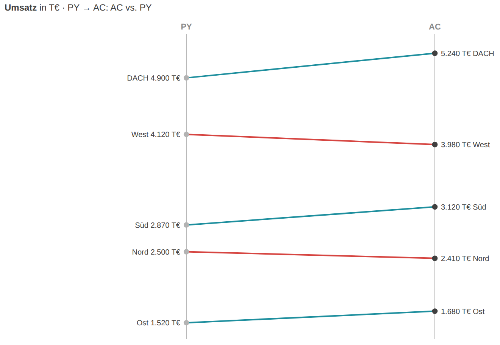

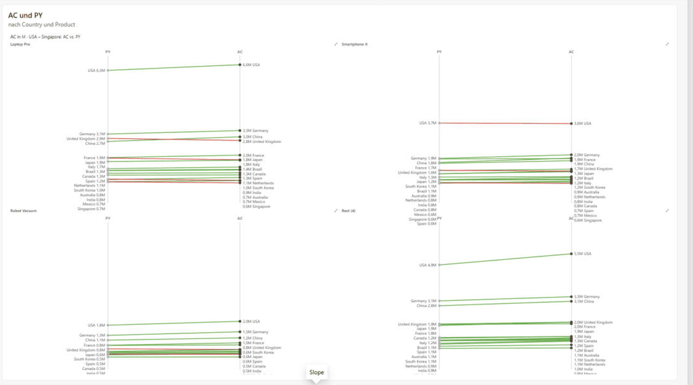

Rangwechsel zwischen zwei Zeitpunkten: PY links, AC rechts, je Kategorie eine Linie — Steigung und Farbe zeigen Auf- und Absteiger. Ideal, um Positionsverschiebungen in einem Ranking zu erzählen. Braucht AC und PY/PL je Kategorie.

### 12 · KPI-Karten

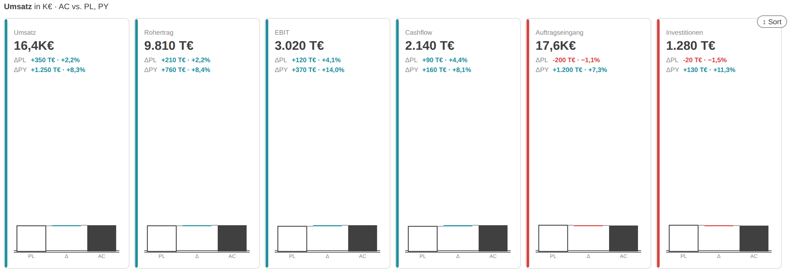

KPI-Kacheln fürs Monitoring: je Kennzahl eine Karte mit großem AC-Wert, ΔPL- und ΔPY-Zeilen und einer Mini-Brücke PL→Δ→AC. Optional mit Status-Ampel, Hintergrund-Färbung und Bullet gegen die Benchmark. Für Überblicks-Seiten und Kontrollraum-Wände.

### 13 · GuV-Statement

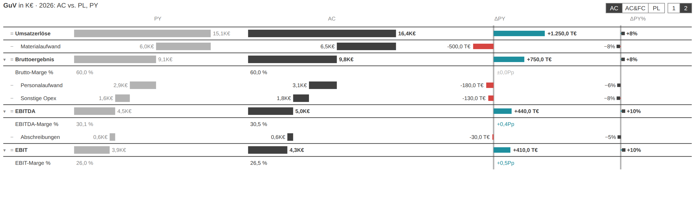

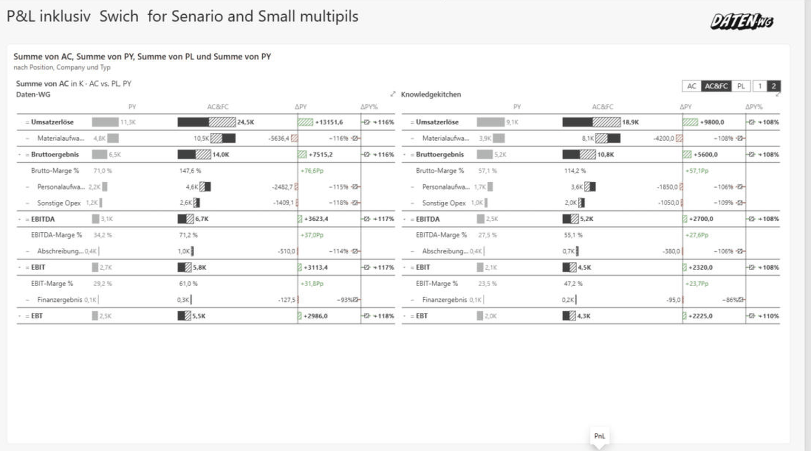

Das vollständige GuV-Statement: Ergebnisrechnung mit Summen-, Delta- und Margen-Zeilen, PY-/AC-Kaskadenspalten und ΔPY plus ΔPY-%-Pins. Ebenen (nur Zwischensummen / alle Positionen) und Ansichten (AC / AC+FC / PL) sind per Button umschaltbar. Der Abschluss-Modus für die formale Berichterstattung. Braucht PY (oder PL) als Referenz.

## 04 · ChartKitchen im Einsatz

Die folgenden Aufnahmen stammen direkt aus Power BI Desktop, mit Beispieldaten aus einem echten Bericht. Die übrigen Abbildungen dieser Dokumentation sind mit demselben Renderer erzeugt — hier siehst du das Visual so, wie es im Berichtsalltag zusammenspielt.

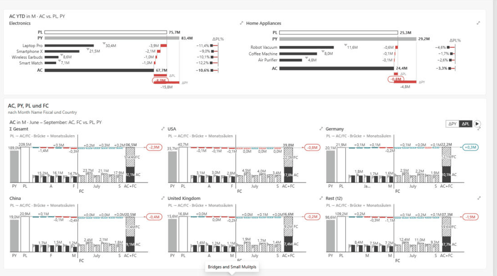

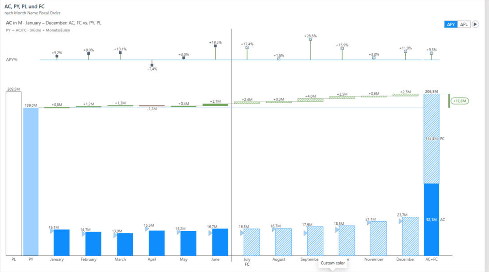

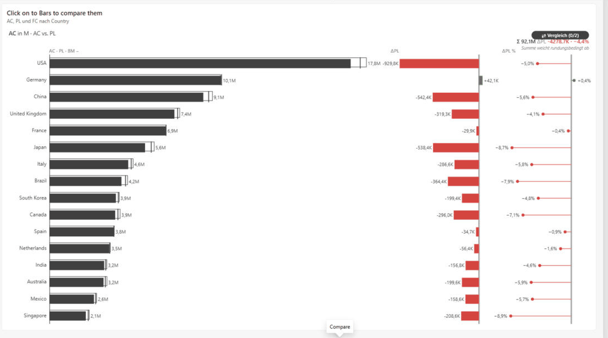

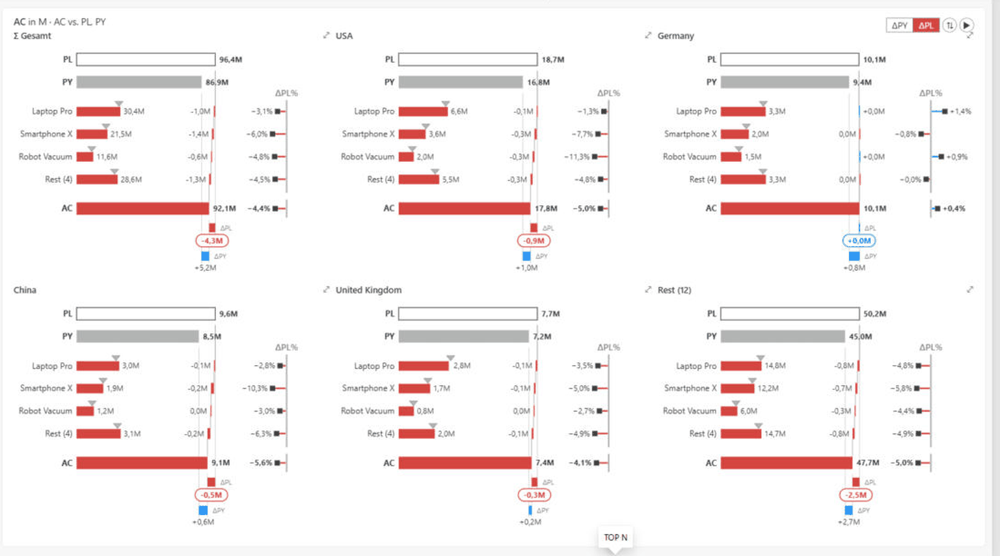

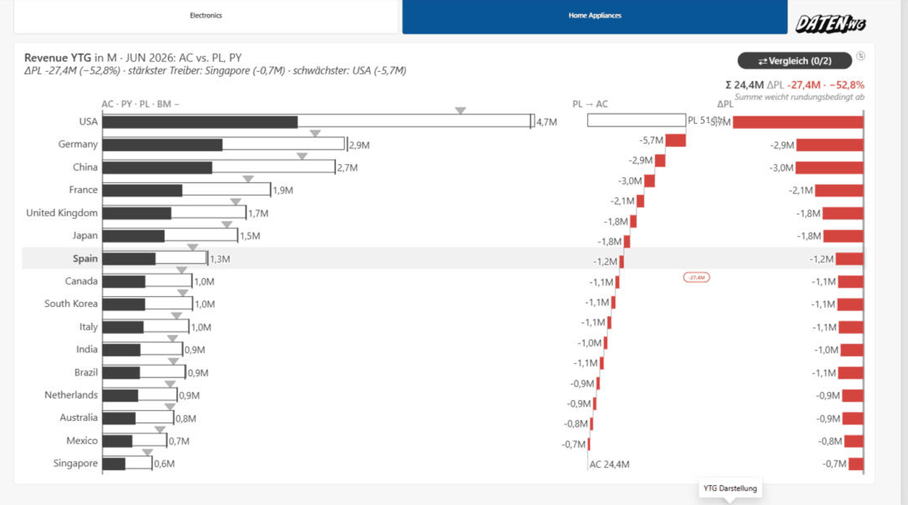

## 05 · Funktionen im Detail

### Szenarien, Forecast-Schraffur & Benchmark

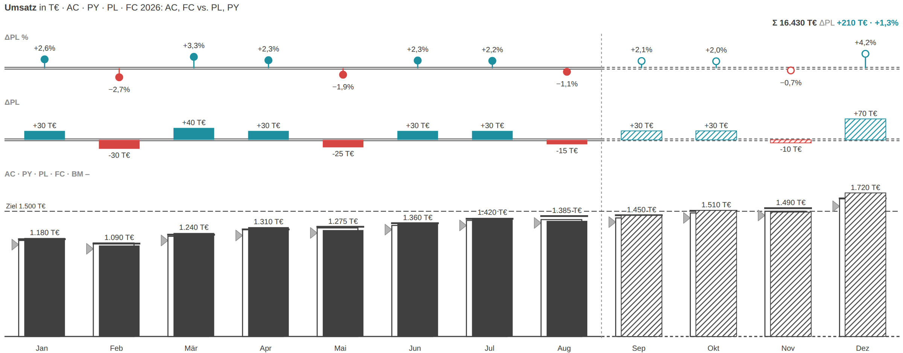

1. Binde AC, PY, PL und FC in die jeweiligen Feldrollen — alle vier erscheinen in einem Chart.
2. FC wird automatisch schraffiert gezeichnet. Alternativ zur FC-Measure kannst du eine 1/0-Spalte in die Rolle „Forecast-Flag“ binden.
3. Bei drei Szenarien (AC + PY + PL) zeigt IBCS PY als graues Dreieck an der Säule. Über Chart → Layout → „PY als Dreieck“ schaltest du das aus.
4. Für einen Zielwert je Kategorie füllst du die Benchmark-Rolle — sie erscheint als Querstrich-Marker (Dreieck).
5. Eine feste Ziel- oder Schwellenlinie ziehst du stattdessen über Skala → Referenzlinie (Wert + Beschriftung).

### Small Multiples

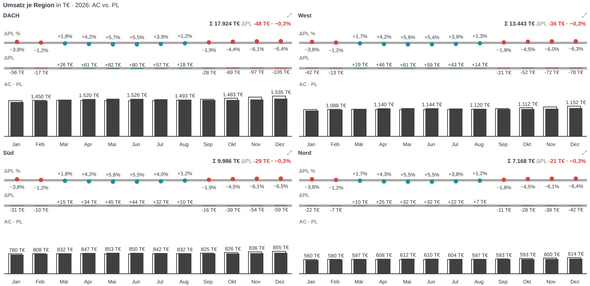

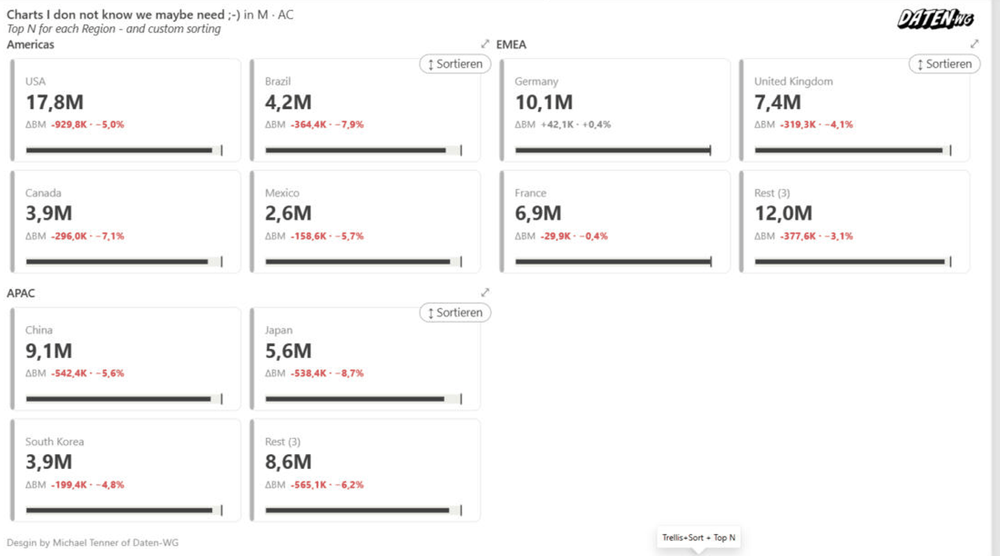

1. Ziehe ein Gruppierungsfeld (z. B. Region) in die Rolle „Small Multiples“. Das Visual zerlegt sich in eine Kachel je Gruppe auf gemeinsamer Skala (IBCS).
2. Unter Chart → Small Multiples steuerst du eine vorangestellte „Σ Gesamt“-Kachel, Top-N-Kacheln (der Rest wird zu „Rest“ aggregiert) und eine größere erste Kachel.
3. Für die Brücken-Modi (Integrierte/Kategorie-Brücke) erzwingst du mit „Brücken: gleiche Skala für alle Kacheln“ eine identische Skala; Säulen, Balken und Wasserfall teilen sie ohnehin.
4. Ein Klick auf das Zoom-Symbol einer Kachel vergrößert sie temporär.

### Matrix: Spaltengruppen, Drill & horizontales Scrollen

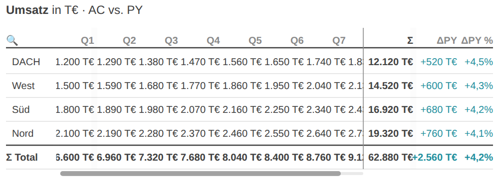

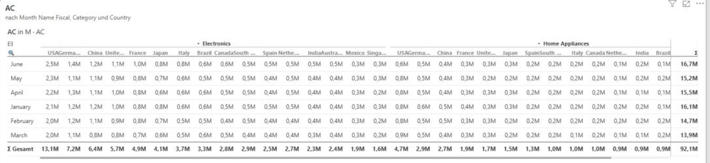

1. Fülle zusätzlich zur Kategorie die Rolle „Spalten (Matrix)“ mit bis zu zwei Ebenen (z. B. Quartal, Monat).
2. Spaltengruppen klappst du per Klick auf die Kopfzeile auf und zu; mit dem ⊞/⊟-Knopf im Kopf öffnest oder schließt du alle Spaltengruppen auf einmal, mit dem Doppelchevron alle Zeilen.
3. Wird die Matrix breiter als die Kachel, wird der Blockstreifen horizontal scrollbar (Shift + Mausrad oder der Scrollbalken unten). Namensspalte links und Σ-Block rechts bleiben fixiert.
4. Spaltenbreiten ziehst du am Griff an der rechten Kante; ein Doppelklick passt die Spalte an den längsten sichtbaren Inhalt an (Auto-Fit). Die Breiten werden im Bericht gespeichert.
5. Beim Export/Druck bleibt es beim „… +n“-Hinweis, da ein Standbild nicht scrollbar ist.

### Zwei-Zeilen-Kompaktmodus

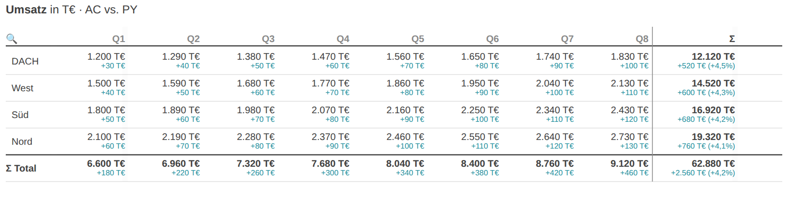

1. Unter Chart → Tabelle → „Zellen-Layout (Matrix)“ wählst du „Zwei Zeilen“: der Wert steht groß oben, die kleinere Δ-Zahl direkt darunter in derselben Zelle.
2. Die Matrix wird dadurch etwa halb so breit und passt oft ohne horizontales Scrollen.
3. Der Δ-Minibalken entfällt in diesem Layout; Werte-Spalten (AC · PY · PL) bleiben als eigene Spalten neben dem Wert erhalten.

### Werte-Spalten

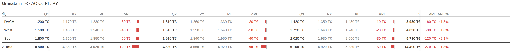

1. Unter Chart → Tabelle → „Werte-Spalten“ schaltest du zwischen „Nur AC“, „AC + Varianzbasis“ und „AC · PY · PL“.
2. Die bezifferten Referenzwerte stehen dann neben der ΔBasis-Balkenspalte und dem Σ-Block — für druck- und boardtaugliche Tabellen ohne Balken-Interpretation.

### Position der Σ-Zeile

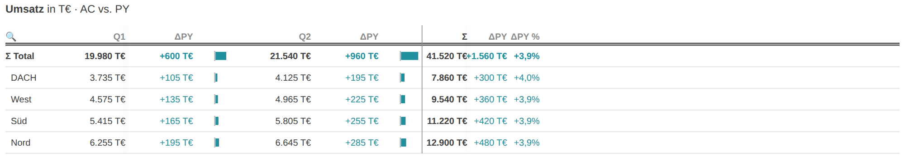

1. Unter Chart → Tabelle → „Position der Σ-Zeile“ wählst du „Oben“ (direkt unter dem Kopf, IBCS) oder „Unten“ (Standard, deutsche GuV-Lesart).
2. In beiden Fällen bleibt die Σ-Zeile beim vertikalen Scrollen fixiert.

### Tabellen-Komfort: Zebra, Gitter, Dichte, Suche, Sortierung

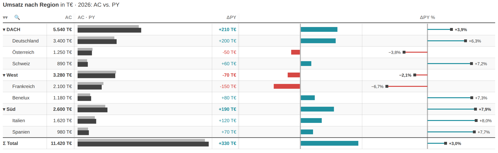

1. Unter Chart → Tabelle stellst du Zebra-Streifen, Zeilenhöhe (kompakt/normal/luftig) und Gitterlinien (horizontal/keine/beide) ein.
2. Mit einem zweiten Kategorie-Feld entsteht eine Hierarchie (z. B. Region → Land): per Chevron klappst du einzelne Zeilen auf, mit dem Doppelchevron ⇕ im Kopf alle.
3. Über das Lupen-Symbol durchsuchst du die Zeilennamen; ein Klick auf eine Spaltenüberschrift sortiert nach dieser Spalte (erneut: aufsteigend / aus).

### GuV-Statement & Zeilentypen

1. Im Modus „GuV-Statement“ (oder Wasserfall) legst du über die Rolle „Waterfall-Typ“ je Zeile fest: „sum“ = Zwischensumme, „delta“ = Bewegung.
2. Ohne diese Rolle strukturierst du per Listen in Chart → Tabelle: Ergebniszeilen (fett, Anker), Zeilen aus Summen ausnehmen, ausblenden, einrücken (davon), Grafik nur für gelistete Zeilen.
3. Formelzeilen (z. B. „Marge = EBIT / Umsatz“) und Zahlenformate pro Zeile (z. B. „Marge = 0,0 %“) ergänzen berechnete bzw. gemischte €-/%-/Stück-Zeilen.
4. Der Struktur-Modus (Chart → Tabelle → „Zeilen-Struktur bearbeiten“) setzt diese Eigenschaften per Klick auf eine Zeile; die Wahl wird in den Listen persistiert.

### Kommentare

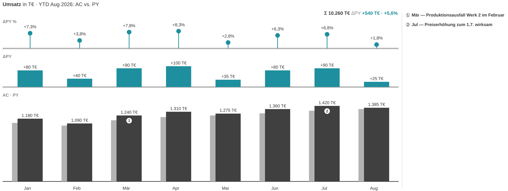

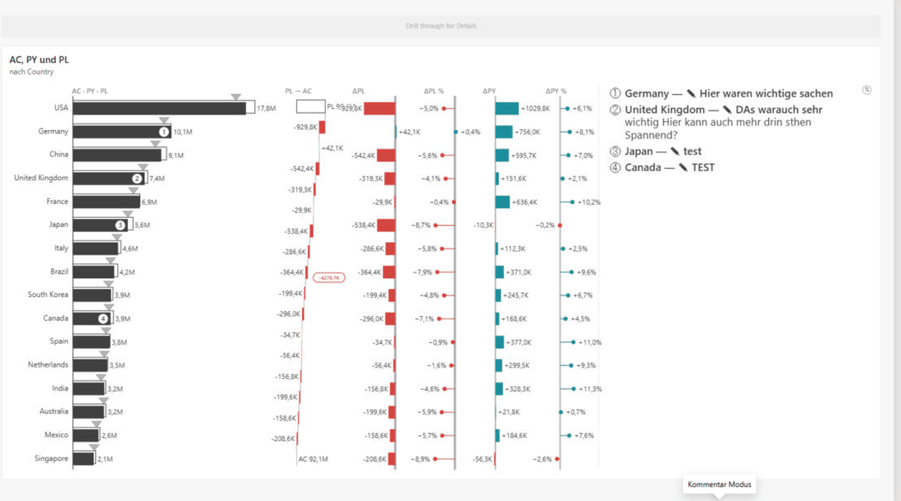

1. Binde eine Text-Measure in die Rolle „Kommentare“ — Kategorien mit Text bekommen einen nummerierten Marker ① ②, die Liste steht rechts neben dem Chart und bleibt im Export sichtbar.
2. Alternativ aktivierst du unter Kommentare → „Kommentare im Chart erfassen“ den Kommentar-Modus: ein Klick auf eine Kategorie öffnet ein Eingabefeld, der Text wird im Bericht gespeichert (bookmark-fähig, wandert mit der PBIX).
3. Kommentarliste ein-/ausblenden und die Schriftgröße stellst du in derselben Karte „Kommentare“ ein.

### Finance-Format

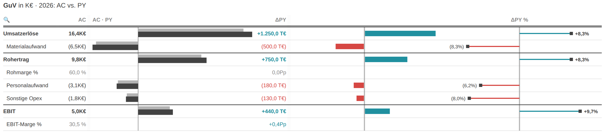

1. Unter Datenbeschriftungen → „Finance-Format (Klammern)“ werden negative Werte in Klammern statt mit Minuszeichen dargestellt — (1.234) — und Null als „–“.
2. Das gilt für Wert- und Δ-Beschriftungen inklusive Δ % und passt zu den GuV-Zeilentypen Summe, Delta und Marge.

### IBCS-Titel, Fußzeilen & Beschriftungen

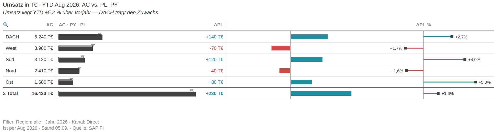

1. Der IBCS-Titel („KPI · Einheit · Zeitraum: Szenarien“) entsteht automatisch; KPI-Name und Zeitraum überschreibst du in der Karte „IBCS-Titel“.
2. Eine Botschaftszeile (IBCS: SAY) trägst du oben ein oder lässt sie über „Automatische Botschaft“ aus Gesamtabweichung und größten Treibern erzeugen.
3. Zwei Fußzeilen sind möglich: „Fußzeile (Datenstand · Quelle)“ unten links und die Filter-Fußzeile mit der gebundenen Filter-Info-Measure plus dem Anzeige-Zustand (YTD, Top-N, Sortierung …).
4. Alle Schriften skalierst du zentral über Datenbeschriftungen → Größen-Preset (Kompakt/Full HD/Präsentation) und den Faktor „Alle Beschriftungen skalieren %“; die Beschriftungs-Dichte steuert das Ausdünnen.

### Monitoring-Karten (Ampel & Bullet)

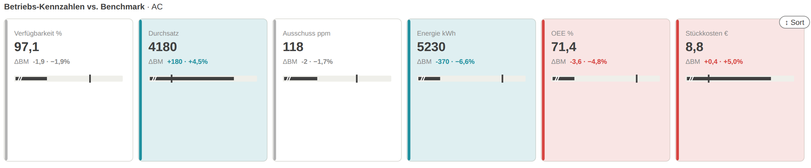

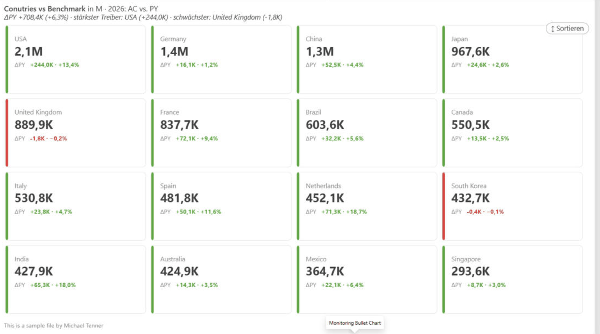

1. Im KPI-Karten-Modus steuerst du unter Chart → KPI-Karten die Status-Basis: gegen die Abweichungsbasis (ΔPL/ΔPY) oder gegen die gebundene Benchmark-Measure.
2. Die Hintergrund-Färbung (Ampel) samt Intensität und die Highlight-Richtung (beide / nur schlecht / nur gut) bewerten AC gegen diese Basis.
3. Das Bullet gegen die Benchmark (optional mit Zoom auf den Zielbereich) und die Mini-Brücke zeigst du je nach Bedarf; sortieren kannst du nach Abweichung (größte oben-links).
4. Für die Benchmark-Bewertung muss die Benchmark-Rolle gefüllt sein.

### Cross-Filter, Tooltips & Bookmarks

1. Ein Klick auf eine Kategorie filtert die übrigen Visuals der Seite (Cross-Filter). Ausnahmen: solange Kommentar-, Vergleich- oder Struktur-Modus aktiv sind, filtern Klicks nicht quer.
2. Beim Überfahren zeigen Standard- und Canvas-Tooltips Werte, Abweichungen, Serie und Kommentar; Canvas-Tooltips (Report-Page-Tooltips) werden unterstützt.
3. Interaktive Zustände sind bookmark-fähig: die Varianz-Basis, die YTD-Sicht, die In-Chart-Sortierung, aufgeklappte Zeilen/Spalten, erfasste Kommentare und Spaltenbreiten wandern mit dem Bericht bzw. dem Lesezeichen.

## 06 · Einstellungs-Referenz

Die folgenden Darstellungen zeigen Aufbau und Reihenfolge des Formatbereichs (Schema — Benennung wie in Power BI). Jede Karte und Untergruppe erscheint als schematische Skizze neben ihrer Einstellungstabelle, sodass du Schalter und Auswahlfelder direkt im Pane wiederfindest.

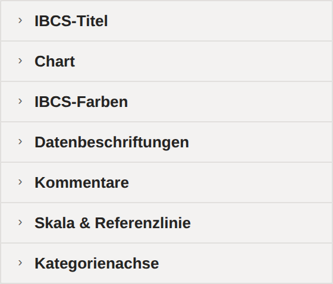

> Die folgenden Tabellen listen alle Einstellungen des Formatbereichs, gegliedert nach Karten und Gruppen — genau in der Reihenfolge und mit den Benennungen, wie sie im Power-BI-Formatbereich erscheinen. Die Karte „Chart“ bündelt die meisten Einstellungen; viele wirken nur in bestimmten Modi (z. B. die Gruppen „Tabelle“, „Small Multiples“, „Brücke“, „KPI-Karten“).

### IBCS-Titel

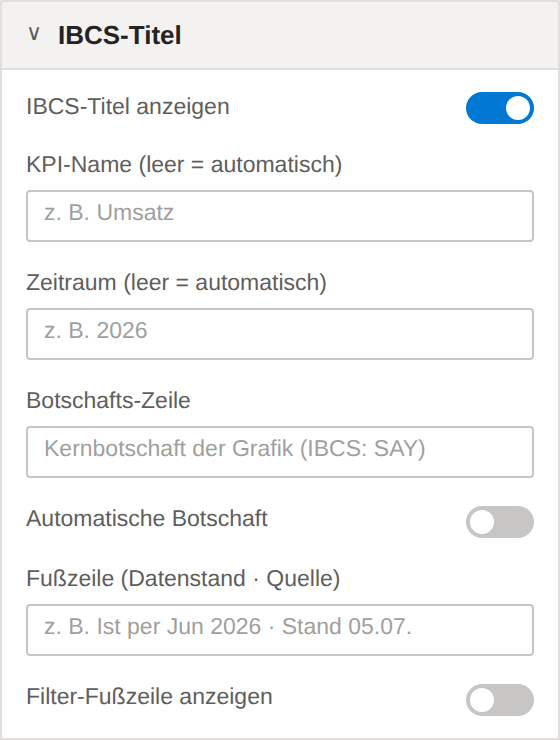

| Einstellung | Beschreibung | Optionen / Standard |
| --- | --- | --- |
| Beschriftungen anzeigen | — | An / Aus · Standard An |
| KPI-Name (leer = automatisch) | — | Freitext · z. B. Umsatz |
| Zeitraum (leer = automatisch) | — | Freitext · z. B. 2026 |
| Botschafts-Zeile | — | Freitext · Kernbotschaft der Grafik (IBCS: SAY) |
| Automatische Botschaft | Erzeugt die Botschafts-Zeile (Treiber-Text) automatisch aus Gesamtabweichung und größten Treibern, wenn keine eigene Botschaft eingegeben ist. Standard aus. | An / Aus · Standard Aus |
| Fußzeile (Datenstand · Quelle) | Fußzeile unten links — z. B. Datenstand und Quelle: „Ist per Jun 2026 · Stand 05.07. · Quelle: SAP FI". | Freitext · z. B. Ist per Jun 2026 · Stand 05.07. |
| Filter-Fußzeile anzeigen | Zweite Fußzeile mit dem Filterkontext: zeigt die gebundene „Filter-Info“-Text-Measure (Report-Filter sind für Custom Visuals nicht per API sichtbar) plus den Anzeige-Zustand des Visuals selbst — YTD, Top-N, In-Chart-Sortierung, Σ-Ausschlüsse, Vergleich. | An / Aus · Standard Aus |

### Chart

#### Layout

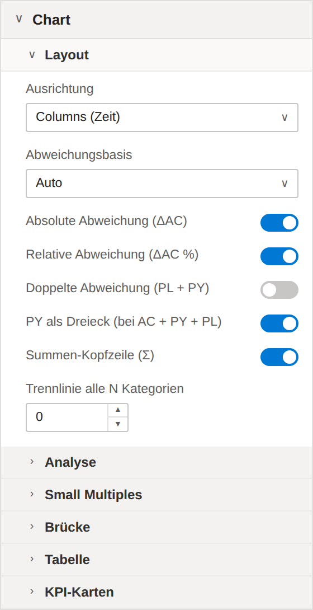

| Einstellung | Beschreibung | Optionen / Standard |
| --- | --- | --- |
| Ausrichtung | — | Optionen: Columns (Zeit) \| Bars (Struktur) \| Line (Zeit, viele Punkte) \| Waterfall / Brücke \| Integrierte Brücke (Zeit) \| Kategorie-Brücke (Struktur) \| Tabelle (IBCS) \| Pareto (Struktur) \| Dumbbell (Struktur) \| Slope · Vorher/Nachher \| KPI-Karten (Kacheln) \| GuV-Statement (IBCS) · Standard „Columns (Zeit)“ |
| Abweichungsbasis | Basis für die Abweichungs-Panels. Auto: PL wenn vorhanden, sonst PY. | Optionen: Auto \| Vorjahr (PY) \| Plan (PL) \| FC Vormonat (Revision) · Standard „Auto“ |
| Absolute Abweichung (ΔAC) | — | An / Aus · Standard An |
| Relative Abweichung (ΔAC %) | — | An / Aus · Standard An |
| Doppelte Abweichung (PL + PY) | Zeigt zusätzlich die Abweichungs-Panels zur zweiten Basis — ΔPL und ΔPY gleichzeitig (benötigt PY und PL). | An / Aus · Standard Aus |
| PY als Dreieck (bei AC + PY + PL) | IBCS-Notation bei drei Szenarien: Sind AC, PY und PL gebunden, wird das Vorjahr als graues Dreieck (▶) am Säulen-/Balkenrand auf PY-Höhe gezeigt statt als dritte Säule — weniger überladen. Aus = PY wieder als graue Säule. | An / Aus · Standard An |
| Summen-Kopfzeile (Σ) | Zeigt Summe und Gesamtabweichung als Kopfzeile. | An / Aus · Standard An |
| Trennlinie alle N Kategorien | Zeichnet eine dünne Trennlinie nach jeweils N Kategorien, quer durch alle Panels — für Struktur-Vergleiche mit natürlichen Untergruppen (z. B. Regionen). 0 = aus. | 0–50 · Standard 0 |

#### Analyse

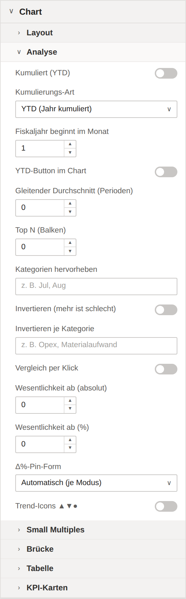

| Einstellung | Beschreibung | Optionen / Standard |
| --- | --- | --- |
| Kumuliert (YTD) | Schaltet alle Panels auf kumulierte Sicht: Säulen, ΔBasis und ΔBasis % zeigen Year-to-Date-Werte. | An / Aus · Standard Aus |
| Kumulierungs-Art | YTD setzt am Fiskaljahres-Beginn zurück, QTD an jedem Quartalsstart, R12 summiert rollierend die letzten 12 Perioden. Monats-Erkennung über die Kategorie-Labels (Jan…Dez, 01…12). | Optionen: YTD (Jahr kumuliert) \| QTD (Quartal kumuliert) \| R12 (rollierende 12 Perioden) · Standard „YTD (Jahr kumuliert)“ |
| Fiskaljahr beginnt im Monat | 1 = Januar … 12 = Dezember. Bestimmt, wo YTD/QTD zurücksetzen (z. B. 4 für ein Fiskaljahr ab April). | 1–12 · Standard 1 |
| YTD-Button im Chart | Zeigt einen klickbaren „YTD"-Button oben rechts im Chart (Columns/Line) — der Enduser schaltet die kumulierte Sicht direkt im Bericht um; die Wahl wird persistiert. Standard aus. | An / Aus · Standard Aus |
| Gleitender Durchschnitt (Perioden) | Dünne Overlay-Linie mit gleitendem Durchschnitt über N Perioden (Columns/Line). 0 = aus. | 0–24 · Standard 0 |
| Top N (Balken) | Struktur-Modi (Bars, Kategorie-Brücke, Tabelle, Dumbbell, KPI-Karten): zeigt die N größten Kategorien, der Rest wird aggregiert. 0 = alle. | 0–50 · Standard 0 |
| Kategorien hervorheben | Kommagetrennte Kategorie-Namen, die hervorgehoben werden (IBCS EMPHASIZE), z. B. der aktuelle Monat. | Freitext · z. B. Jul, Aug |
| Invertieren (mehr ist schlecht) | Für Kosten-KPIs: Mehrwert ist schlecht (rot), Minderwert ist gut (grün). | An / Aus · Standard Aus |
| Invertieren je Kategorie | Kommagetrennte Kategorien, deren Wertung umgekehrt wird (z. B. Kosten-Zeilen neben Umsatz-Zeilen in KPI-Karten oder der GuV-Tabelle). Wirkt zusätzlich zum globalen Invert-Schalter. | Freitext · z. B. Opex, Materialaufwand |
| Vergleich per Klick | Nur Columns/Bars: zwei Säulen/Balken anklicken zeigt die Differenz (absolut + %) als Overlay — Klicks filtern dann nicht mehr quer. Klick ins Leere setzt zurück. Standard aus. | An / Aus · Standard Aus |
| Wesentlichkeit ab (absolut) | Wesentlichkeits-Schwelle: Abweichungen unter diesem absoluten Betrag werden grau statt rot/grün dargestellt (Panels, Wasserfall-Stufen, Tabelle). 0 = aus. | ab 0 · Standard 0 |
| Wesentlichkeit ab (%) | Wesentlichkeits-Schwelle in Prozent: Abweichungen unter diesem Δ % werden grau dargestellt. Sind beide Schwellen gesetzt, muss eine Abweichung beide überschreiten, um farbig zu sein. 0 = aus. | 0–100 · Standard 0 |
| Δ%-Pin-Form | Form des Lollipop-Kopfes der Δ%-Pins. „Automatisch" behält den bisherigen Stil je Modus (Säulen/Balken/Wasserfall rund, Brücken und Tabelle quadratisch); „Rund" oder „Quadratisch" vereinheitlichen alle Modi. | Optionen: Automatisch (je Modus) \| Rund \| Quadratisch · Standard „Automatisch (je Modus)“ |
| Trend-Icons ▲▼● | Stellt den Δ-Werten in Tabelle und KPI-Karten Richtungspfeile voran: ▲ Anstieg, ▼ Rückgang, ● unwesentlich (unter der Materialitätsschwelle). Lesbar auch in Schwarzweiß-Druck und für Farbenblinde — die Farbe bewertet weiterhin gut/schlecht. | An / Aus · Standard Aus |

#### Small Multiples

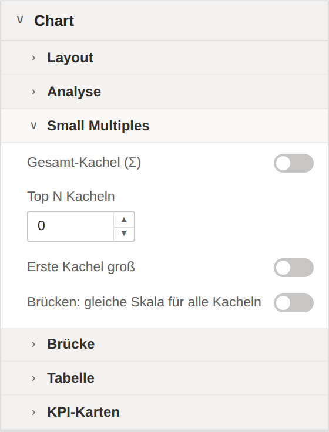

| Einstellung | Beschreibung | Optionen / Standard |
| --- | --- | --- |
| Gesamt-Kachel (Σ) | Stellt eine „Σ Gesamt"-Kachel voran — Summe über alle Gruppen, auf derselben Skala (IBCS). | An / Aus · Standard Aus |
| Top N Kacheln | Zeigt nur die N größten Gruppen (nach Summe AC) als Kacheln — die übrigen werden zu einer „Rest"-Kachel aggregiert. 0 = alle. | 0–24 · Standard 0 |
| Erste Kachel groß | Gibt der ersten Kachel (z. B. „Σ Gesamt" oder der größten Gruppe) mehr Platz — alle Kacheln behalten dieselbe Skala (IBCS CT 13). | An / Aus · Standard Aus |
| Brücken: gleiche Skala für alle Kacheln | Skaliert auch die Brücken-Modi (Integrierte Brücke, Kategorie-Brücke) über alle Kacheln identisch (IBCS). Standard: aus — jede Brücken-Kachel skaliert für sich. Säulen, Balken und Wasserfall teilen sich die Skala immer. | An / Aus · Standard Aus |

#### Brücke

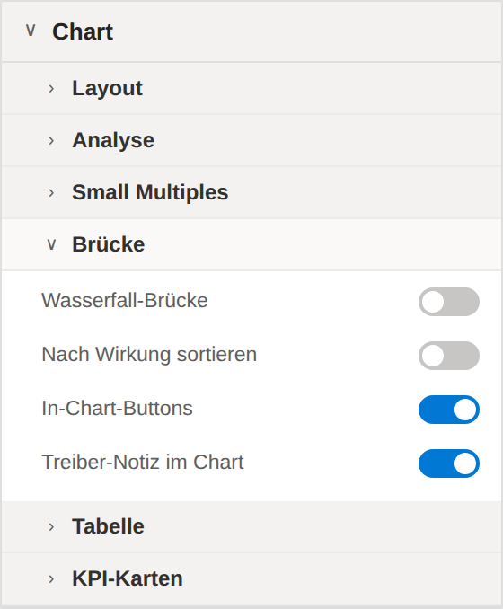

| Einstellung | Beschreibung | Optionen / Standard |
| --- | --- | --- |
| Wasserfall-Brücke | Nur Columns/Bars: zeigt die Kategorien als Wasserfall-Brücke von der Basis (PY/PL) zu AC mit Verbindungslinien, statt als einzelne Balken. Optional — Standard ist aus. | An / Aus · Standard Aus |
| Nach Wirkung sortieren | Nur bei Waterfall bridge: sortiert die Kategorien nach Abweichungsgröße (größter Treiber zuerst). Eine Top-N-Rest-Zeile bleibt am Ende. Auch per Klick auf das ⇅-Symbol im Chart umschaltbar. | An / Aus · Standard Aus |
| In-Chart-Buttons | Integrierte/Kategorie-Brücke: zeigt klickbare Buttons oben rechts im Chart — ΔPY/ΔPL-Referenz-Umschalter, ⇅ Sortierung und ▶ Aufbau-Animation. Der Enduser kann die Varianz-Basis direkt im Bericht wechseln; die Wahl wird persistiert. | An / Aus · Standard An |
| Treiber-Notiz im Chart | Kategorie-Brücke: kursive Notiz am größten Treiber („größter Treiber · n % der Gesamtabweichung“) — überlagert den Zeilenbereich, hier abschaltbar. | An / Aus · Standard An |

#### Tabelle

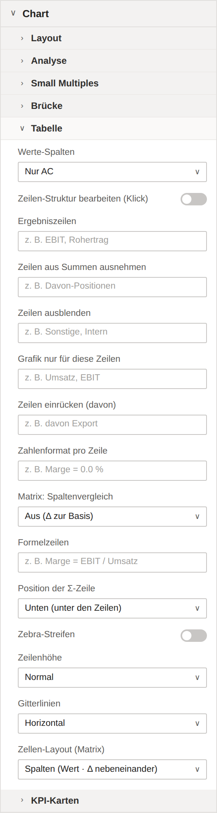

| Einstellung | Beschreibung | Optionen / Standard |
| --- | --- | --- |
| Werte-Spalten | Zusätzliche Zahlenspalten neben AC: die Varianzbasis (PY oder PL, je nach Abweichungsbasis) oder beide Referenzszenarien — für druck- und boardtaugliche Tabellen ohne Balken-Interpretation. | Optionen: Nur AC \| AC + Varianzbasis \| AC · PY · PL · Standard „Nur AC“ |
| Zeilen-Struktur bearbeiten (Klick) | Bearbeitungsmodus: Klick auf eine Zeile öffnet ein kleines Menü mit „Invertieren“, „Ergebniszeile“ und „Aus Summen ausnehmen“ — die Ein-Klick-GuV ohne Datenmodell-Änderung. Die Wahl wird in den Listen unten persistiert; zum Berichten wieder ausschalten. | An / Aus · Standard Aus |
| Ergebniszeilen | Kommagetrennte Zeilennamen, die als Ergebniszeilen formatiert werden (fett, Trennlinie, vom Σ ausgenommen; im Wasserfall als Anker) — Alternative zur Waterfall-Typ-Rolle. | Freitext · z. B. EBIT, Rohertrag |
| Zeilen aus Summen ausnehmen | Kommagetrennte Zeilennamen, die nicht in Σ-Zeile, Skalen und Wasserfall-Kaskade einfließen (z. B. nachrichtliche Positionen). Die Zeile bleibt sichtbar, wird aber dezent dargestellt. | Freitext · z. B. Davon-Positionen |
| Zeilen ausblenden | Kommagetrennte Zeilennamen, die nur ausgeblendet werden — Σ-Zeile, Skalen und Formeln rechnen weiter mit ihnen (anders als „Aus Summen ausnehmen“). Auch per Klick im Struktur-Modus setzbar. | Freitext · z. B. Sonstige, Intern |
| Grafik nur für diese Zeilen | Kommagetrennte Zeilennamen: Wenn befüllt, zeigen nur diese Zeilen die Balken-/Pin-Grafiken — alle anderen bleiben reine Zahlenzeilen. Leer = Grafiken überall. Die Σ-Zeile behält ihre Grafik immer. | Freitext · z. B. Umsatz, EBIT |
| Zeilen einrücken (davon) | Kommagetrennte Zeilennamen, die als „davon:“-Positionen eingerückt und dezent dargestellt werden — ohne Hierarchie-Feld. Meist kombiniert mit „Aus Summen ausnehmen“. | Freitext · z. B. davon Export |
| Zahlenformat pro Zeile | Zahlenformat pro Zeile, mit Semikolon getrennt: „Marge = 0.0 %; Menge = #,0“. Prozent multipliziert mit 100; Werte erscheinen unskaliert (keine T€-Teilung) — für gemischte €-, %- und Stück-Zeilen. | Freitext · z. B. Marge = 0.0 % |
| Matrix: Spaltenvergleich | Vergleich innerhalb der Matrix-Spalten: „Δ vs. Vorspalte“ ersetzt das ΔBasis je Block durch die Veränderung zur vorherigen Spalte (Periodenvergleich Q2 vs. Q1, Mär vs. Feb …). | Optionen: Aus (Δ zur Basis) \| Δ zur Vorspalte · Standard „Aus (Δ zur Basis)“ |
| Formelzeilen | Berechnete Zeilen, mit Semikolon getrennt: „EBIT = Umsatz - Kosten“ ergänzt eine Summenzeile, „Marge = EBIT / Umsatz“ eine %-Zeile. Operanden sind Zeilennamen; Operatoren bitte mit Leerzeichen umgeben. Formelzeilen fließen nicht in die Σ-Zeile ein. | Freitext · z. B. Marge = EBIT / Umsatz |
| Position der Σ-Zeile | Wo die Σ-Gesamtzeile steht: „Unten“ (Standard, deutsche GuV-Lesart) unter allen Zeilen, „Oben“ direkt unter dem Kopf (IBCS). Bleibt beim Scrollen fixiert. | Optionen: Unten (unter den Zeilen) \| Oben (unter dem Kopf) · Standard „Unten (unter den Zeilen)“ |
| Zebra-Streifen | Legt jede zweite Datenzeile mit einem sehr dezenten Hintergrund an — leichtere Zeilenverfolgung in breiten Tabellen. Im Hochkontrast-Modus aus. Standard aus. | An / Aus · Standard Aus |
| Zeilenhöhe | Zeilenhöhe: „Kompakt“ für dichte Tabellen, „Normal“ (Standard) wie bisher, „Luftig“ für mehr Weißraum. Skaliert nur die Obergrenze; sehr hohe Visuals bleiben gedeckelt. | Optionen: Kompakt \| Normal \| Luftig · Standard „Kompakt“ |
| Gitterlinien | Trennlinien-Stil: „Horizontal“ (Standard) nur Zeilenlinien, „Keine“ für ein ruhiges Bild, „Horizontal + vertikal“ ergänzt dezente Spalten-/Blocktrenner. | Optionen: Horizontal \| Keine \| Horizontal + vertikal · Standard „Horizontal“ |
| Zellen-Layout (Matrix) | Nur Matrix: „Spalten“ (Standard) zeigt Wert und ΔBasis nebeneinander. „Zwei Zeilen“ setzt den Wert groß nach oben und die kleinere Δ-Zahl direkt darunter in dieselbe Zelle — die Matrix wird etwa halb so breit. Der Δ-Minibalken entfällt dabei; Referenzspalten bleiben eigene Spalten neben dem Wert. | Optionen: Spalten (Wert · Δ nebeneinander) \| Zwei Zeilen: Wert oben, Δ darunter · Standard „Spalten (Wert · Δ nebeneinander)“ |

#### KPI-Karten

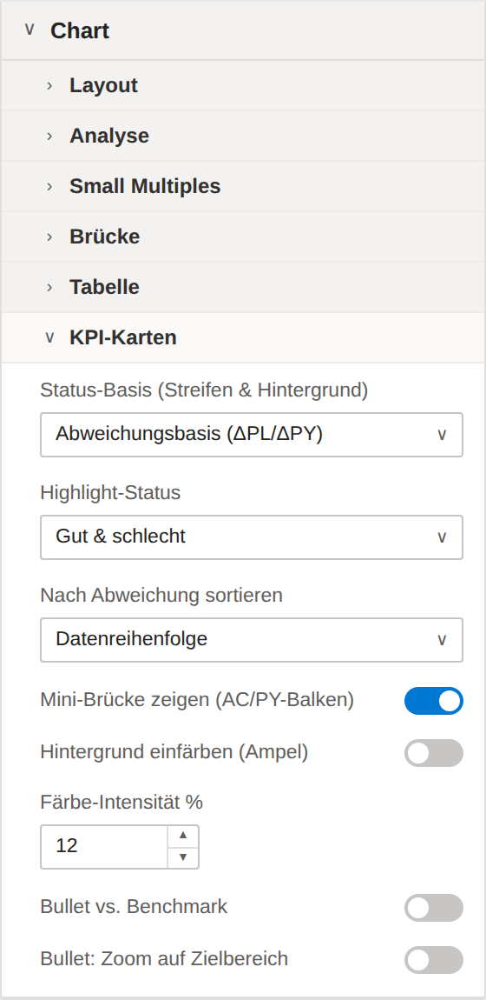

| Einstellung | Beschreibung | Optionen / Standard |
| --- | --- | --- |
| Status-Basis (Streifen & Hintergrund) | Wogegen Streifen und Hintergrund-Ampel bewerten: gegen die Abweichungsbasis (ΔPL bzw. ΔPY) oder gegen die gebundene Benchmark-Measure — für Monitoring gegen Zielwerte/Schwellen. | Optionen: Abweichungsbasis (ΔPL/ΔPY) \| Benchmark (BM) · Standard „Abweichungsbasis (ΔPL/ΔPY)“ |
| Highlight-Status | Welche Richtung farbig hervorgehoben wird: beide (Ampel), nur schlechte (Problem-Monitoring — Positives bleibt neutral) oder nur gute (Erfolgs-Board). Gilt für Streifen, Hintergrund, Δ-Zeilen und Bullet. | Optionen: Gut & schlecht \| Nur schlechte \| Nur gute · Standard „Gut & schlecht“ |
| Nach Abweichung sortieren | Ordnet die Karten nach der farbrelevanten Abweichung (Benchmark bzw. ΔPL/ΔPY, je nach Status-Basis): größte Abweichung oben-links — für maximalen Fokus. „Datenreihenfolge“ lässt sie wie im Modell. | Optionen: Datenreihenfolge \| Größte Abweichung zuerst \| Schlechteste zuerst (oben) \| Beste zuerst (oben) · Standard „Datenreihenfolge“ |
| Mini-Brücke zeigen (AC/PY-Balken) | Zeigt die kleine Balken-Brücke Basis → Δ → AC unten auf der Karte. Aus: reine Zahlen-Karte (großer Wert + Δ-Zeilen), ruhiger für dichte KPI-Wände. | An / Aus · Standard An |
| Hintergrund einfärben (Ampel) | Färbt den Karten-Hintergrund dezent: leicht grün wenn besser, leicht rot wenn schlechter als die Status-Basis — neutral (unterhalb der Wesentlichkeit) bleibt ohne Farbe. Für Monitoring-Wände; im Hochkontrast-Modus aus. | An / Aus · Standard Aus |
| Färbe-Intensität % | Deckkraft der Hintergrund-Färbung in Prozent (4–40). Standard 12 — kräftiger für Kontrollraum-Monitore, dezenter für Board-Reports. | 4–40 · Standard 12 |
| Bullet vs. Benchmark | Kleines Bullet-Chart auf der Karte: AC-Balken auf hellem Band, Benchmark als Tick — unter der Zahl (Stapel-Layout) bzw. neben den Δ-Zeilen (flaches Layout). Braucht die Benchmark-Rolle. | An / Aus · Standard Aus |
| Bullet: Zoom auf Zielbereich | Spreizt das Bullet auf den Bereich um AC und Benchmark statt bei Null zu starten — KPIs nahe am Ziel (97 vs. 99) werden unterscheidbar. Der Achsenbruch am linken Balkenende kennzeichnet die gekappte Skala. | An / Aus · Standard Aus |

### IBCS-Farben

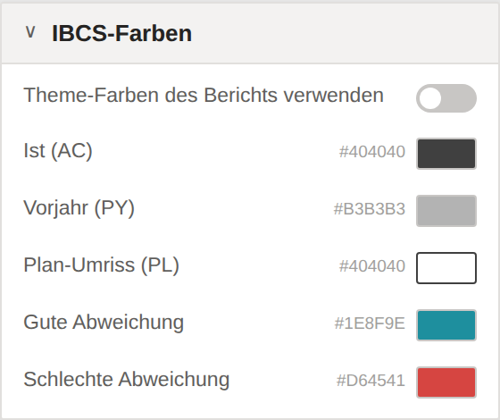

| Einstellung | Beschreibung | Optionen / Standard |
| --- | --- | --- |
| Theme-Farben des Berichts verwenden | Übernimmt Good/Bad und Neutralfarben aus dem Berichtsdesign (Theme) statt der Farbwähler unten. | An / Aus · Standard Aus |
| Ist (AC) | — | Standard #404040 |
| Vorjahr (PY) | — | Standard #B3B3B3 |
| Plan-Umriss (PL) | — | Standard #404040 |
| Gute Abweichung | Standard ist das DatenWG-Teal (#1E8F9E) statt klassischem Grün — durch den Blauanteil bleibt „gut“ auch bei Rot-Grün-Schwäche klar vom Rot unterscheidbar. Hier übersteuerbar. | Standard #1E8F9E |
| Schlechte Abweichung | — | Standard #D64541 |

### Datenbeschriftungen

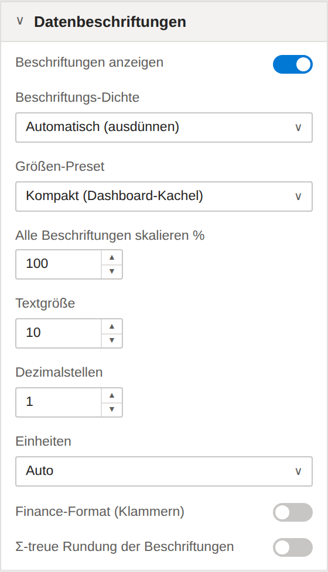

| Einstellung | Beschreibung | Optionen / Standard |
| --- | --- | --- |
| Beschriftungen anzeigen | — | An / Aus · Standard An |
| Beschriftungs-Dichte | Steuert die Ausdünnung der Wertbeschriftungen: „Automatisch" blendet bei Platzmangel aus (bisheriges Verhalten), „Alle" beschriftet jeden Punkt (kann überlappen), „Anfang · Ende · Extrema" zeigt nur ersten/letzten Wert sowie Minimum und Maximum. | Optionen: Automatisch (ausdünnen) \| Alle \| Anfang · Ende · Extrema · Standard „Automatisch (ausdünnen)“ |
| Größen-Preset | Skaliert alle Schriften im Visual auf einmal: Kompakt ×1 (Standard) · Full HD ×1,5 (empfohlen für 1080p-Berichte) · Präsentation ×2. | Optionen: Kompakt (Dashboard-Kachel) \| Full HD (1080p) \| Präsentation (4K / Beamer) · Standard „Kompakt (Dashboard-Kachel)“ |
| Alle Beschriftungen skalieren % | Vergrößert bzw. verkleinert ALLE Beschriftungen zusätzlich zum Preset um einen freien Faktor (50–300 %). 100 = neutral. Preset × Faktor ergibt die effektive Schriftgröße. | 50–300 · Standard 100 |
| Textgröße | — | 6–24 · Standard 10 |
| Dezimalstellen | — | 0–3 · Standard 1 |
| Einheiten | — | Optionen: Auto \| Keine \| Tausend (k) \| Millionen (M) \| Milliarden (B) · Standard „Auto“ |
| Finance-Format (Klammern) | Finanzkonvention für Zahlen: negative Werte in Klammern statt Minuszeichen — (1.234) — und Null als „–". Gilt für Wert- und Δ-Beschriftungen inkl. Δ %. | An / Aus · Standard Aus |
| Σ-treue Rundung der Beschriftungen | Rundet die Wertbeschriftungen nach dem Restwertverfahren so, dass sie exakt auf die Σ-Kopfzeile aufaddieren — keine Rundungsdifferenz-Nachfragen mehr. Aus = mathematisch exakte Einzelrundung, dafür erscheint bei Abweichung ein Rundungshinweis unter der Σ-Zeile. | An / Aus · Standard Aus |

### Kommentare

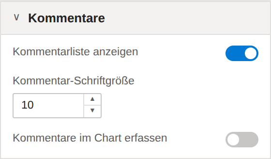

| Einstellung | Beschreibung | Optionen / Standard |
| --- | --- | --- |
| Kommentarliste anzeigen | Zeigt die Kommentare als nummerierte Liste rechts neben dem Chart — bleibt auch im PDF/PowerPoint-Export sichtbar. | An / Aus · Standard An |
| Kommentar-Schriftgröße | Schriftgröße der Kommentar-Liste in pt (8–24). Wird zusätzlich mit dem Schrift-Preset und dem Skalierungs-Faktor multipliziert, skaliert also mit dem Rest des Visuals mit. | 8–24 · Standard 10 |
| Kommentare im Chart erfassen | Kommentar-Modus: Klick auf eine Kategorie öffnet ein Eingabefeld — der Kommentar wird im Bericht gespeichert (bookmark-fähig, wandert mit der PBIX). Solange der Modus an ist, filtern Klicks nicht quer. Standard aus. | An / Aus · Standard Aus |

### Skala & Referenzlinie

#### Skalen-Sync

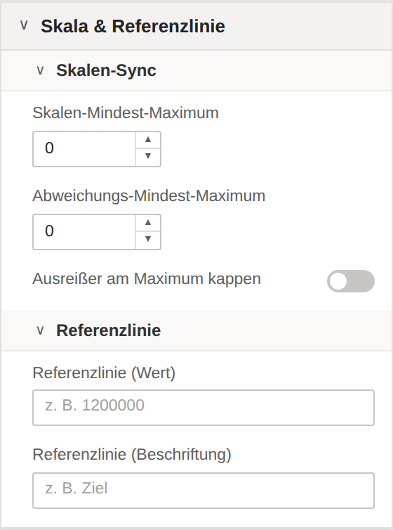

| Einstellung | Beschreibung | Optionen / Standard |
| --- | --- | --- |
| Skalen-Mindest-Maximum | Skaliert das Basis-Chart mindestens bis zu diesem Wert — für identische Skalen über mehrere Visuals (IBCS). 0 = automatisch. Größere Datenwerte erweitern die Skala weiterhin. | ab 0 · Standard 0 |
| Abweichungs-Mindest-Maximum | Wie oben, für das absolute Abweichungs-Panel (symmetrisch ±). 0 = automatisch. | ab 0 · Standard 0 |
| Ausreißer am Maximum kappen | Macht das Skalen-Maximum hart: größere Werte werden gekappt und mit Doppelstrich markiert (Label zeigt den echten Wert). | An / Aus · Standard Aus |

#### Referenzlinie

| Einstellung | Beschreibung | Optionen / Standard |
| --- | --- | --- |
| Referenzlinie (Wert) | Zeichnet eine Ziel-/Schwellenlinie bei diesem Wert quer durch das Basis-Chart. Leer = aus. | Freitext · z. B. 1200000 |
| Referenzlinie (Beschriftung) | — | Freitext · z. B. Ziel |

### Kategorienachse

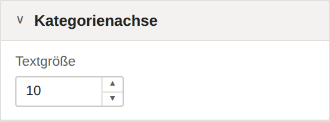

| Einstellung | Beschreibung | Optionen / Standard |
| --- | --- | --- |
| Textgröße | — | 6–24 · Standard 10 |

## 07 · FAQ & Troubleshooting

### Das Visual zeigt nur einen Hinweis wie „benötigt PY oder PL“.

Die Modi Integrierte Brücke, Kategorie-Brücke, GuV-Statement, Dumbbell und Slope brauchen eine Vergleichsbasis. Binde eine Kennzahl in die Rolle Vorjahr (PY) oder Plan (PL). Bei rein negativen Summen wechselst du auf Waterfall oder Columns mit Wasserfall-Brücke.

### Warum gibt es keine Laufsumme (YTD) in der Matrix?

Die Kumulierung ist in der Matrix bewusst deaktiviert: sie würde über die flache Zeilenliste kumulieren und die Spaltengruppen (z. B. Quartale) doppelt zählen. Nutze YTD im Columns- oder Line-Modus, oder rechne die Laufsumme als Measure im Datenmodell.

### Die Brücke bricht bei negativen Summen.

Integrierte und Kategorie-Brücke unterstützen keine rein negativen Summen — das Visual zeigt dann einen Hinweis statt einer kaputten Grafik. Nimm den Wasserfall-Modus oder Columns/Bars mit aktivierter Wasserfall-Brücke.

### Die Zahlen erscheinen in K€ statt T€.

Die Anzeigeeinheiten stehen auf Auto oder Tausend (k). Stelle Datenbeschriftungen → Einheiten auf die gewünschte Stufe; die Einheit erscheint im Titel. Für gemischte €-/%-/Stück-Zeilen nutzt du „Zahlenformat pro Zeile“ in der Tabelle.

### Beim PDF-/PowerPoint-Export fehlt das horizontale Scrollen der Matrix.

Ein Standbild ist nicht scrollbar, daher greift im Export der „… +n“-Hinweis. Verschmälere die Matrix vorher: Zwei-Zeilen-Kompaktmodus, Werte-Spalten reduzieren, Spaltenbreiten anpassen oder Spaltengruppen zuklappen.

### PY erscheint als Dreieck statt als Säule.

Bei drei gebundenen Szenarien (AC + PY + PL) zeigt das Visual PY nach IBCS als graues Dreieck, um die Säule nicht zu überladen. Abschalten über Chart → Layout → „PY als Dreieck“.

### Die Farben „gut/schlecht“ passen nicht zu meiner KPI (z. B. Kosten).

Für Kosten ist ein höherer Wert schlecht. Aktiviere Chart → Analyse → „Invertieren“ global oder „Invertieren je Kategorie“ für einzelne Zeilen (z. B. Aufwandspositionen neben Umsatz).

### Der Filterkontext steht nicht in der Fußzeile.

Report-Filter sind für Custom Visuals nicht per API sichtbar. Binde eine Text-Measure (z. B. via SELECTEDVALUE/CONCATENATEX) in die Rolle „Filter-Info“ und aktiviere die Filter-Fußzeile in der Karte „IBCS-Titel“.

### Unter der Σ-Zeile erscheint ein Rundungshinweis.

Aktiviere Datenbeschriftungen → „Σ-treue Rundung der Beschriftungen“. Dann werden die Einzelbeschriftungen nach dem Restwertverfahren so gerundet, dass sie exakt auf die Σ-Kopfzeile aufaddieren.

**ChartKitchen byDatenWG** · Version 1.38.0.0

Kontakt: Michael Tenner · [michael.tenner84@gmail.com](mailto:michael.tenner84@gmail.com)

Ein Änderungsprotokoll (Changelog) liegt der Visual-Auslieferung bei.

> IBCS® ist eine eingetragene Marke der IBCS Association. Dieses Visual ist von den IBCS-Prinzipien inspiriert und steht in keiner Verbindung zur IBCS Association.

---

## Weitere Fassungen dieser Seite

- HTML (maßgeblich): https://datenwgknowledgekitchen.com/chartkitchen-doku.html
- PDF: [chartkitchen-doku.pdf](../chartkitchen-doku.pdf)
- Englisch: [chartkitchen-doku_en.html](../chartkitchen-doku_en.html) · [chartkitchen-doku_en.md](chartkitchen-doku_en.md)
- Schnellstart: [chartkitchen-schnellstart.html](../chartkitchen-schnellstart.html) · [chartkitchen-schnellstart.md](chartkitchen-schnellstart.md)
- Referenz für KI-Agenten (Datenvertrag, alle Format-Properties): [ibcsInspiredChartDeck/AGENT-GUIDE.md](../ibcsInspiredChartDeck/AGENT-GUIDE.md)
