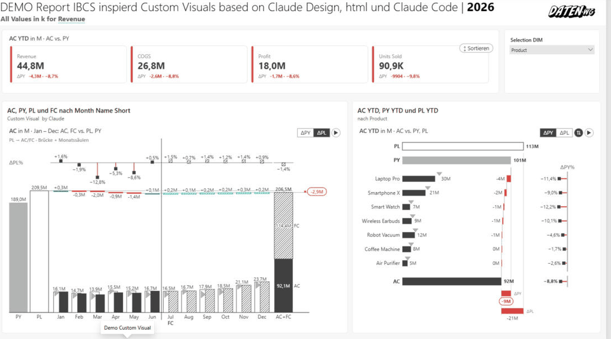

# ChartKitchen byDatenWG — Quick Start

> Markdown version of [chartkitchen-schnellstart_en.html](../chartkitchen-schnellstart_en.html) · https://datenwgknowledgekitchen.com/chartkitchen-schnellstart_en.html · generated with scripts/build_md.py — if the two differ, the HTML version prevails.

Power BI visual · Quick start

One Power BI visual with 13 IBCS-inspired modes — from columns, lines and waterfall to table, matrix and a full P&L statement. Understand in two minutes what the visual does, how to get going and where to find the full documentation.

13 modes · DE · EN · ES · JA · Version 1.42.0.0

*Power BI · A complete report page: KPI cards, an AC/FC monthly bridge and a YTD bridge by product — every tile comes from the same ChartKitchen visual.*

### Download the visual

Version **1.42.0.0** · **.pbiviz** · 23.08.2026

Direct download, no registration — this link always serves the latest release. Import in Power BI Desktop: *Visualizations → “…” → Import a visual from a file*. All builds are also available on [GitHub](https://github.com/Losveratos/Power-BI-Custom-Visuals-byDatenWG).

**Download:** https://datenwgknowledgekitchen.com/downloads/chartkitchen-byDatenWG-latest.pbiviz

> **Beta notice:** As long as ChartKitchen is not listed in Microsoft AppSource, every build is a beta version — not certified by Microsoft. Please try it in a test report first; using it in production reports is at your own risk. Feedback is very welcome at [michael.tenner84@gmail.com](mailto:michael.tenner84@gmail.com?subject=ChartKitchen%20byDatenWG%20—%20Feedback).

### For AI agents: the Agent Guide

**AGENT-GUIDE.md** · machine-readable reference · always matches the current release

ChartKitchen ships with something few custom visuals have: **documentation written for AI assistants** — the full data contract (field roles incl. pitfalls), all ~90 formatting properties with exact names and values for PBIR authoring, the persisted states (sort order, expand state, column widths), formula syntax, DAX rules and the known traps. With it, an agent — Claude, Copilot, Cursor & co. — can *configure the visual correctly instead of guessing*: complete report pages from a prompt, including settings you would otherwise have to click together by hand.

**How to use it:** ① Hand the guide to your agent — paste the link into the chat, drop the file into your project, or put it next to your `CLAUDE.md`/`AGENTS.md`. ② State the task (“report page: columns with ΔPL, YTD button, table sorted by ΔPY”). ③ The agent writes the matching configuration with exact property names — the guide also tells it what the data model needs to look like.

**Agent guide:** [ibcsInspiredChartDeck/AGENT-GUIDE.md](../ibcsInspiredChartDeck/AGENT-GUIDE.md) · absolute: https://datenwgknowledgekitchen.com/ibcsInspiredChartDeck/AGENT-GUIDE.md

Direct link to paste into your agent chat: `datenwgknowledgekitchen.com/ibcsInspiredChartDeck/AGENT-GUIDE.md` · also on [GitHub](https://github.com/Losveratos/PowerBI-Kitchen-/blob/main/ibcsInspiredChartDeck/AGENT-GUIDE.md). The guide itself is in German — every capable agent reads it fine; an English edition may follow.

## 01 · Get going in three steps

From the import file to a finished IBCS chart — two or three fields are enough for the first diagram.

1. **Import the .pbiviz** — In Power BI Desktop, in the *Visualizations* pane click `…` → *Import a visual from a file* and pick the `.pbiviz` file. The ChartKitchen icon appears and can be dragged onto the page.
2. **Fill Category + AC** — Assign your axis to the *Category* role and your measure to the *Actual (AC)* role. Landing tiles appear — click a mode and the visual draws it right away.
3. **Add PY / PL** — Add *Previous year (PY)* and *Plan (PL)*. Variances follow automatically: absolute and relative variance panels sit next to or above the base chart with no extra work.

Every step in detail — import, minimal setup and field roles — is in the [Quick start chapter of the documentation →](../chartkitchen-doku_en.html#quickstart)

## 02 · Continue in the documentation

Each tile jumps straight to the matching section of the full documentation.

- **[Quick start](../chartkitchen-doku_en.html#quickstart)** · Chapter 02 — Import, minimal setup and the field roles Category, AC, PY, PL — step by step.
- **[The 13 modes](../chartkitchen-doku_en.html#modes)** · Chapter 03 — Columns, bars, line, waterfall, bridge, table, matrix, KPI cards, P&L and more — every mode explained.
- **[In action](../chartkitchen-doku_en.html#inaction)** · Chapter 04 — Real Power BI examples: complete report pages, monitoring, comparisons and more.
- **[Features in detail](../chartkitchen-doku_en.html#features)** · Chapter 05 — Scenario notation, small multiples, comments, cumulation, Top N and the remaining features.
- **[Settings reference](../chartkitchen-doku_en.html#settings)** · Chapter 06 — All 84 settings across seven format cards — with schematic sketches of the format pane.
- **[FAQ & troubleshooting](../chartkitchen-doku_en.html#faq)** · Chapter 07 — Common questions, typical pitfalls and quick answers around the visual.
- **[Docs as PDF (EN)](../chartkitchen-doku_en.pdf)** · Download — The complete English documentation as a PDF for offline reading and sharing.

**ChartKitchen byDatenWG** · Version 1.42.0.0

Contact: Michael Tenner · [michael.tenner84@gmail.com](mailto:michael.tenner84@gmail.com)

The full documentation is available as a [web page](../chartkitchen-doku_en.html) and as a [PDF](../chartkitchen-doku_en.pdf).

> IBCS® is a registered trademark of the IBCS Association. This visual is inspired by the IBCS principles and is not affiliated with the IBCS Association.
