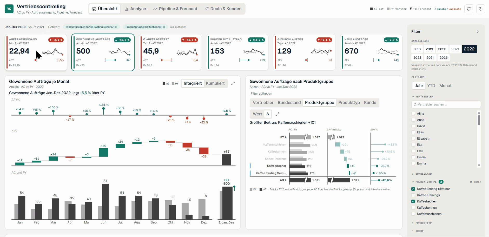
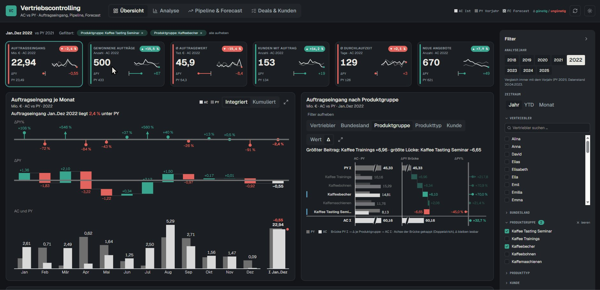
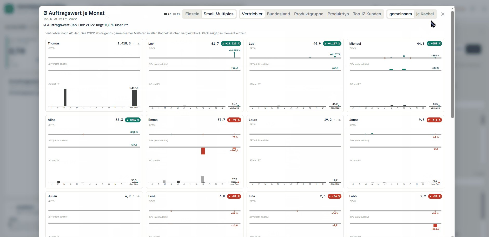
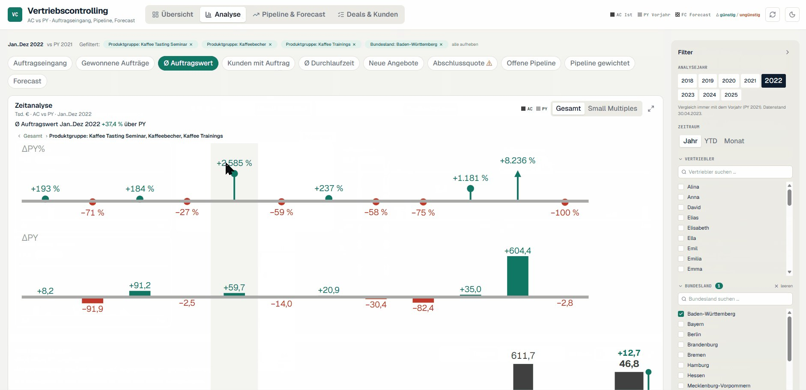
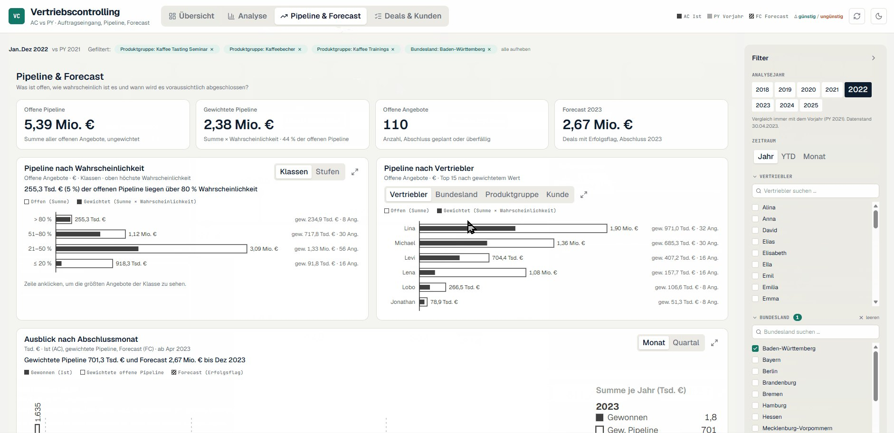
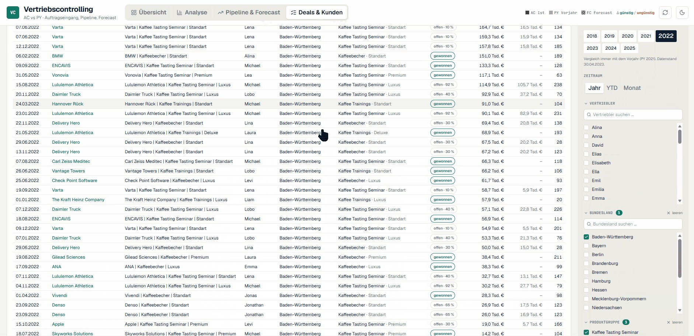
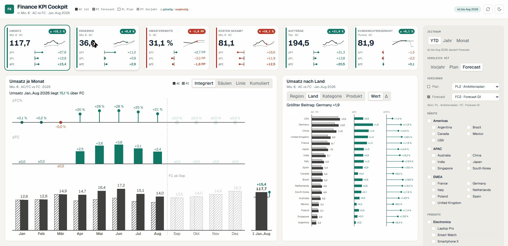
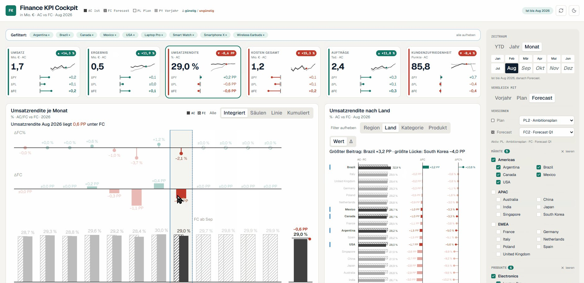
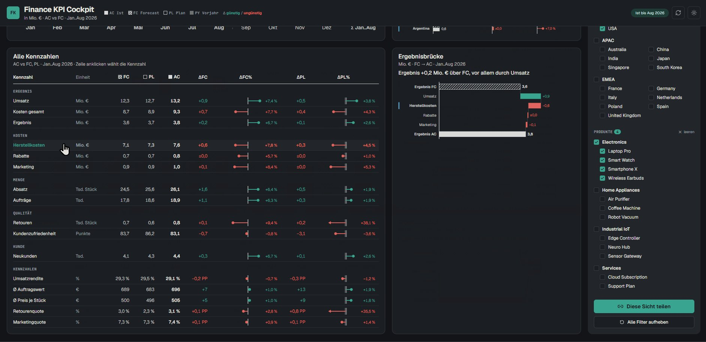
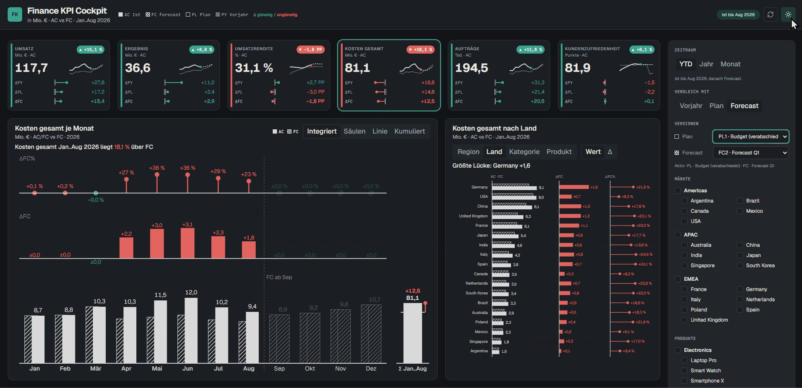

# Fabric Apps on Power BI's Home Turf: Sales and Finance

> Markdown version of [fabric-apps-controlling-post_en.html](../fabric-apps-controlling-post_en.html) · https://datenwgknowledgekitchen.com/fabric-apps-controlling-post_en.html · generated with scripts/build_md.py — if the two differ, the HTML version prevails.

Post · Fabric Apps & Visualization

Fabric Apps are now available in our Fabric environment. Let's start to test them. I have seen many, many great, fancy, super cool apps. Then I got the idea: why not build something? Many people need a lot of **sales controlling and finance reporting**. I would call this the classic home turf of Power BI reports. With clear standards instead of show.

By **Michael Tenner** · Updated · **October 2026** · Tools · **Rayfin CLI · Claude Code · MockupKitchen · ChartKitchen** · Status · **Fabric Apps (Preview)**

Visualisation Fabric IBCS

**Demo video:** ../assets/fabric-apps/fabric-apps-live.mp4

**Poster frame:** ../assets/fabric-apps/fabric-apps-live-poster.jpg

**89 seconds, recorded live, no cuts:** first the sales controlling app with dark mode, filters, analysis, pipeline, deals and the zoom into small multiples. Then the Finance KPI Cockpit with AC against PY, plan and forecast. All data is demo data.

## What are *Fabric Apps?*

Fabric Apps are a new item type in Microsoft Fabric, currently in preview. Microsoft introduced them at Build 2026 together with **Rayfin**, an open-source SDK and CLI. You write a web app in TypeScript and React, connect it to Fabric data through connectors and deploy it to a workspace with `rayfin up`. Sign-in runs through Fabric SSO, and everyone only sees the data they can access in the model.

For reporting, the connector to the **semantic model** is the interesting one. The app sends DAX queries to the existing model through the Execute Queries API. The model stays the data source. The app handles display and interaction.

> ### The basics at Microsoft Learn
>
> - [What is Fabric Apps (Preview)?](https://learn.microsoft.com/fabric/apps/overview) · overview, prerequisites and capacity
> - [Create your first Fabric app](https://learn.microsoft.com/fabric/apps/create-app) · quick start with Node and Rayfin
> - [Create a Fabric app with the Rayfin CLI](https://learn.microsoft.com/fabric/apps/create-app-with-cli) · the command-line route
> - [Connect Fabric Apps to Fabric data](https://learn.microsoft.com/fabric/apps/connectors) · connectors for semantic model, lakehouse, warehouse
> - [Create an app connected to a semantic model](https://learn.microsoft.com/fabric/apps/data-apps-template) · an app on a semantic model
> - [Deploy a Fabric app to Fabric](https://learn.microsoft.com/fabric/apps/deploy-app) · what `rayfin up` does
> - [Troubleshoot Fabric Apps](https://learn.microsoft.com/fabric/apps/troubleshooting) · known limits
> - [Fabric region availability](https://learn.microsoft.com/fabric/admin/region-availability) · Fabric Apps are not available in every region yet
> - [Datasets · Execute Queries](https://learn.microsoft.com/rest/api/power-bi/datasets/execute-queries) · the API behind the model connector
> - [Build 2026 announcement](https://azure.microsoft.com/en-us/blog/microsoft-build-2026-building-agentic-apps-with-microsoft-fabric-and-microsoft-databases/) · Azure Blog

## What we *built*

Two apps in the same workspace, both on an existing semantic model. Each one took about an hour.

- **Sales controlling:** four pages with overview, analysis, pipeline & forecast, and deals & customers. Order intake AC against PY, integrated variance analysis, structure bridge, value driver tree and a zoom that turns one chart into small multiples.
- **Finance KPI Cockpit:** six KPIs against previous year, plan and forecast, with selectable plan and forecast versions, forecast hatched from the first open month, all KPIs as a table, and a profit bridge.

***Overview:** KPI cards, integrated variance analysis per month, structure bridge per product group.*

***Dark mode:** one click, same notation.*

***Zoom:** from one chart into small multiples, switchable by dimension.*

***Analysis:** pick a KPI, small multiples and value driver tree.*

***Pipeline & forecast:** open quotes by probability and salesperson.*

***Deals & customers:** every quote in detail, demo data.*

***Finance KPI Cockpit:** ΔPY, ΔPL and ΔFC on every card.*

***Filters:** visible above the page, removed with one click.*

***All KPIs:** table and profit bridge.*

***Versions:** switch plan and forecast directly.*

Things I really like: the **filters showing above the page**, easy to see and to delete. The **zoom with new actions**. And the "best": the easy switch to **dark mode**. I never would have built this in Power BI :-) Every view is also stored in the URL, so you can share exactly that state.

## How we built it: *a playbook*

To get Fabric Apps that follow IBCS-inspired guidelines, I used the skill I created in combination with MockupKitchen and the code developed for my custom Power BI visuals. This became my first attempt at a playbook for a reproducible, IBCS-inspired Fabric App setup for my coding agent with Rayfin.

### 1 · Page framework — MockupKitchen

Header band, KPI bar, tile grid and filter panel on the right. Every tile has a title, a subtitle and a key message. So it is clear **what** belongs on the page before a single line of code exists.

### 2 · Proven chart patterns — ChartKitchen · Custom Visuals

Integrated variance analysis, pins for percentage variances, bridges, value driver tree. These patterns already run as Power BI custom visuals. The agent **ports them** instead of reinventing them.

### 3 · Rules as a skill — Notation · Colors · Interaction

Scenarios, colors for good and bad, scaling, labeling. Plus rules for interaction based on the Shneiderman mantra: overview first, zoom and filter, then details on demand.

### 4 · Build, test, deploy — Claude Code · Rayfin CLI

The coding agent sets up the project, writes the DAX queries for the connector, builds the pages, runs the tests and deploys with `rayfin up`. For larger pages, several agents work in parallel against the same data context.

~1 hour — **per app, from an empty project to a deployed Fabric App.** This works because the playbook already contains the decisions. The agent does not have to invent the page framework, chart patterns or notation.

## Why we rely on *standards*

Fabric Apps can do everything a web app can do. In controlling, that is exactly the risk. A financial report is read again every month, by people who have to decide fast. They do not need fancy fireworks. They need a **reliable workhorse** that works the same way every time.

A well-known standard for this is the **International Business Communication Standards (IBCS)**. They define how scenarios, variances and structures are shown in a consistent way. Since June 2026 there is IBCS version 2.0, aligned with the new standard **ISO 24896** for notation in business reporting. Our apps pick up some of its concepts:

**AC · Actual** Solid and dark

**PY · Previous year** Grey

**PL · Plan** Outlined

**FC · Forecast** Hatched

On top of that come variances as their own chart, consistent scaling and a clear color for good and bad. Instead of green we use our Kitchen teal, so the colors stay distinguishable with red-green color blindness.

With a coding agent, a standard becomes even more valuable. **It is a specification the agent can follow.** Without a standard, the agent invents a new design for every app, and you have to learn to read each app again. With a standard, the third app looks like the first, and readers recognize AC, PY, plan and forecast right away. That makes the result reproducible, and that is exactly what the playbook is about.

> ### The basics on IBCS
>
> - [IBCS · International Business Communication Standards](https://www.ibcs.com/) · home page
> - [IBCS Standards Version 2.0](https://www.ibcs.com/ibcs-version-2-0/) · since June 2026, aligned with ISO 24896
> - [ISO 24896 at IBCS](https://www.ibcs.com/iso-24896/) · what the standard covers
> - [ISO 24896:2026 · Notation for business reporting](https://www.iso.org/standard/88366.html) · the standard at ISO
> - [IBCS Association](https://www.ibcs.com/ibcs-association/) · non-profit association that publishes the standards freely under Creative Commons

## Git: a clean workflow, *even without official support*

For me, reproducible also means versioned. That is why the workspace is connected to a private GitHub repository through the **Fabric Git integration**. Semantic models, reports, the lakehouse and the other items sync there automatically.

For the apps, though, Fabric source control shows **"Unsupported"**. Right now Fabric Apps are not yet among the items Microsoft supports for Git integration. Fabric simply skips them during sync. That is not a setup error. It is the current state of the preview.

We did not want to wait for that. So we put the app source code into the same repository **on purpose**, in its own folder next to the items from the Fabric sync. Fabric ignores that folder because it contains no item definitions. This way the app side follows a sensible workflow too:

- **One repository for everything:** model, report and app code live together and share one history.
- **Branches and merges:** changes to the apps go through their own branch and get merged, like any other code.
- **No secrets in the repo:** environment files, deployment state and data exports stay out. After cloning, they are created again locally.
- **Rebuild instead of copy:** from the repository, every app can be deployed with `rayfin up` to another workspace, for example a separate demo or test workspace.

As soon as Microsoft adds the app item to the Git integration, the folder can move into the regular sync. Until then, this is the pragmatic way.

> ### Git and environments at Microsoft Learn
>
> - [What is Microsoft Fabric Git integration?](https://learn.microsoft.com/fabric/cicd/git-integration/intro-to-git-integration) · including the list of supported items
> - [Manage dev and prod environments with the Rayfin CLI](https://learn.microsoft.com/fabric/apps/dev-prod-workflow) · dev and prod workspaces for Fabric Apps

## What you should *keep in mind*

It is not all sunshine. These points belong to an honest assessment:

- **Calculation logic moves into the app code.** If the app calculates KPIs in the browser, that logic no longer lives in the semantic model. It has to be tested and documented, otherwise you get two versions of the truth.
- **Governance.** The Fabric Git integration does not support the app item yet. The workaround with its own folder in the repository needs to be maintained deliberately, see above.
- **Preview and regions.** Fabric Apps are in preview, the tenant admin has to enable them, and not every region supports them.
- **Capacity and limits.** Apps consume Capacity Units, and small capacities throttle quickly. The Execute Queries API has limits on rows and queries per minute.
- **No replacement for Power BI.** For many reports, a Power BI report stays the easier way. Fabric Apps pay off where interaction makes the difference.

## Why this *makes sense*

Fabric Apps are an addition, not a replacement. They get exciting when you combine them with standards and a playbook. Then you get the freedom of a web app without starting from zero with every app. The semantic model stays the source, the notation stays the same, and the agent builds in an hour what otherwise costs days of design and alignment.

This is a first attempt. **What do you think?** I would love feedback, criticism and your own experiments.

Questions, criticism, your own experiments: **Michael Tenner** · [michael.tenner84@gmail.com](mailto:michael.tenner84@gmail.com)

All numbers, customers and names shown are demo data. Tools: Rayfin CLI, Claude Code, MockupKitchen, ChartKitchen.

Individual concepts such as scenario notation and variance display are inspired by IBCS®. The apps are not certified and have no affiliation with the IBCS Association. IBCS® is a registered trademark of the IBCS Institute.

---

## Read on

- HTML (authoritative): https://datenwgknowledgekitchen.com/fabric-apps-controlling-post_en.html
- German version: [fabric-apps-controlling-post.html](../fabric-apps-controlling-post.html) · [fabric-apps-controlling-post.md](fabric-apps-controlling-post.md)
