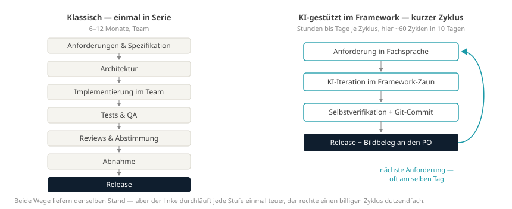
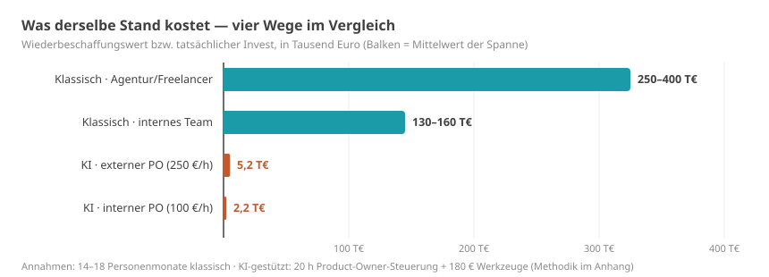

# Zehn Tage bis zum marktfähigen Stand

> Markdown-Fassung von [ki-entwicklung-zehn-tage.html](../ki-entwicklung-zehn-tage.html) · https://datenwgknowledgekitchen.com/ki-entwicklung-zehn-tage.html · generiert mit scripts/build_md.py — bei Abweichungen gilt die HTML-Fassung.

Talks & Post · KI & Wirtschaftlichkeit

Ich habe in zehn Tagen KI-gestützt ein Power-BI-Visual gebaut, das man ernsthaft benutzen kann — und dann nachgerechnet, was derselbe Stand klassisch gekostet hätte. Daraus ist ein **empirisch gestütztes Thesenpapier** geworden: jede Zahl aus der öffentlichen Git-Historie, Bewertung nach anerkannten Verfahren, jede Aussage mit Evidenz-Label. Hier die Essenz — das ganze Papier gibt es unten als PDF und Web-Version.

Von **Michael Tenner** · Stand · **Juli 2026** · Basis · **1 Fallstudie, 124 Commits, öffentlich** · Papier · **34 Seiten, v2.2**

Der Fall in drei Sätzen: Zwölf Diagrammtypen, eine Controlling-Tabelle mit Hierarchie, vier Sprachen, 80+ automatisierte Render-Tests — gebaut in zehn Kalendertagen, gesteuert von einer Person, die keinen Code getippt hat. Hätte ich das klassisch beauftragt, wäre ich nach meiner Schätzung bei 14 bis 18 Personenmonaten gelandet, irgendwo zwischen 150.000 und 350.000 Euro [Evidenz: S]. Tatsächlich gekostet hat es mich rund 20 dokumentierte Stunden Steuerung und 180 Euro für Werkzeuge [Evidenz: M].

13–93× — **Kostenhebel, ehrlich gerechnet** — also mit gleichem Leistungsumfang auf beiden Seiten. Die Schlagzeilen-Rechnung ergäbe bis zu 161×; die Gegenrechnung gegen die eigene Schlagzeile steht mit im Papier. Selbst bei sechsfacher Steuerungszeit bleibt ein Faktor von mindestens 5.

## Warum die Kosten so *unterschiedlich* entstehen

Der Unterschied liegt nicht bei den Stundensätzen, sondern im Prozess: Der klassische Weg durchläuft jede Stufe einmal — teuer und in Serie. Der KI-gestützte Weg durchläuft einen kurzen, billigen Zyklus dutzendfach. In diesem Projekt: rund 60 Release-Zyklen in zehn Tagen, oft mehrere am selben Tag.



**Zwei Produktionswege zum selben Stand.** Links einmal in Serie, rechts ein kurzer Zyklus, dutzendfach durchlaufen.

## Die eigentliche Erkenntnis: *nicht die KI*

Es liegt nicht an der KI allein. Es funktioniert, weil vier Dinge zusammenkommen: **KI × festes Framework × Fachwissen × Git**. Fehlt eins davon, kippt das Ganze.

- **Feste Frameworks** wie Power-BI-Visuals, Office-Add-ins oder dbt-Pakete engen den Lösungsraum so ein, dass KI-Entwicklung kontrollierbar und wiederholbar wird. Die fehleranfälligsten Schichten klassischer Projekte existieren gar nicht erst — und die Sandbox deckelt den Schaden strukturell.
- **Fachwissen in der Steuerung** macht den Unterschied zwischen zwei Iterationen und zwanzig: Anforderungen in Fachsprache, mit eingebautem Qualitätsmaßstab.
- **Git** macht die Geschwindigkeit erst verantwortbar: Jeder Schritt ist prüfbar, rückholbar, auditierbar. Ohne Versionskontrolle wäre das alles nichts wert gewesen — mit ihr sind alle 124 Schritte öffentlich nachvollziehbar.

Das ist auch der Grund, warum das Papier über den Einzelfall hinaus interessant ist: Die absoluten Produktivitätsfaktoren werden sich mit jeder Modellgeneration ändern. Der Mechanismus — enger Zaun, kleine Iterationen, schnelle lokale Verifikation — nicht.

## Was das *wirtschaftlich* bedeutet

Das Papier rechnet den Wiederbeschaffungswert mit drei anerkannten Verfahren gegen (Bottom-up, COCOMO II, Function Points) und stellt Build-vs.-Buy als Barwertvergleich auf: Ab etwa **30 bis 45 Report-Nutzern** lohnt sich der Eigenbau gegenüber der Lizenz [Evidenz: S]. Und ein glaubwürdiges freies Werkzeug wirkt schon in der Lizenzverhandlung — ohne dass gewechselt wird [Evidenz: H].



**Vier Wege zum selben Stand.** Die KI-gestützten Balken sind auf dieser Skala kaum sichtbar — das ist die Aussage.

> ### Was das Papier nicht behauptet
>
> Dass KI Entwickler ersetzt · dass jede Software in zehn Tagen entsteht · dass jeder Fachbereich dieselben Ergebnisse erreicht · dass ein Einzelfall (n = 1!) einen Markttrend beweist. Deshalb trägt jede Aussage ein Evidenz-Label: [Evidenz: M] gemessen · [Evidenz: A] Annahme · [Evidenz: S] Schätzung · [Evidenz: H] Hypothese. Es ist als Thesenpapier gebaut — zum Nachrechnen und zum Widersprechen. Beides ausdrücklich erwünscht.

Thesenpapier · 34 Seiten · v2.2

### Das ganze Papier lesen

Mit allen Rechenwegen: Kostenhebel, DCF, Sensitivitäten, Governance-Kapitel, Quellen — und der Einladung zur Replikation.

[PDF laden ↓](../whitepaper-ki-entwicklung-roi.pdf) · [Web-Version →](../whitepaper-ki-entwicklung-roi.html)

## Die LinkedIn-Fassung *zum Mitnehmen*

Wer die Essenz teilen will — hier die Kurzfassung zum Kopieren:

### LinkedIn-Fassung

```
Wochenend-Lektüre, wer mag: Ich habe dokumentiert, wie weit man mit KI-gestützter Entwicklung bei Power BI wirklich kommt.

Ich habe in zehn Tagen ein Power-BI-Visual gebaut, das man ernsthaft benutzen kann. Zwölf Diagrammtypen, Controlling-Tabelle mit Hierarchie, vier Sprachen. Klassisch beauftragt wäre ich bei 14 bis 18 Personenmonaten gelandet, irgendwo zwischen 150.000 und 350.000 Euro. Tatsächlich gekostet hat es mich rund 20 dokumentierte Stunden Steuerung und 180 Euro für Werkzeuge.

Was ich dabei gelernt habe:

Es liegt nicht an der KI allein. Es funktioniert, weil vier Dinge zusammenkommen: KI, ein festes Framework, Fachwissen und Git. Fehlt eins davon, kippt das Ganze.

Feste Frameworks wie Power-BI-Visuals, Office-Add-ins oder dbt-Pakete engen den Lösungsraum so ein, dass KI-Entwicklung kontrollierbar und wiederholbar wird. Das halte ich für die eigentliche Erkenntnis — und sie bleibt gültig, wenn die nächste Modellgeneration kommt.

Ohne Versionskontrolle wäre das alles nichts wert gewesen. Erst Git macht die Arbeit prüfbar und rückholbar. Alle 124 Commits des Projekts sind öffentlich.

Ehrlich gerechnet, also mit gleichem Leistungsumfang auf beiden Seiten, bleibt ein Kostenhebel von 13 bis 93. Und ab etwa 30 bis 45 Report-Nutzern lohnt sich der Eigenbau gegenüber der Lizenz nach Barwert.

Was das Papier nicht sagt: dass KI Entwickler ersetzt, dass jede Software in zehn Tagen entsteht, oder dass ein einzelner Fall einen Markttrend beweist. Jede Aussage ist markiert als gemessen, Annahme, Schätzung oder Hypothese.

Wer nachrechnen oder widersprechen will: gern. Genau dafür ist es geschrieben.

#PowerBI #Controlling #KI #BuildVsBuy
```

Replikationen, Kritik und Rückfragen: **Michael Tenner** · [michael.tenner84@gmail.com](mailto:michael.tenner84@gmail.com)

Quellcode, Git-Historie und Thesenpapier sind öffentlich — jede Zahl ist nachrechenbar. Eine Fallstudie beweist keine Regel; sie stellt eine präzise Frage. Widersprechende Fälle sind mindestens so willkommen wie bestätigende.

---

## Weiterlesen

- HTML (maßgeblich): https://datenwgknowledgekitchen.com/ki-entwicklung-zehn-tage.html
- Englische Fassung: [ki-entwicklung-zehn-tage_en.html](../ki-entwicklung-zehn-tage_en.html) · [ki-entwicklung-zehn-tage_en.md](ki-entwicklung-zehn-tage_en.md)
- Das vollständige Thesenpapier: [whitepaper-ki-entwicklung-roi.html](../whitepaper-ki-entwicklung-roi.html) · [whitepaper-ki-entwicklung-roi.md](../whitepaper-ki-entwicklung-roi.md) · [PDF](../whitepaper-ki-entwicklung-roi.pdf)
- Evidenz-Labels: M = gemessen · A = Annahme · S = Schätzung · H = Hypothese
