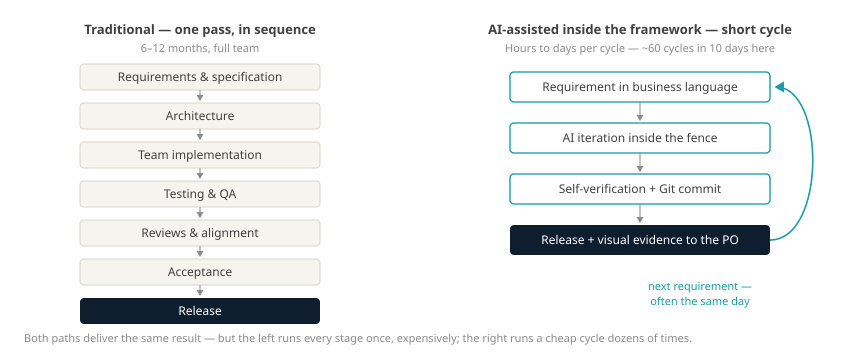
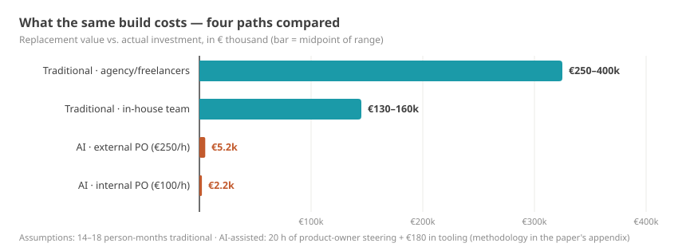

# Ten Days to a Market-Ready State

> Markdown version of [ki-entwicklung-zehn-tage_en.html](../ki-entwicklung-zehn-tage_en.html) · https://datenwgknowledgekitchen.com/ki-entwicklung-zehn-tage_en.html · generated with scripts/build_md.py — if the two differ, the HTML version prevails.

Talks & Post · AI & Economics

I built a Power BI visual you can seriously use — in ten days, AI-assisted — and then ran the numbers on what the same build would have cost the traditional way. The result is an **evidence-based thesis paper**: every figure traceable to the public Git history, valuations done with recognized methods, every claim carrying an evidence label. Here is the essence — the full paper is linked below as PDF and web version.

By **Michael Tenner** · As of · **July 2026** · Basis · **1 case study, 124 commits, public** · Paper · **34 pages, v2.2, EN & DE**

The case in three sentences: Twelve chart types, a controlling table with hierarchy, four languages, 80+ automated render tests — built in ten calendar days, steered by one person who never typed a line of code. Commissioned traditionally, my estimate lands at 14 to 18 person-months, somewhere between €150,000 and €350,000 [Evidence: S]. What it actually cost me: about 20 documented hours of steering and €180 in tooling [Evidence: M].

13–93× — **Cost leverage, honestly calculated** — that is, with the same scope on both sides of the comparison. The headline math would yield up to 161×; the counter-calculation against my own headline is part of the paper. Even at six times the steering hours, a factor of at least 5 remains.

## Why the costs are so *different*

The difference is not in the hourly rates — it is in the process. The traditional path runs every stage once, expensively and in sequence. The AI-assisted path runs a short, cheap cycle dozens of times. In this project: about 60 release cycles in ten days, often several on the same day.



**Two production paths to the same result.** Left: one expensive pass. Right: a cheap cycle, run dozens of times.

## The actual insight: *not the AI*

It is not the AI alone. It works because four things come together: **AI × a fixed framework × domain expertise × Git**. Remove one, and the whole thing tips over.

- **Fixed frameworks** like Power BI visuals, Office add-ins or dbt packages narrow the solution space until AI development becomes controllable and repeatable. The most error-prone layers of traditional projects simply do not exist — and the sandbox caps the damage structurally.
- **Domain expertise in the steering seat** is the difference between two iterations and twenty: requirements in business language, with a built-in quality yardstick.
- **Git** is what makes the speed defensible: every step is reviewable, reversible, auditable. Without version control none of this would be worth anything — with it, all 124 steps are publicly traceable.

This is also why the paper matters beyond the single case: absolute productivity factors will change with every model generation. The mechanism — a tight fence, small iterations, fast local verification — will not.

## What it means *economically*

The paper cross-checks the replacement value with three recognized methods (bottom-up, COCOMO II, function points) and frames build vs. buy as a present-value comparison: from roughly **30 to 45 report users** onward, building beats licensing [Evidence: S]. And a credible free tool already shifts license negotiations — without anyone switching [Evidence: H].



**Four paths to the same build.** The AI-assisted bars are barely visible at this scale — that is the point.

> ### What the paper does not claim
>
> That AI replaces developers · that every piece of software takes ten days · that every domain gets the same results · that a single case (n = 1!) proves a market trend. That is why every claim carries an evidence label: [Evidence: M] measured · [Evidence: A] assumption · [Evidence: S] estimate · [Evidence: H] hypothesis. It is built as a thesis paper — to be recalculated and to be contradicted. Both are explicitly welcome.

Thesis paper · 34 pages · v2.2

### Read the full paper

With every calculation shown: cost leverage, DCF, sensitivities, a governance chapter, sources — and an open invitation to replicate. Available in English and German.

[PDF (EN) ↓](../whitepaper-ki-entwicklung-roi_en.pdf) · [Web version →](../whitepaper-ki-entwicklung-roi_en.html)

## The LinkedIn version *to take away*

If you want to share the essence — here is the short version to copy:

### LinkedIn version

```
Weekend read, if you are into this sort of thing: I documented how far AI-assisted development really goes on Power BI.

I built a Power BI visual you can seriously use — in ten days. Twelve chart types, a controlling table with hierarchy, four languages. Commissioned traditionally, my estimate lands at 14 to 18 person-months, somewhere between €150,000 and €350,000. What it actually cost me: about 20 documented hours of steering and €180 in tooling.

What I learned along the way:

It is not the AI alone. It works because four things come together: AI, a fixed framework, domain expertise, and Git. Remove one, and it tips over.

Fixed frameworks like Power BI visuals, Office add-ins or dbt packages narrow the solution space until AI development becomes controllable and repeatable. That, I think, is the real insight — and it stays valid when the next model generation arrives.

Without version control, none of it would have been worth anything. Git is what makes the work reviewable and reversible. All 124 commits of the project are public.

Calculated honestly — same scope on both sides — a cost leverage of 13 to 93 remains. And from roughly 30 to 45 report users onward, building beats licensing on present value.

What the paper does not say: that AI replaces developers, that every piece of software takes ten days, or that a single case proves a market trend. Every claim is labeled as measured, assumption, estimate, or hypothesis.

If you want to recalculate or push back: please do. That is exactly what it was written for.

#PowerBI #Controlling #AI #BuildVsBuy
```

Replications, criticism, questions: **Michael Tenner** · [michael.tenner84@gmail.com](mailto:michael.tenner84@gmail.com)

Source code, Git history and the thesis paper are public — every figure can be recalculated. A single case study proves no rule; it asks a precise question. Contradicting cases are at least as welcome as confirming ones.

---

## Read on

- HTML (authoritative): https://datenwgknowledgekitchen.com/ki-entwicklung-zehn-tage_en.html
- German version: [ki-entwicklung-zehn-tage.html](../ki-entwicklung-zehn-tage.html) · [ki-entwicklung-zehn-tage.md](ki-entwicklung-zehn-tage.md)
- The full position paper: [whitepaper-ki-entwicklung-roi_en.html](../whitepaper-ki-entwicklung-roi_en.html) · [whitepaper-ki-entwicklung-roi_en.md](../whitepaper-ki-entwicklung-roi_en.md) · [PDF](../whitepaper-ki-entwicklung-roi_en.pdf)
- Evidence labels: M = measured · A = assumption · S = estimate · H = hypothesis
