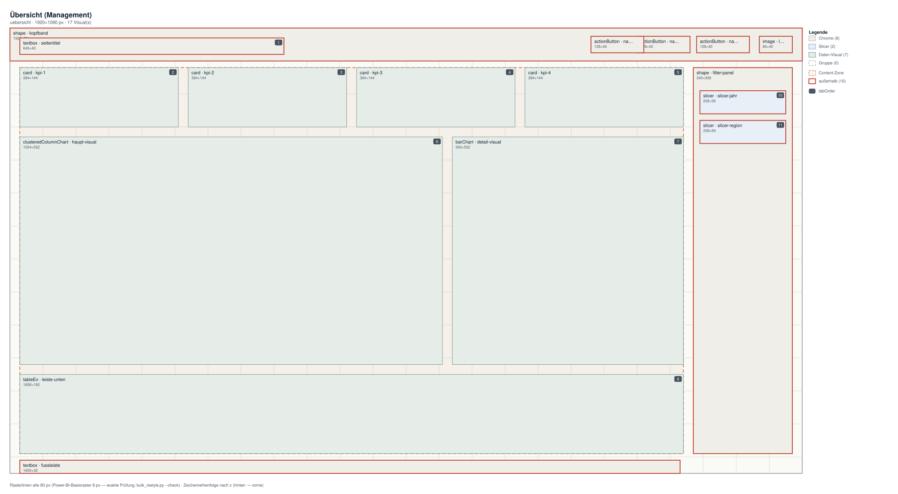

# Report-Design als Framework — ein Skill für Power BI

> Markdown-Fassung von [powerbi-design-skill.html](../powerbi-design-skill.html) · https://datenwgknowledgekitchen.com/powerbi-design-skill.html · generiert mit scripts/build_md.py — bei Abweichungen gilt die HTML-Fassung.

Post · Claude-Skill & Power BI

Zehn Reports, zehn Layouts, zehn Meinungen, wo das Logo hingehört. Der **Power BI Design Skill** macht daraus ein System: ein kurzes Interview (oder einfach die Firmen-Webseite als Quelle), und heraus kommt ein verbindliches Seitengerüst — Theme, Zonen-Koordinaten, Gestaltungsregeln. Gebaut für menschliche **und** agentische Entwickler, als Open-Source-Skill für Claude Code.

Von **Michael Tenner** · Stand · **August 2026** · Werkzeug · **Claude Code** · Lizenz · **MIT · Open Source**

## Das Problem: Konsistenz *skaliert nicht von allein*

Ein Power-BI-Theme macht Farben einheitlich — aber nicht Abstände, Navigation, Filter-Panels oder die Frage, wie groß eine KPI-Kachel ist. Sobald mehrere Menschen (oder mehrere KI-Agenten) Seiten bauen, driftet das Design auseinander: hier ein Schatten, dort ein anderes Raster, drüben die dritte Interpretation von „modern". Der Skill setzt genau davor an: **Er verwandelt Design-Entscheidungen in überprüfbare Artefakte.**

### 1 · Interview mit Defaults — ~10 Fragen

Zweck, Canvas, Navigation, Logo, Fußleiste, Filter-Panel, KPI-Kacheln, Accessibility — jede Frage hat einen sinnvollen Standard. **„Nimm die Standards" reicht als Antwort.** Wer eine Branding-Quelle mitbringt, überspringt die Farbfragen komplett.

### 2 · Branding aus der Quelle — Webseite · Präsi · Logo

Der Skill liest Farbrollen direkt aus dem CSS einer Webseite, dem Theme einer PowerPoint-Datei oder den Pixeln eines Logos — **statt nach Hexcodes zu fragen**. Jede Kombination läuft durch einen WCAG-Kontrast-Check, der bei Verfehlung automatisch die nächstliegende konforme Variante vorschlägt. Kontrast ist hier Messwert, nicht Geschmack.

### 3 · Artefakte statt Absichten — design-out/

Heraus kommen **theme.json** (importierbar), eine **Design-Spec** für Menschen, ein **Agent-Brief** mit Zonen als x,y,w,h für KI-Entwickler, **zones.json** für die Werkzeuge und **Klick-Schritte** für alles, was ein Theme nicht kann. Ein Agent, der nur den Brief liest, platziert Visuals konsistent zum Rest.

### 4 · Warten statt neu bauen — Bulk · Linter · Wireframes

„Überall Schatten raus, runde Ecken rein" ist **ein Kommando** über alle Seiten der PBIP-Datei (Dry-Run zuerst, Backup automatisch). Ein Design-Linter prüft Raster, Schriftgrößen und Zonen als Qualitäts-Gate — und ein Renderer zeichnet jede Report-Seite als SVG-Wireframe, damit auch ein Agent **sieht**, was er gebaut hat, ohne Power BI Desktop zu öffnen.

## Der Praxistest: *diese Webseite als Branding-Quelle*

Erster echter Lauf: „Bau mir ein Seitengerüst für einen Management-Report, Farben von datenwgknowledgekitchen.com, Logo klein rechts." Der Skill zog das Daten-WG-Teal als Chrome-Akzent aus dem CSS, machte aus den Bucket-Farben der Startseite eine Datenpalette — und **alle Farbpaare bestanden WCAG AA ohne eine einzige Korrektur** (Text-Kontrast 16,6:1, Akzent 5,15:1, gemessen, nicht geschätzt).

**Das Ergebnis als generiertes Wireframe (1920×1080):** KPI-Reihe, Haupt- und Detail-Visual, Filter-Panel rechts, Logo klein rechts im Kopfband. Nummern-Badges = Tab-Reihenfolge (Accessibility), gestrichelt = Content-Zone; rot markiert = Chrome, das bewusst außerhalb liegt. Gerendert vom Skill selbst — ganz ohne Power BI Desktop.

0 → AA — **Null Korrekturen nötig:** Jede Text-/Hintergrund-Kombination der extrahierten Palette erfüllt WCAG AA auf Anhieb — und weil der Skill misst statt schätzt, steht der Beleg für jedes Farbpaar in der Design-Spec.

## Für wen: *Menschen und Agenten*

- **Report-Entwickler** bekommen Theme, Maße und Desktop-Klickschritte — plus eine versteckte **Komponenten-Seite** (Atomic Design: Buttons in allen Zuständen, KPI-Kacheln, Kopfband) zum Kopieren statt Neu-Formatieren.
- **Agentische Entwickler** (Claude Code & Co.) lesen den Agent-Brief mit Slot-Koordinaten und Verboten, bauen die Seite, und prüfen sich selbst mit Linter und Wireframe-Renderer — ein geschlossener Feedback-Loop.
- **Controlling-Teams** schalten den **IBCS-Modus** zu: Szenario-Notation (AC/PY/PL/FC) regiert die Chartfarben, die Markenfarbe bleibt im Chrome, und Strukturelemente wie Titelblock, Notationsband und Kommentarspalte werden feste Layout-Slots.

> ### Ehrlich eingeordnet
>
> Der Skill ist v1 und arbeitet nach dem Prinzip „vorbereiten + Plan": Er schreibt nie ungefragt in Report-Dateien, Schreibzugriffe auf PBIP/PBIR laufen als Dry-Run mit Backup. Die PBIR-Fakten (Containerformat, Literal-Kodierung) sind gegen das offizielle Schema verifiziert, aber der erste Lauf gegen *deine* PBIP validiert am Ende — Feedback und Issues sind ausdrücklich willkommen. Alle Skripte: Python-Standardbibliothek, keine Installation nötig.

Open Source · MIT

### Skill ausprobieren

Englische Standalone-Edition mit Anleitung im README — das deutsche Original liegt in der PowerBI-Kitchen. Ordner kopieren, Claude Code öffnen, loslegen.

[Zum Repo →](https://github.com/Losveratos/Power-BI-Design-Skill) · [PowerBI-Kitchen (DE)](https://github.com/Losveratos/PowerBI-Kitchen-)

Fragen, Feedback, eigene Läufe: **Michael Tenner** · [michael.tenner84@gmail.com](mailto:michael.tenner84@gmail.com)

Der Skill entstand komplett in Claude Code — inklusive Multi-Agenten-Review, Web-verifizierter PBIR-Fakten und des Wireframes oben. Passt zusammen mit ChartKitchen byDatenWG und dem Business Chart Builder aus der Knowledge Kitchen.

---

## Mehr dazu

- HTML (maßgeblich): https://datenwgknowledgekitchen.com/powerbi-design-skill.html
- Skill-Repository (englische Standalone-Edition): https://github.com/Losveratos/Power-BI-Design-Skill
- Deutsches Original in der PowerBI-Kitchen: https://github.com/Losveratos/PowerBI-Kitchen-
