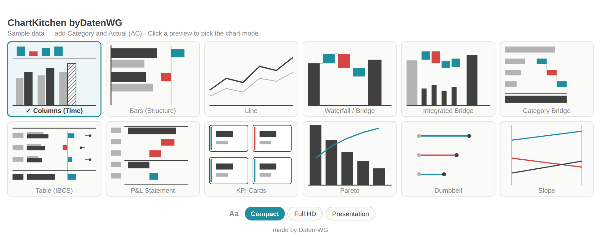
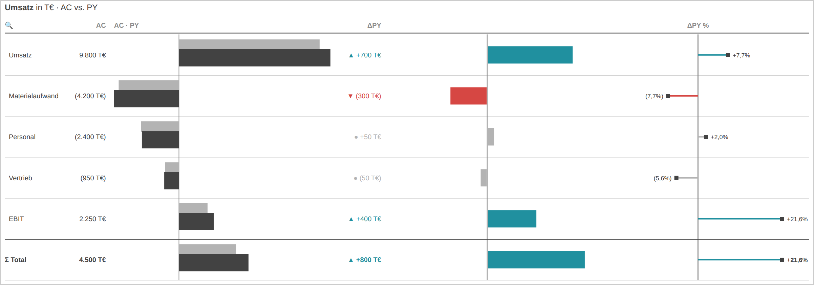
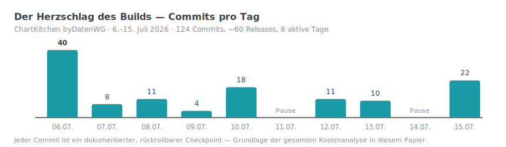
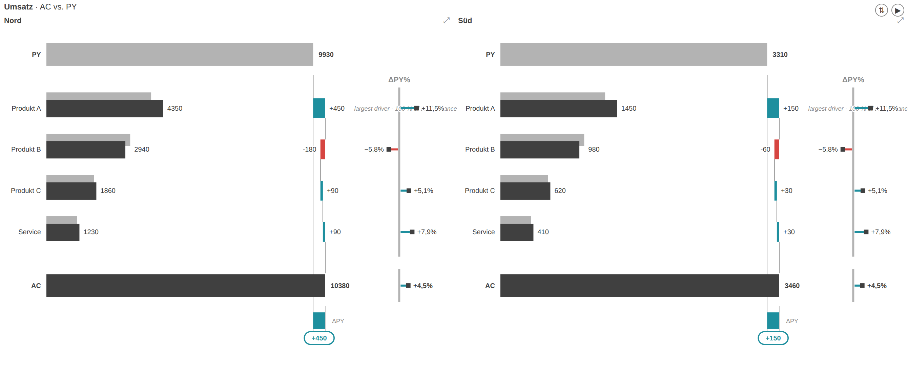
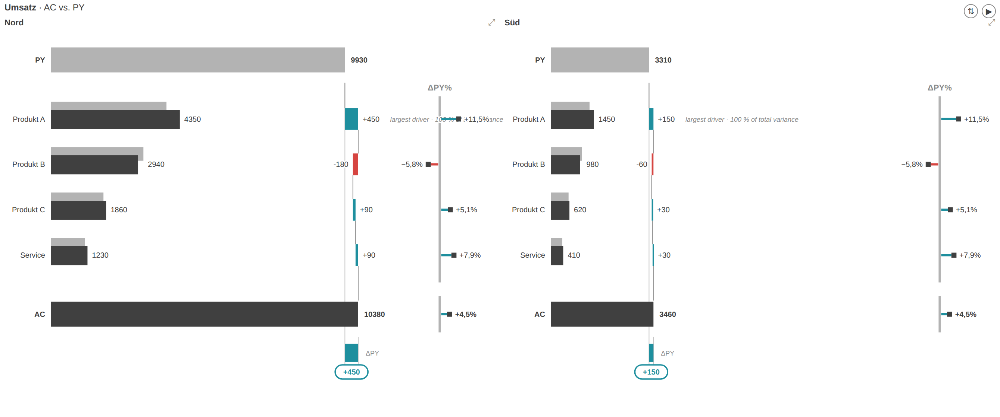
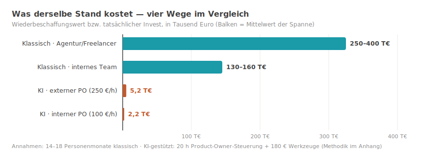
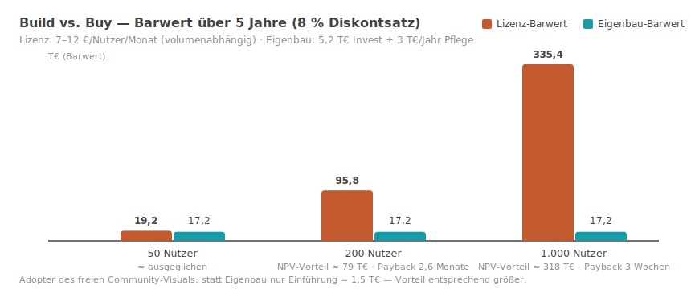
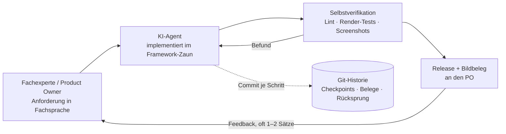
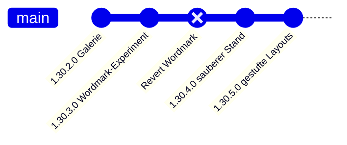

# Zehn Tage statt zehn Monate

## Wie KI-gestützte Entwicklung die Build-oder-Buy-Frage neu entscheidet — nachgerechnet an einem realen Projekt

**Ein Whitepaper der Daten-WG · Juli 2026 · v1.0**

---

## Management Summary

**Worum es geht.** Dieses Papier dokumentiert ein Experiment mit
betriebswirtschaftlicher Sprengkraft: Ein einzelner Controlling-Experte —
kein Entwicklerteam — hat mithilfe KI-gestützter Software-Entwicklung in
**zehn Kalendertagen** ein professionelles Berichts-Werkzeug für Microsoft
Power BI gebaut. Funktionsumfang und Qualität entsprechen einem Produkt,
dessen Entwicklung auf klassischem Weg **14–18 Personenmonate** gedauert und
**150.000–350.000 €** gekostet hätte.

**Was es tatsächlich gekostet hat.** Rund 20 Stunden Steuerungszeit des
Fachexperten plus etwa 180 € Werkzeugkosten. Je nachdem, ob man die Stunden
mit einem externen Beratersatz (250 €/h) oder einem internen Vollkostensatz
(100 €/h) bewertet, liegt der Gesamtinvest bei **~5.200 €** bzw. **~2.200 €**
— ein Faktor 29 bis 161 unter dem Wiederbeschaffungswert.

**Warum das mehr als eine Anekdote ist.** Das Ergebnis beruht nicht auf
Glück, sondern auf drei reproduzierbaren Bedingungen: einem festen
Software-Framework mit klaren Regeln (Kapitel 7), einem Fachexperten, der
präzise formulieren kann, was gebaut werden soll, und disziplinierter
Versionskontrolle, die jeden Schritt prüfbar und rückgängig machbar hält
(Kapitel 8). Wo diese Bedingungen vorliegen, ist das Muster übertragbar —
und dann kippen etablierte Kalküle: die Build-oder-Buy-Entscheidung, die
Verhandlungsposition in Lizenzgesprächen und die Preissetzungsmacht von
Software-Anbietern.

**Für wen das relevant ist.** CFOs und Controlling-Leitungen (Lizenzkosten,
Verhandlungsmacht), IT- und BI-Verantwortliche (was intern plötzlich
machbar ist), Software-Anbieter (wo ihr Geschäftsmodell unter Druck gerät)
und Beratungen (wohin der Wert wandert). Kapitel 11 fasst die
Handlungsempfehlungen je Rolle zusammen.

| Kernergebnis | Wert |
| --- | --- |
| Tatsächlicher Invest (externer Experte, 250 €/h) | **~5.200 €** |
| Tatsächlicher Invest (interner Experte, 100 €/h) | **~2.200 €** |
| Klassischer Wiederbeschaffungswert | **150.000–350.000 €** |
| Kapitalrendite (ROI) auf den Invest | **29–67×** (extern) · **69–161×** (intern) |
| Kalenderzeit | **10 Tage** statt 6–12 Monate |

**Die fünf Kernthesen:**

1. **Build-vs-Buy kippt** für Framework-Software: Ab mittlerer
   Unternehmensgröße schlägt der Eigenbau (oder die Adoption eines freien
   Community-Builds) das Lizenzmodell nach Barwert deutlich.
2. **Ein glaubwürdiges freies Werkzeug wirkt spieltheoretisch** — es
   verschiebt Lizenzverhandlungen zu Gunsten des Kunden, ohne dass
   gewechselt werden muss.
3. **Open Source × KI wirkt multiplikativ:** KI macht Community-Software
   pflegbar, offener Code macht KI präzise. Der Feature-Burggraben klassischer
   Software-Vendoren wird trockengelegt.
4. **Das Framework ist der halbe Erfolg:** Vordefinierte Schnittstellen,
   Sandbox und Zertifizierungsregeln begrenzen Fehler- und Sicherheitsfläche
   von KI-generiertem Code — sie machen Geschwindigkeit erst verantwortbar.
5. **Git ist das unterschätzte Fundament:** Ohne Versionskontrolle wird
   KI-Iterationsgeschwindigkeit zur Haftung. Mit ihr wird jeder Schritt
   rückrollbar, prüfbar — und die gesamte Analyse dieses Papiers erst möglich.

---

## Begriffe & Prämissen — was Sie zum Lesen brauchen

Dieses Papier richtet sich ausdrücklich auch an Leserinnen und Leser ohne
Entwicklungs-Hintergrund. Acht Begriffe genügen:

| Begriff | Bedeutung in diesem Papier |
| --- | --- |
| **Power-BI-Custom-Visual** | Ein Zusatzmodul für Microsofts Berichts-Plattform Power BI, das eigene Diagramm- und Tabellentypen nachrüstet — vergleichbar einer App auf einem Smartphone: läuft nur innerhalb der Plattform, nach deren Regeln. |
| **IBCS** | International Business Communication Standards — ein verbreiteter Notationsstandard für Geschäftsberichte (einheitliche Szenario-Muster, Varianzdarstellungen, „weniger Deko, mehr Aussage"). |
| **KI-gestützte Entwicklung („Vibe Coding")** | Ein Mensch beschreibt in normaler Sprache, was die Software können soll; ein KI-Agent schreibt, testet und dokumentiert den Code. Der Mensch prüft Ergebnisse und steuert nach — er tippt keinen Code. |
| **Product Owner (PO)** | Die steuernde Fachperson: formuliert Anforderungen, beurteilt Ergebnisse, entscheidet Prioritäten. Hier: ein Controlling-/BI-Experte ohne Entwicklerteam. |
| **Open Source (Apache 2.0)** | Der Quellcode ist öffentlich und darf kostenlos genutzt, geprüft und verändert werden. Die Lizenz Apache 2.0 erlaubt auch kommerziellen Einsatz. |
| **Git / Versionskontrolle** | Ein Protokollsystem, das jeden Änderungsschritt („Commit") dauerhaft festhält und rückgängig machbar hält — das Logbuch und Sicherheitsnetz der Software-Entwicklung. |
| **ROI** | Return on Investment: Wie oft der Gegenwert den Einsatz übersteigt. „29×" heißt: Der geschaffene Wert entspricht dem 29-Fachen des Invests. |
| **Barwert (DCF)** | Zukünftige Zahlungen (z. B. fünf Jahre Lizenzgebühren), mit einem Zinssatz auf heute abgezinst — die betriebswirtschaftlich korrekte Basis für Build-vs-Buy-Vergleiche. |

**Die Prämissen der Rechnung — vorab in aller Klarheit:**

1. **Die Fallstudie ist exemplarisch.** Belegt wird jede Zahl an einem
   konkreten Projekt — einem Power-BI-Custom-Visual für Controlling-Berichte.
   Das Muster gilt aber für eine ganze Klasse von Software: alles, was
   innerhalb eines festen Frameworks mit definierten Schnittstellen lebt
   (Office-Add-ins, IDE-Extensions, Plattform-Plugins, interne
   Fachwerkzeuge). Wer „Visual" liest, darf „unser Werkzeug X" denken.
2. **Die Projektzahlen sind Messwerte, keine Schätzungen:** Kalendertage,
   Commits, Releases und Code-Umfang stammen aus der öffentlichen
   Git-Historie; Token- und Werkzeugkosten aus dem Session-Protokoll und
   Rechnungen (Anhang).
3. **Die Stundensätze sind Annahmen:** 250 €/h für einen erfahrenen externen
   Berater (Marktsatz), 100 €/h interner Vollkostensatz. Beide Rechnungen
   werden durchgängig nebeneinander geführt.
4. **Die klassischen Vergleichskosten sind eine Schätzung** — bottom-up in
   Personenmonaten, bewusst als breite Spanne (150–350 T€), ohne eingeholte
   Angebote. Die Kernaussagen überleben auch das untere Ende der Spanne.
5. **Der Lizenzvergleich nutzt öffentliche Preisindikationen** kommerzieller
   IBCS-Visual-Suiten (7–12 €/Nutzer/Monat), über 5 Jahre mit 8 % abgezinst.
6. **Interessenlage:** Die Daten-WG ist Herausgeberin des beschriebenen
   Visuals und berät im Power-BI-Umfeld. Deshalb ist die Methodik offengelegt
   und jede Zahl nachrechenbar — das Papier argumentiert mit Belegen, nicht
   mit Autorität.

**Leseführung:** Kapitel 1–5 enthalten den belegten Fall und die Rechnungen
(Kosten, ROI, Barwert). Kapitel 6–9 ordnen ein: Verhandlungsmacht, warum das
Framework und Git die Risiken zähmen, was das für den Software-Markt heißt.
Kapitel 10–11 klären Übertragbarkeit, Grenzen und Handlungsempfehlungen.
Der Anhang dokumentiert die Methodik.

---

## 1 · Der Fall: Was gebaut wurde

ChartKitchen byDatenWG ist ein natives Power-BI-Custom-Visual
(TypeScript/SVG, API 5.11.0, keine externen Laufzeit-Abhängigkeiten) für
Controlling-Berichte in IBCS-inspirierter Notation — quelloffen (Apache 2.0)
und kostenlos.

| Umfang (Stand 15.07.2026, v1.34.1.0) | Wert |
| --- | --- |
| Chart-Modi | 12 (Säulen, Balken, Linie, Wasserfall, integrierte Brücke, Kategorie-Brücke, Tabelle/Matrix, GuV-Statement, KPI-Karten, Pareto, Dumbbell, Slope) |
| Kern-Code | ~10.200 Zeilen |
| Tabelle/Matrix | N-Ebenen-Hierarchie, Scrolling mit fixiertem Header + Σ, Formelzeilen, klappbare Spaltenhierarchie, Suche, Sortierung |
| Lokalisierung | de, en, es, ja — je ~245 Oberflächen-Strings |
| Qualitätssicherung | 80+ Headless-Render-Tests, Microsoft-Lint-Regeln, `npm audit` 0 Findings |
| Distribution | baubarer Quellcode-Export, AppSource-Einreichungspaket, Marken-/Rechtsprüfung |

*Abb. 1 — Die Modus-Galerie des Visuals: 12 klickbare Vorschauen, Schrift-Presets, mehrsprachig.*

*Abb. 2 — Controlling-Tabelle: integrierte Balken, Δ- und Δ%-Spalten, Finanzkonvention (negative Werte in Klammern), Trend-Icons ▲▼● an Materialitätsschwellen.*

---

## 2 · Zeit, Kosten und Arbeitsweise — die tatsächlichen

Die Git-Historie erlaubt eine ehrliche Abgrenzung: erster Commit des Visuals
am **6. Juli 2026**, der beschriebene Stand am **15. Juli 2026**.

*Abb. 3 — 124 Commits, ~60 Releases in 10 Kalendertagen (8 aktive Tage).*

| Kennzahl | Wert |
| --- | --- |
| Steuerungszeit des Product Owners (Anforderungen, Tests, Feedback) | ~20 h |
| Werkzeugkosten (KI-Abo ~100 $ + 80 € Zusatzbudget) | ~180 € |
| Verarbeitete Tokens | ~1,8 Mrd. (96 % Cache-Lesevorgänge) |
| API-Listenpreis-Äquivalent der Rechenleistung | ~2.900 $ (durch Pauschal-Abo abgedeckt) |
| CO₂-Fußabdruck (Methodik: [Daten-WG-KI-CO₂-Simulator](https://datenwgknowledgekitchen.com/ki-co2-simulator.html), mittleres Szenario) | ~0,2–1,1 t CO₂e ≈ ein Inlandsflug |

**Anatomie einer typischen Iteration** — vom Satz zum Release am selben Tag:
Der Product Owner meldet morgens per Screenshot: *„Bei Small Multiples
skalieren die Brücken jede Kachel für sich — das sollte optional eine
gemeinsame Skala können."* Nachmittags ist die Option gebaut, getestet,
lokalisiert und als Release verteilt:

*Abb. 4a — Vorher: Region „Süd" (⅓ des Volumens von „Nord") füllt ihre Kachel genauso aus.*

*Abb. 4b — Nachher (gleicher Tag): optionale gemeinsame Skala — „Süd" ist sichtbar ein Drittel, inklusive der Δ%-Pin-Skalen.*

**Gesamtinvest, zwei Bewertungen:**

- **Externer Product Owner** (erfahrener Berater, 250 €/h):
  20 h × 250 € + 180 € = **~5.200 €**
- **Interner Product Owner** (Controller/BI-Verantwortlicher, 100 €/h
  Vollkosten): 20 h × 100 € + 180 € = **~2.200 €**

Bemerkenswert an beiden Rechnungen: **Werkzeugkosten sind 3–8 % des Invests —
über 90 % ist Expertenzeit.** Der Engpass ist nicht mehr das
Entwicklungsbudget, sondern die Person, die weiß, was gebaut werden soll.

---

## 3 · Was derselbe Stand klassisch gekostet hätte

Bottom-up geschätzt in Personenmonaten (PM) Entwicklung:

| Block | PM |
| --- | --- |
| Grundgerüst, Build-Pipeline, Settings-Modell | 0,5–1 |
| Säulen/Balken/Linie inkl. Varianz-Panels, Skalen-Sync, YTD | 2–3 |
| Wasserfall + zwei Brücken-Modi | 1–1,5 |
| Tabelle/Matrix (Hierarchie, Scroll-Freeze, Formeln, Matrix-Ausbau) | 2,5–4 |
| KPI-Karten inkl. Bullet/Benchmark | 0,75–1 |
| Small Multiples (Σ-Kachel, Top-N, Zoom, gemeinsame Skalen) | 0,75–1 |
| Landing, In-Chart-Interaktionen, Persistierung/Bookmarks | 0,5–1 |
| Lokalisierung, Barrierefreiheit, Kontrastmodus | 0,5 |
| Test-Harness + Testfälle | 0,75–1 |
| Zertifizierungsvorbereitung, Lizenz/Marken, AppSource-Kit | 0,5–1 |
| **Entwicklung** | **10–14 PM** |
| + Projektrealität (Spezifikation, Reviews, Abstimmung, QA) | **14–18 PM** |

Bewertet zu Marktsätzen: **intern ~130–160 T€** (Senior-Vollkosten 9 T€/PM,
sofern Entwickler mit Power-BI-Visual- *und* Controlling-Erfahrung verfügbar
sind), **extern ~250–400 T€** (900–1.200 €/Tag). Wir rechnen konservativ mit
der Spanne **150–350 T€**. Ehrlicher Abschlag: Ein klassisches Projekt hätte
Endnutzer-Doku und formale Abnahmetests enthalten, die hier noch ausstehen
(−10–20 %) — die Größenordnung bleibt unberührt.

*Abb. 5 — Vier Wege zum selben Stand. Die KI-gestützten Balken sind auf dieser Skala kaum sichtbar — das ist die Aussage.*

---

## 4 · ROI — beide Besetzungen

| | Externer PO (5.200 €) | Interner PO (2.200 €) |
| --- | ---: | ---: |
| vs. 150 T€ (konservativ) | ROI ~2.800 % · **29×** | ROI ~6.800 % · **69×** |
| vs. 250 T€ (mittel) | ROI ~4.700 % · **48×** | ROI ~11.400 % · **115×** |
| vs. 350 T€ (extern) | ROI ~6.700 % · **67×** | ROI ~16.000 % · **161×** |

Effektiver Stundenwert der 20 Steuerungsstunden: **7.500–17.500 €** — Hebel
30–70 auf den externen Beratersatz, 75–175 auf den internen. Pro Release:
~85 € (extern) bzw. ~37 € (intern). Pro Zeile Code: ~0,20–0,50 € — klassisch
liegt eine produktive Zeile bei 15–35 €.

Zwei Einordnungen: Der ROI ist gegen den *Wiederbeschaffungswert* gerechnet —
realisiert wird er über Nutzung, Reichweite und Folgeeffekte; der wichtigere
Punkt ist, dass ein Werkzeug **überhaupt entsteht**, das nie ein
250-T€-Budget bekommen hätte. Und: Der ROI gehört zur Kombination
„Fachexperte + Werkzeug". KI ersetzt hier das Entwicklerteam — **nicht den
Product Owner.**

---

## 5 · Build vs. Buy im Barwertvergleich

Kommerzielle Visual-Suiten kosten grob **7–12 € pro Nutzer und Monat**.
Diskontiert über 5 Jahre (8 %, Annuitätenfaktor 3,99), gegen Eigenbau mit
5,2 T€ Invest und angenommenen 3 T€/Jahr Pflege:

*Abb. 6 — Ab ~150–200 Report-Nutzern ist der Eigenbau nach Barwert klar überlegen.*

| Unternehmensgröße | Lizenz-Barwert (5 J) | Eigenbau-Barwert | NPV-Vorteil |
| --- | ---: | ---: | ---: |
| 50 Nutzer × 8 €/M | 19.200 € | 17.200 € | ~2.000 € |
| 200 Nutzer × 10 €/M | 95.800 € | 17.200 € | **~78.600 €** |
| 1.000 Nutzer × 7 €/M | 335.400 € | 17.200 € | **~318.000 €** |

Payback: 2,6 Monate (200 Nutzer), ~3 Wochen (Konzern). Sensitivität: Selbst
bei verdreifachter Pflege (10 T€/Jahr) bleibt der Mittelstandsfall ~50 T€ im
Plus.

**Die Adopter-Perspektive verschärft das Bild:** Wer das freie
Community-Visual einsetzt statt selbst zu bauen, trägt nur die Einführung
(~2 Controller-Tage ≈ 1,5 T€) gegen 19–335 T€ Lizenz-Barwert. Für kleine
Unternehmen — deren reale Alternative oft „keine IBCS-Visuals" ist — ist das
keine Ersparnis, sondern **Zugang zu einer Fähigkeit, die es in ihrer
Preisklasse nicht gab**.

Fairness: Der Vergleich gilt, wo der Funktionsumfang genügt. Kommerzielle
Anbieter verkaufen zusätzlich Reife, SLAs, Zertifizierung, Roadmap. Diese
Lücke adressiert im Community-Modell ein Support-Abo (§9).

---

## 6 · Die spieltheoretische Dimension

Der unterschätzteste Wert eines glaubwürdigen freien Werkzeugs realisiert
sich, **ohne dass es eingesetzt wird**: Es verändert die
Verhandlungsposition (BATNA) gegenüber kommerziellen Anbietern.

- Bisher lautete die Alternative in Lizenzverhandlungen: „zahlen oder
  verzichten". Mit einer glaubwürdigen freien Option genügt die
  **Möglichkeit** des Wechsels: Beim 1.000-Nutzer-Konzern entsprechen
  10–20 % Renewal-Nachlass **33–67 T€ Barwert** — allein durch die Existenz
  der Alternative im Beschaffungsvergleich.
- **Glaubwürdigkeit ist die Währung:** offener, baubarer Quellcode ✓,
  sichtbare Pflege (60 Releases in 10 Tagen) ✓, Zertifizierung und Doku als
  nächste Schritte. Der billigste glaubwürdige Zug eines Konzerns: ein Pilot
  auf einer einzigen Berichtsseite.
- **Grenzen:** Ohne Zertifizierung bleibt die Karte in vielen Häusern formal
  unspielbar; große Berichtsbestände (Wechselkosten) stumpfen sie ab. Am
  schärfsten ist sie bei Neueinführungen und auslaufenden Rahmenverträgen.

---

## 7 · Warum das feste Framework der halbe Erfolg ist

Die verbreitete Sorge gegenüber KI-generiertem Code — „schnell, aber
unsicher und fehlerhaft" — unterschätzt, wie stark ein festes Framework
beide Risikoflächen beschneidet. Ein Power-BI-Visual lebt in einem
**vordefinierten Vertrag**:

**Begrenzte Bug-Fläche.** Die API gibt den Lebenszyklus vor (eine
`update()`-Schnittstelle, deklarative Capabilities, ein Settings-Modell).
Es gibt keine selbstgebaute Netzwerk-, Persistenz- oder Threading-Schicht,
in der sich KI-Fehler verstecken könnten — die fehleranfälligsten Schichten
klassischer Projekte **existieren gar nicht erst**. Was bleibt, ist
Rendering- und Fachlogik, und die ist lokal testbar: Der Headless-Harness
rendert jeden Stand als Bild, Fehler sind *sichtbar* statt latent.

**Begrenzte Security-Fläche.** Das Visual läuft in einer Sandbox (isolierter
iframe), ohne Netzwerkzugriff, ohne Dateisystem, ohne Speicher-APIs. Die
Microsoft-Zertifizierungsregeln verbieten zusätzlich `eval`, `innerHTML`,
externes Nachladen — Regeln, gegen die automatisiert geprüft wird
(projektweit eingehalten, `npm audit`: 0 Findings). Der maximale
Schadensradius eines KI-Fehlers ist damit strukturell gedeckelt: **Er kann
ein Chart falsch zeichnen, aber keine Daten exfiltrieren.**

**Vordefinierte APIs = lokale Verifikation.** Jede Anforderung übersetzt
sich in „welche Option, welcher Renderer, welche Persistierung" — keine
Architektur-Grundsatzfragen, deren Fehlentscheidung erst Monate später
sichtbar wird. Genau deshalb konvergiert KI-Entwicklung hier so schnell:
Der Zaun macht jede Iteration klein, prüfbar und rückrollbar.

*Abb. 7 — Der Loop: klein iterieren, selbst verifizieren, alles versionieren.*

Die Verallgemeinerung: Dieses Risikoprofil haben **alle**
Framework-Ökosysteme mit Sandbox und Zertifizierung — Office-Add-ins,
Browser-Extensions, App-Store-Apps, dbt-Pakete. Dort ist „Vibe Coding"
nicht trotz, sondern **wegen** der Einschränkungen produktionstauglich.
Greenfield-Systeme ohne Zaun haben dieses Sicherheitsnetz nicht — dort
gelten andere Maßstäbe (§10).

---

## 8 · Git: das unterschätzte Fundament

Die unbequeme Wahrheit zuerst: **Ohne Versionskontrolle ist Vibe Coding
Müll.** Eine KI, die pro Tag dutzende Änderungen produziert, ist ohne
Rücksprungpunkte kein Beschleuniger, sondern ein unkontrollierbares Risiko —
jede fehlgeschlagene Iteration kontaminiert den Stand, niemand weiß mehr,
was wann warum geändert wurde. Mit Git kehrt sich das um; vier Mechanismen
haben diesen Build getragen:

**1. Checkpoints & Rollback.** Jeder Arbeitsschritt endet in einem Commit
(im Setup sogar erzwungen: ohne Commit + Push endet keine Arbeitssitzung).
Reales Beispiel aus dem Projekt: Ein Design-Experiment — ein Wortmarken-Logo
auf der Startseite — gefiel dem Product Owner nicht. Ein `git revert`,
Release als 1.30.4.0, fünf Minuten, kein Schaden:

*Abb. 8 — Experimente werden billig, wenn Rückwege garantiert sind.*

**2. Kleine Commits als Review-Fläche.** 124 Commits für 60 Releases heißt:
Die durchschnittliche Änderung ist klein genug, um per Diff gelesen zu
werden. Das ist die realistische Antwort auf „wer reviewt den KI-Code?" —
nicht Zeile für Zeile alles, sondern **abgegrenzte Diffs mit beschreibenden
Commit-Botschaften**, stichprobenhaft tief geprüft.

**3. Branch-Isolation.** Die gesamte Entwicklung lief auf einem eigenen
Branch — die KI kann nichts „kaputt machen", was nicht explizit
zusammengeführt wird. Für Teams: KI-Arbeit ist damit organisatorisch genauso
integrierbar wie die eines neuen Entwicklers, inklusive Pull-Request-Gate.

**4. Historie als Beweismittel.** Jede Zahl in diesem Papier — Kalendertage,
Commits pro Tag, Release-Frequenz, sogar die Abgrenzung „Visual vs.
Vorarbeiten" — stammt aus `git log`. Versionskontrolle macht KI-Entwicklung
**auditierbar**: Für Wirtschaftsprüfer, für IT-Compliance, für die eigene
Kostenrechnung. Ohne Git wäre dieses Whitepaper Behauptung; mit Git ist es
nachrechenbar.

Praktische Konsequenz für jedes KI-Entwicklungs-Setup: Commit-Pflicht pro
Arbeitsschritt, aussagekräftige Botschaften, eigener Branch, Push als Teil
der Definition-of-Done. Das kostet nichts und entscheidet über
Produktionstauglichkeit.

---

## 9 · Die Marktthese: Open Source × KI wirkt multiplikativ

Einzeln waren beide Kräfte für Software-Vendoren beherrschbar: Open Source
scheiterte im Anwendungs-Layer oft am Pflegeargument („wer wartet das?");
KI-Entwicklung allein blieb ohne offene Referenz-Codebasen auf
Prototypen-Niveau. **Zusammen hebeln sie sich:**

- KI macht Community-Software **pflegbar** — ein Ein-Personen-Projekt hat
  effektiv ein Entwicklerteam; „Bus-Faktor 1" bedeutet nicht mehr Stillstand.
- Offener Code macht KI **präzise** — jedes offene Projekt ist sofort
  erweiterbar, weil das Modell die Codebasis liest wie ein eingearbeiteter
  Entwickler.

Damit fällt der klassische Burggraben der Feature-Vendoren („Entwicklung ist
teuer, wir haben sie bezahlt, ihr mietet sie"). Am stärksten exponiert:
Single-Product-Anbieter mit Feature-Differenzierung und Sitzplatz-Preisen.
Wenig bedroht: Plattformen (Microsoft gewinnt durch jedes gute Visual),
Daten-/Netzwerk-Lock-in, Haftung als Kaufgrund.

Das historische Muster existiert: Open Source hat die
Infrastruktur-Schicht konsolidiert (Linux, Postgres); überlebt hat das
**Red-Hat-Modell** — Software frei, Erlöse aus Support und Verlässlichkeit.
Unsere Erwartung: Dasselbe Modell erreicht jetzt den Anwendungs-Layer.

**Gegenkräfte, ehrlich benannt:** (1) Vendoren können ebenfalls KI-gestützt
entwickeln — was fällt, ist ihr Preissetzungsspielraum gegen „gut genug und
kostenlos", nicht ihr Produkt. (2) Die kommende Flut KI-gebauter
Wegwerf-Software wertet Vertrauenssignale **auf**: Zertifizierung,
Release-Historie, ein Gesicht dahinter. (3) Ein Marktsegment zahlt dauerhaft
für SLAs und Haftung — es schrumpft, verschwindet nicht.

---

## 10 · Übertragbarkeit — und Grenzen

Drei Zutaten erklären das Ergebnis; fehlt eine, bricht die Rechnung:

1. **Festes Framework** (§7) — begrenzte Bug-/Security-Fläche, lokale
   Verifikation.
2. **Domänenexpertise in der Steuerung** — Anforderungen in Fachsprache mit
   eingebautem Qualitätsmaßstab („Bestandsgrößen darf man nicht summieren").
   Der Unterschied zwischen zwei Iterationen und zwanzig.
3. **Selbstverifikation + Versionskontrolle** (§8) — der Loop aus Abb. 7.

Überträgt sich auf: Office-Add-ins, IDE-Extensions, Plattform-Plugins,
dbt-Pakete, interne Fachanwendungen mit klarem Rahmen. Überträgt sich
**nicht** unmittelbar auf: Greenfield-Architekturen, verteilte Systeme,
Legacy-Integration — dort fehlen Zaun und schnelle Verifikation, und die
Maßstäbe für Review und Absicherung sind andere.

**Offene Punkte dieses Projekts,** die ein 250-T€-Projekt enthalten hätte:
Endnutzer-Doku, formale Abnahmetests mit Anwendern, eine vollständige
adversariale Prüfrunde der jüngsten Pakete. Sie stehen im öffentlichen
Backlog — Transparenz gehört zur Glaubwürdigkeit.

---

## 11 · Was das für Unternehmen bedeutet

**CFO / Controlling-Leitung:** Visual- und Werkzeug-Lizenzen gegen die freie
Alternative prüfen — als Wechseloption oder Verhandlungskarte. Ab ~150–200
Nutzern ist der Barwertvorteil erheblich (§5).

**IT- / BI-Verantwortliche:** Die Kombination „Framework-Zaun + interner
Fachexperte + KI + Git-Disziplin" ist reproduzierbar — und mit dem internen
100-€-Satz ist die Einstiegshürde vierstellig, nicht sechsstellig.
Kandidaten: alles, was heute als Sitzplatz-Lizenz eingekauft wird, im Kern
aber abgegrenzte Fachlogik ist.

**Software-Anbieter:** Feature-Paritäts-Verteidigung wird teurer als
Differenzierung nach oben (Planung, Writeback, Enterprise-Integration) oder
ein Service-Modell. Die Preissetzung der Basisschicht diszipliniert sich.

**Beratungen:** Der Wert wandert von der Lizenz zur Expertise. Das
tragfähige Modell ist das der Infrastruktur-Welt: Software frei, Erlöse aus
Enablement, Support und Weiterentwicklung — das Abo als formalisierte
Antwort auf die Pflege-Frage.

---

## Anhang · Methodik und Belege

- **Projektdaten:** Git-Historie des öffentlichen Repositories (erster
  Visual-Commit 06.07.2026; 124 Commits, ~60 Releases bis 15.07.2026);
  Code-Umfang per `wc -l`; Testfälle im Repo. Abb. 1–4 sind unbearbeitete
  Render-Ausgaben des Test-Harness.
- **Token-/Kostendaten:** Auswertung des Entwicklungs-Session-Protokolls
  (4.446 API-Aufrufe; Output 5,3 M, Cache-Write 70,5 M, Cache-Read 1.725 M
  Tokens); API-Listenpreise Stand Juni 2026; Abo-Kosten laut Rechnung.
- **Stundensätze:** 250 €/h externer Senior-Berater (Marktsatz), 100 €/h
  interner Vollkostensatz (Gehalt + Nebenkosten + Overhead eines erfahrenen
  Controllers/BI-Verantwortlichen).
- **CO₂-Schätzung:** Methodik des Daten-WG-KI-CO₂-Simulators (Wh je 1.000
  Output-Tokens nach Modellklasse, PUE 1,15–1,56, US-Strommix 300–450 g/kWh);
  Cache-Reads mit Faktor 0,1 als preis-analoge Näherung.
- **Klassische Kostenschätzung:** Bottom-up in PM (§3), bewertet mit
  9 T€/PM intern bzw. 900–1.200 €/Tag extern; keine Anbieterangebote
  eingeholt, Spanne bewusst breit.
- **DCF-Annahmen:** Lizenzpreise 7–12 €/Nutzer/Monat (öffentliche
  Preisindikationen kommerzieller IBCS-Visuals, volumenabhängig); 8 %
  Diskontsatz; 5 Jahre; Pflege Eigenbau 3 T€/Jahr (Sensitivität bis
  10 T€/Jahr geprüft).
- **Interessenlage:** Die Daten-WG ist Herausgeberin des beschriebenen
  Visuals und erbringt Beratungsleistungen im Power-BI-Umfeld. Alle
  Schätzungen sind Größenordnungen, keine Angebote oder Zusicherungen.

*v1.0 — Zahlen Stand 15.07.2026. Feedback willkommen.*
