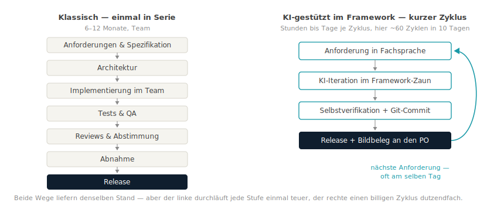
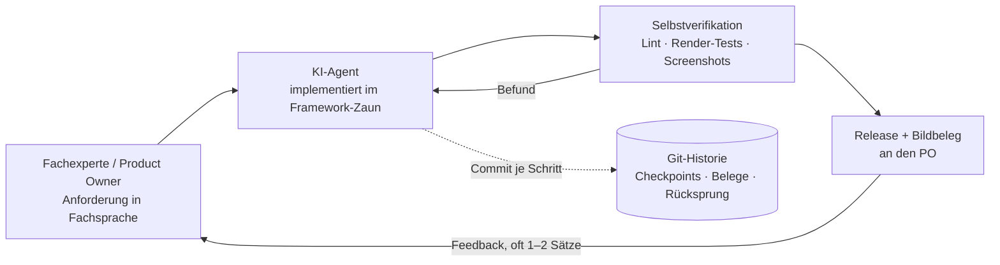
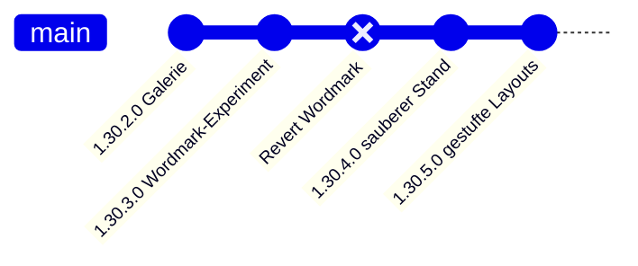

# Zehn Tage bis zum marktfähigen Stand

## Ein Bewertungsmodell für KI-gestützte Software-Entwicklung in festen Frameworks — transparent durchgerechnet an einer realen Fallstudie

**Ein empirisch gestütztes Thesenpapier der Daten-WG · Juli 2026 · v2.2**

---

## Management Summary

> **Die Hauptthese [M]:** Unter fünf Randbedingungen — festes Framework,
> Domänenexpertise in der Steuerung, kleine Iterationen, schnelle lokale
> Verifikation, konsequente Versionskontrolle — steigt die Produktivität
> KI-gestützter Entwicklung nicht um Prozente, sondern um Größenordnungen.
> Die Formel lautet nicht „KI schafft das", sondern **KI × Framework ×
> Domänenexpertise × Versionskontrolle**. Dieses Papier belegt das an einem
> vollständig dokumentierten Fall und liefert das Bewertungsmodell dazu.
> Die eigentliche Innovation ist dabei nicht die KI selbst, sondern ihre
> ökonomische Konsequenz: Sie verändert die Kostenstruktur der
> Software-Entwicklung — und zwingt damit die Build-vs.-Buy-Logik zur
> Neubewertung.

*Evidenz-Kennzeichnung in diesem Papier: [M] gemessen · [A] Annahme ·
[S] Schätzung/Modellrechnung · [H] Hypothese — Details unter „Begriffe &
Prämissen".*

**Worum es geht.** Dieses Papier schlägt ein **Bewertungsmodell für
KI-gestützte Software-Entwicklung** vor und rechnet es an einer vollständig
dokumentierten Fallstudie durch: Ein einzelner Controlling-Experte — kein
Entwicklerteam — hat in **zehn Kalendertagen** ein Berichts-Werkzeug für
Microsoft Power BI bis zu einem marktfähigen Entwicklungsstand gebaut.
Derselbe Stand wird — nach drei anerkannten Schätzverfahren — klassisch auf
**14–18 Personenmonate** und **150.000–350.000 €** taxiert [S]. Fallstudie,
Historie und Methodik sind vollständig öffentlich [M].

**Was es tatsächlich gekostet hat.** Rund **20 Stunden dokumentierte
Steuerungszeit** des Fachexperten (Sitzungsprotokolle; Denk- und
Recherchezeit außerhalb der Sitzungen ist nicht erfasst — die
Sensitivitätsrechnung in Kapitel 4 rechnet deshalb bis 120 Stunden durch)
plus etwa 180 € Werkzeugkosten. Je nach Stundensatz (250 €/h extern,
100 €/h intern) liegt der Invest bei **~5.200 €** bzw. **~2.200 €** — ein
Kostenhebel von 29 bis 161 gegenüber dem Wiederbeschaffungswert. Wichtig
zur Einordnung: Dieser Vergleich stellt den erreichten Ist-Stand einem
klassischen Vollprozess gegenüber und ist insoweit asymmetrisch — eine
symmetrische Gegenrechnung (Kapitel 4) drückt den Hebel auf **13 bis 93**,
ändert die Größenordnung der Aussage aber nicht. Bewusst sprechen wir vom
**Kostenhebel (Cost Avoidance)**, nicht von „ROI": Ein ROI setzt
realisierte Erträge voraus; hier werden vermiedene Wiederbeschaffungskosten
ins Verhältnis zum Invest gesetzt (Begriffe & Prämissen).

**Warum das mehr als eine Anekdote ist.** Das Ergebnis beruht nicht auf
Glück, sondern auf drei reproduzierbaren Bedingungen: einem festen
Software-Framework mit klaren Regeln (Kapitel 7), einem Fachexperten, der
präzise formulieren kann, was gebaut werden soll, und disziplinierter
Versionskontrolle, die jeden Schritt prüfbar und rückgängig machbar hält
(Kapitel 8). Wo diese Bedingungen vorliegen, ist das Muster übertragbar —
und dann geraten etablierte Kalküle unter Druck: die
Build-oder-Buy-Entscheidung, die Verhandlungsposition in Lizenzgesprächen
und die Preissetzungsmacht von Software-Anbietern. Zugleich gilt: Die
Evidenzbasis ist **eine einzelne Fallstudie**. Was am Fall gemessen ist und
was daraus abgeleitete Hypothese über mögliche Marktwirkungen ist, wird im
Papier durchgängig getrennt ausgewiesen.

**Für wen das relevant ist.** CFOs und Controlling-Leitungen (Lizenzkosten,
Verhandlungsposition), IT- und BI-Verantwortliche (was intern machbar wird,
Governance in Kapitel 9), Software-Anbieter (wo ihr Geschäftsmodell unter
Druck geraten könnte) und Beratungen (wohin der Wert wandert). Kapitel 12
fasst die Handlungsoptionen je Rolle zusammen.

| Kernergebnis | Wert | Evidenz |
| --- | --- | :-: |
| Tatsächlicher Invest (externer Experte, 250 €/h) | **~5.200 €** | [M] · [A] |
| Tatsächlicher Invest (interner Experte, 100 €/h) | **~2.200 €** | [M] · [A] |
| Klassischer Wiederbeschaffungswert (3 Verfahren, Anhang B) | **150.000–350.000 €** | [S] |
| Kostenhebel, Ist-Stand-Vergleich | **29–67×** (extern) · **69–161×** (intern) | [S] |
| Kostenhebel symmetrisch (gleicher Leistungsumfang, Kapitel 4) | **13–39×** (extern) · **31–93×** (intern) | [S] |
| Kalenderzeit: **10 Tage** | statt geschätzt 6–12 Monaten klassisch | [M] · [S] |

**Die fünf Kernthesen:**

1. **KI × Framework × Domänenexpertise — nicht KI allein:** Feste
   Frameworks mit definierten Schnittstellen, Sandbox und
   Zertifizierungsregeln reduzieren die Freiheitsgrade so weit, dass
   KI-Entwicklung kontrollierbar und reproduzierbar wird. Das ist die
   zentrale These dieses Papiers (Kapitel 7). [M]
2. **Git ist das unterschätzte Fundament:** Ohne Versionskontrolle wird
   KI-Iterationsgeschwindigkeit zur Haftung. Mit ihr wird jeder Schritt
   rückrollbar, prüfbar — und die gesamte Analyse dieses Papiers erst
   möglich (Kapitel 8). [M]
3. **Die Build-oder-Buy-Rechnung verschiebt sich** für Framework-Software:
   Nach Barwert schlägt der Eigenbau (oder die Adoption eines freien
   Community-Builds) das Lizenzmodell ab mittlerer Nutzerzahl deutlich —
   eine Rechnung unter offengelegten Annahmen (Kapitel 5). [S]
4. **Verhandlungsmacht-Hypothese:** Ein glaubwürdiges freies Werkzeug
   könnte Lizenzverhandlungen zu Gunsten des Kunden verschieben, ohne dass
   gewechselt werden muss (Kapitel 6). [H]
5. **Markt-Hypothese:** Open Source und KI könnten sich wechselseitig
   verstärken — KI macht Community-Software pflegbar, offener Code macht
   KI präzise — und den Entwicklungskosten-Vorsprung kommerzieller
   Anbieter verringern (Kapitel 10). [H]

*Zum Evidenzstatus der Thesen:* These 1 und 2 sind am Fall direkt belegt.
These 3 ist eine Rechnung unter offengelegten Annahmen. These 4 und 5
extrapolieren vom Einzelfall auf Markt-Ebene — sie sind als **begründete
Hypothesen über mögliche Auswirkungen** zu lesen, nicht als nachgewiesene
Effekte (Einordnung in Kapitel 6, 10 und 11).

---

## Begriffe & Prämissen — was Sie zum Lesen brauchen

Dieses Papier richtet sich ausdrücklich auch an Leserinnen und Leser ohne
Entwicklungs-Hintergrund. Acht Begriffe genügen:

| Begriff | Bedeutung in diesem Papier |
| --- | --- |
| **Power-BI-Custom-Visual** | Ein Zusatzmodul für Microsofts Berichts-Plattform Power BI, das eigene Diagramm- und Tabellentypen nachrüstet — vergleichbar einer App auf einem Smartphone: läuft nur innerhalb der Plattform, nach deren Regeln. |
| **IBCS** | International Business Communication Standards — ein verbreiteter Notationsstandard für Geschäftsberichte (einheitliche Szenario-Muster, Varianzdarstellungen, „weniger Deko, mehr Aussage"). |
| **KI-gestützte Entwicklung („Vibe Coding")** | Ein Mensch beschreibt in normaler Sprache, was die Software können soll; ein KI-Agent schreibt, testet und dokumentiert den Code. Der Mensch prüft Ergebnisse und steuert nach — er tippt keinen Code. |
| **Product Owner (PO)** | Die steuernde Fachperson: formuliert Anforderungen, beurteilt Ergebnisse, entscheidet Prioritäten. Hier: ein Controlling-/BI-Experte ohne Entwicklerteam. |
| **Open Source (Apache 2.0)** | Der Quellcode ist öffentlich und darf kostenlos genutzt, geprüft und verändert werden. Die Lizenz Apache 2.0 erlaubt auch kommerziellen Einsatz. |
| **Git / Versionskontrolle** | Ein Protokollsystem, das jeden Änderungsschritt („Commit") dauerhaft festhält und rückgängig machbar hält — das Logbuch und Sicherheitsnetz der Software-Entwicklung. |
| **Kostenhebel (Cost Avoidance)** | Verhältnis der vermiedenen Kosten (Wiederbeschaffungswert) zum tatsächlichen Invest. „29×" heißt: Der Wiederbeschaffungswert entspricht dem 29-Fachen des Invests. Bewusst nicht „ROI" genannt — ein ROI setzt realisierte Erträge voraus, hier werden vermiedene Ausgaben verglichen. |
| **Barwert (DCF)** | Zukünftige Zahlungen (z. B. fünf Jahre Lizenzgebühren), mit einem Zinssatz auf heute abgezinst — die betriebswirtschaftlich korrekte Basis für Build-vs-Buy-Vergleiche. |

**Evidenz-Kennzeichnung:** Größere Aussagen tragen in diesem Papier ein
Kürzel: **[M]** = gemessen — aus Git-Historie, Sitzungsprotokollen oder
Rechnungen. **[A]** = Annahme — gesetzt und begründet, z. B. Stundensätze.
**[S]** = Schätzung oder Modellrechnung — aus [M] und [A] abgeleitet, z. B.
Wiederbeschaffungswert, Kostenhebel, Barwerte. **[H]** = Hypothese —
Extrapolation über den Einzelfall hinaus. Die Kürzel machen auf einen Blick
sichtbar, worauf jede Aussage steht.

**Die Prämissen der Rechnung — vorab in aller Klarheit:**

1. **Die Fallstudie ist exemplarisch.** Belegt wird jede Zahl an einem
   konkreten Projekt — einem Power-BI-Custom-Visual für Controlling-Berichte.
   Das Muster gilt aber für eine ganze Klasse von Software: alles, was
   innerhalb eines festen Frameworks mit definierten Schnittstellen lebt
   (Office-Add-ins, IDE-Extensions, Plattform-Plugins, interne
   Fachwerkzeuge). Wer „Visual" liest, darf „unser Werkzeug X" denken.
2. **Die Projektzahlen sind Messwerte, keine Schätzungen:** Kalendertage,
   Commits, Releases und Code-Umfang stammen aus der öffentlichen
   Git-Historie; Token- und Werkzeugkosten aus dem Session-Protokoll und
   Rechnungen (Anhang A).
3. **Die Stundensätze sind Annahmen:** 250 €/h für einen erfahrenen externen
   Berater (Marktsatz), 100 €/h interner Vollkostensatz. Beide Rechnungen
   werden durchgängig nebeneinander geführt.
4. **Die klassischen Vergleichskosten sind eine Schätzung** — bottom-up in
   Personenmonaten, bewusst als breite Spanne (150–350 T€), ohne eingeholte
   Angebote. Die Kernaussagen überleben auch das untere Ende der Spanne.
5. **Der Lizenzvergleich nutzt öffentliche Preisindikationen** kommerzieller
   IBCS-Visual-Suiten (7–12 €/Nutzer/Monat), über 5 Jahre mit 8 % abgezinst.
6. **Der Evidenzstand ist eine Fallstudie (n = 1).** Kapitel 1–5 beruhen
   auf Messwerten und offengelegten Rechnungen zu diesem einen Projekt.
   Kapitel 6, 10 und Teile von 12 leiten daraus Hypothesen über mögliche
   Markt- und Verhandlungseffekte ab — sie sind konditional formuliert und
   wären erst durch weitere, unabhängige Fälle zu erhärten.
7. **Der Basisvergleich ist bewusst als Ist-Stand-Vergleich gerechnet** —
   der klassische Prozess mit vollem Overhead (Doku, QA, Abnahme,
   Projektmanagement), der KI-Build im erreichten Stand ohne diese Anteile.
   Diese Asymmetrie wird nicht nur benannt, sondern in Kapitel 4
   symmetrisch gegengerechnet.
8. **Interessenlage:** Die Daten-WG ist Herausgeberin des beschriebenen
   Visuals und berät im Power-BI-Umfeld. Deshalb ist die Methodik offengelegt
   und jede Zahl nachrechenbar — das Papier argumentiert mit Belegen, nicht
   mit Autorität.

**Leseführung:** Kapitel 1–5 enthalten den belegten Fall und die Rechnungen
(Kosten, Kostenhebel, Barwert). Kapitel 6–9 ordnen ein: Verhandlungsmacht,
warum Framework und Git die Risiken zähmen, Governance und Wartbarkeit.
Kapitel 10 formuliert die Markt-Hypothesen, Kapitel 11–12 klären
Übertragbarkeit, Grenzen und Handlungsoptionen. Anhang A dokumentiert die
Methodik; Anhang B rechnet die Bewertungen nach anerkannten Verfahren vor
(COCOMO II, Function Points, DCF, Lizenzpreisanalogie) und ordnet den Fall
in die Produktivitäts-Literatur ein; ein Quellenverzeichnis schließt das
Papier.

---

## 1 · Der Fall: Was gebaut wurde

ChartKitchen byDatenWG ist ein natives Power-BI-Custom-Visual
(TypeScript/SVG, API 5.11.0, keine externen Laufzeit-Abhängigkeiten) für
Controlling-Berichte in IBCS-inspirierter Notation — quelloffen (Apache 2.0)
und kostenlos.

| Umfang (Stand 15.07.2026, v1.34.1.0) | Wert |
| --- | --- |
| Chart-Modi | 12 (Säulen, Balken, Linie, Wasserfall, integrierte Brücke, Kategorie-Brücke, Tabelle/Matrix, GuV-Statement, KPI-Karten, Pareto, Dumbbell, Slope) |
| Kern-Code | ~10.200 Zeilen |
| Tabelle/Matrix | N-Ebenen-Hierarchie, Scrolling mit fixiertem Header + Σ, Formelzeilen, klappbare Spaltenhierarchie, Suche, Sortierung |
| Lokalisierung | de, en, es, ja — je ~245 Oberflächen-Strings |
| Qualitätssicherung | 80+ Headless-Render-Tests, Microsoft-Lint-Regeln, `npm audit` 0 Findings |
| Distribution | baubarer Quellcode-Export, AppSource-Einreichungspaket, Marken-/Rechtsprüfung |


*Abb. 1 — Die Modus-Galerie des Visuals: 12 klickbare Vorschauen, Schrift-Presets, mehrsprachig.*


*Abb. 2 — Controlling-Tabelle: integrierte Balken, Δ- und Δ%-Spalten, Finanzkonvention (negative Werte in Klammern), Trend-Icons ▲▼● an Materialitätsschwellen.*

---

## 2 · Zeit, Kosten und Arbeitsweise — die tatsächlichen

Die Git-Historie erlaubt eine ehrliche Abgrenzung: erster Commit des Visuals
am **6. Juli 2026**, der beschriebene Stand am **15. Juli 2026**.


*Abb. 3 — 124 Commits, ~60 Releases in 10 Kalendertagen (8 aktive Tage).*

| Kennzahl | Wert |
| --- | --- |
| Dokumentierte Steuerungszeit des PO (Sitzungsprotokolle: Anforderungen, Tests, Feedback) | ~20 h |
| Werkzeugkosten (KI-Abo ~100 $ + 80 € Zusatzbudget) | ~180 € |
| Verarbeitete Tokens | ~1,8 Mrd. (96 % Cache-Lesevorgänge) |
| API-Listenpreis-Äquivalent der Rechenleistung | ~2.900 $ (durch Pauschal-Abo abgedeckt) |
| CO₂-Fußabdruck (Methodik: [Daten-WG-KI-CO₂-Simulator](https://datenwgknowledgekitchen.com/ki-co2-simulator.html), mittleres Szenario) | ~0,2–1,1 t CO₂e ≈ ein Inlandsflug |

Zur Steuerungszeit eine wichtige Präzisierung: **~20 h ist die
dokumentierte Zeit** aus den Sitzungsprotokollen. Nicht erfasst sind
Nachdenken, Recherche und Ideensammlung außerhalb der Sitzungen — sie
lassen sich ehrlicherweise nicht messen. Deshalb rechnet Kapitel 4 die
Sensitivität bis zur sechsfachen Stundenzahl durch.

**Anatomie einer typischen Iteration** — vom Satz zum Release am selben Tag:
Der Product Owner meldet morgens per Screenshot: *„Bei Small Multiples
skalieren die Brücken jede Kachel für sich — das sollte optional eine
gemeinsame Skala können."* Nachmittags ist die Option gebaut, getestet,
lokalisiert und als Release verteilt:


*Abb. 4a — Vorher: Region „Süd" (⅓ des Volumens von „Nord") füllt ihre Kachel genauso aus.*


*Abb. 4b — Nachher (gleicher Tag): optionale gemeinsame Skala — „Süd" ist sichtbar ein Drittel, inklusive der Δ%-Pin-Skalen.*

**Gesamtinvest, zwei Bewertungen:**

- **Externer Product Owner** (erfahrener Berater, 250 €/h):
  20 h × 250 € + 180 € = **~5.200 €**
- **Interner Product Owner** (Controller/BI-Verantwortlicher, 100 €/h
  Vollkosten): 20 h × 100 € + 180 € = **~2.200 €**

Bemerkenswert an beiden Rechnungen: **Werkzeugkosten sind 3–8 % des Invests —
über 90 % ist Expertenzeit.** Der Engpass ist nicht mehr das
Entwicklungsbudget, sondern die Person, die weiß, was gebaut werden soll.

---

## 3 · Was derselbe Stand klassisch gekostet hätte

Bevor gerechnet wird, lohnt der Blick auf die Prozesse selbst — hier
entsteht der Kostenunterschied, nicht bei den Stundensätzen:


*Abb. 5 — Warum die Kosten unterschiedlich entstehen: Der klassische Prozess durchläuft alle Stufen einmal in Serie; der KI-gestützte Loop durchläuft einen kurzen Zyklus dutzendfach — hier ~60-mal in zehn Tagen. [M]*

Bottom-up geschätzt in Personenmonaten (PM) Entwicklung:

| Block | PM |
| --- | --- |
| Grundgerüst, Build-Pipeline, Settings-Modell | 0,5–1 |
| Säulen/Balken/Linie inkl. Varianz-Panels, Skalen-Sync, YTD | 2–3 |
| Wasserfall + zwei Brücken-Modi | 1–1,5 |
| Tabelle/Matrix (Hierarchie, Scroll-Freeze, Formeln, Matrix-Ausbau) | 2,5–4 |
| KPI-Karten inkl. Bullet/Benchmark | 0,75–1 |
| Small Multiples (Σ-Kachel, Top-N, Zoom, gemeinsame Skalen) | 0,75–1 |
| Landing, In-Chart-Interaktionen, Persistierung/Bookmarks | 0,5–1 |
| Lokalisierung, Barrierefreiheit, Kontrastmodus | 0,5 |
| Test-Harness + Testfälle | 0,75–1 |
| Zertifizierungsvorbereitung, Lizenz/Marken, AppSource-Kit | 0,5–1 |
| **Entwicklung** | **10–14 PM** |
| + Projektrealität (Spezifikation, Reviews, Abstimmung, QA) | **14–18 PM** |

Bewertet zu Marktsätzen: **intern ~130–160 T€** (Senior-Vollkosten 9 T€/PM,
sofern Entwickler mit Power-BI-Visual- *und* Controlling-Erfahrung verfügbar
sind), **extern ~250–400 T€** (900–1.200 €/Tag). Wir rechnen konservativ mit
der Spanne **150–350 T€**. [S] Eine unabhängige Gegenrechnung mit zwei
anerkannten Schätzverfahren (COCOMO II, Function Points) bestätigt die
Spanne — Rechenwege in Anhang B.

**Offen benannt: Dieser Vergleich ist asymmetrisch.** Die klassische Seite
enthält den vollen Prozess-Overhead (Spezifikation, Reviews, QA,
Abnahmetests, Endnutzer-Doku, Projektmanagement); der KI-Build enthält
Endnutzer-Doku, formale Abnahmetests und eine vollständige externe
Review-Runde **noch nicht** (Kapitel 11). Wer nur den Ist-Stand vergleicht,
verschafft der KI-Seite also einen systematischen Vorteil. Deshalb wird der
Kostenhebel in Kapitel 4 zusätzlich symmetrisch gerechnet — mit beiden möglichen
Korrekturen (KI-Seite auf Vollumfang hochgerechnet bzw. klassische Seite um
die fehlenden Anteile gekürzt).


*Abb. 6 — Vier Wege zum selben Stand. Die KI-gestützten Balken sind auf dieser Skala kaum sichtbar — das ist die Aussage.*

---

## 4 · Der Kostenhebel — bewusst kein „ROI"

Vorab die Begriffsklärung, die ein kritischer Leser zu Recht einfordert:
Die folgende Kennzahl ist **kein ROI**. Ein Return on Investment setzt
realisierte Erträge voraus; hier wird der tatsächliche Invest ins
Verhältnis zu **vermiedenen Wiederbeschaffungskosten** gesetzt (Cost
Avoidance). Wir nennen die Kennzahl deshalb durchgängig **Kostenhebel**:
„29×" heißt, der Wiederbeschaffungswert entspricht dem 29-Fachen des
Invests — nicht, dass 29-fache Erträge geflossen sind. Realisiert wird der
Wert erst über Nutzung, Reichweite und vermiedene Lizenzkosten (Kapitel 5).
Wer eine klassische Bezeichnung braucht: ein Wert-/Investitionsfaktor auf
Basis des geschätzten Wiederbeschaffungswerts. [S]

| Kostenhebel | Externer PO (5.200 €) | Interner PO (2.200 €) |
| --- | ---: | ---: |
| vs. 150 T€ (konservativ) | **29×** | **69×** |
| vs. 250 T€ (mittel) | **48×** | **115×** |
| vs. 350 T€ (extern) | **67×** | **161×** |

Effektiver Stundenwert der 20 dokumentierten Steuerungsstunden:
**7.500–17.500 €** — Hebel 30–70 auf den externen Beratersatz, 75–175 auf
den internen. Pro Release: ~85 € (extern) bzw. ~37 € (intern). Pro Zeile
Code: ~0,20–0,50 € — klassisch liegt eine produktive Zeile bei 15–35 €.

Zwei Einordnungen: Der wichtigere Punkt als jede Kennzahl ist, dass ein
Werkzeug **überhaupt entsteht**, das nie ein 250-T€-Budget bekommen hätte.
Und: Der Hebel gehört zur Kombination „Fachexperte + Werkzeug". KI ersetzt
hier das Entwicklerteam — **nicht den Product Owner.**

### Sensitivität: Was, wenn es mehr Stunden waren?

Die 20 h sind dokumentierte Sitzungszeit (Kapitel 2) — undokumentierte
Denk- und Recherchezeit kommt realistisch hinzu. Die Rechnung bricht
dadurch nicht:

| Steuerungszeit | Invest extern | Hebel vs. 150–350 T€ | Invest intern | Hebel vs. 150–350 T€ |
| --- | ---: | ---: | ---: | ---: |
| 20 h (dokumentiert) | 5,2 T€ | 29–67× | 2,2 T€ | 69–161× |
| 40 h | 10,2 T€ | 15–34× | 4,2 T€ | 36–84× |
| 80 h | 20,2 T€ | 7–17× | 8,2 T€ | 18–43× |
| 120 h | 30,2 T€ | 5–12× | 12,2 T€ | 12–29× |

Selbst bei **Versechsfachung** der Stunden bleibt ein Hebel von mindestens
5 (extern) bzw. 12 (intern). Die Aussage hängt nicht an der Präzision der
Stundenerfassung.

### Symmetrie-Check: Kostenhebel mit vergleichbarem Leistungsumfang

Die Tabelle oben vergleicht Ist-Stand gegen Vollprozess (Prämisse 7). Zwei
Korrekturen stellen Symmetrie her:

**Weg A — KI-Seite auf Vollumfang hochrechnen.** Endnutzer-Doku, formale
Abnahmetests und eine externe Review-Runde sind mit derselben Methode
schätzungsweise weitere 15–25 PO-Stunden plus ~100 € Werkzeugkosten
(Erfahrungswert aus den bisherigen Doku- und Testpaketen des Projekts —
eine Schätzung, keine Messung):

| | Externer PO | Interner PO |
| --- | ---: | ---: |
| Invest bei Vollumfang | ~9,0–11,5 T€ | ~3,8–4,8 T€ |
| Hebel vs. 150–350 T€ | **13–39×** | **31–93×** |

**Weg B — klassische Seite um die fehlenden Anteile kürzen** (−10–20 %,
Kapitel 3): Vergleichswert 120–315 T€ gegen den Ist-Stand-Invest:

| | Externer PO (5,2 T€) | Interner PO (2,2 T€) |
| --- | ---: | ---: |
| Hebel vs. 120–315 T€ | **23–61×** | **55–144×** |

**Was sich dadurch ändert — und was nicht:** Die Schlagzeilen-Werte 29–161×
gelten nur für den Ist-Stand-Vergleich. Symmetrisch gerechnet liegt der
Hebel je nach Weg und Besetzung bei **13–144×** — im ungünstigsten Szenario
(externer Satz, Vollumfang, konservativer Vergleichswert) bleibt ein Faktor
**13**. Die Kernaussage übersteht die Korrektur; die Einzelwerte sollten
aber stets mit dieser Einordnung zitiert werden. Nicht hochrechenbar ist
schließlich der Abstimmungsaufwand echter Multi-Stakeholder-Organisationen:
Dieses Projekt wurde von einer Person entschieden — in einer Organisation
mit Gremien und Freigaben kämen PO-Stunden hinzu, die den Faktor weiter
drücken (Kapitel 11).

---

## 5 · Build vs. Buy im Barwertvergleich

Kommerzielle Visual-Suiten kosten grob **7–12 € pro Nutzer und Monat**.
Diskontiert über 5 Jahre (8 %, Annuitätenfaktor 3,99), gegen Eigenbau mit
5,2 T€ Invest und angenommenen 3 T€/Jahr Pflege:


*Abb. 7 — Ab ~150–200 Report-Nutzern ist der Eigenbau nach Barwert klar überlegen.*

| Unternehmensgröße | Lizenz-Barwert (5 J) | Eigenbau-Barwert | NPV-Vorteil |
| --- | ---: | ---: | ---: |
| 50 Nutzer × 8 €/M | 19.200 € | 17.200 € | ~2.000 € |
| 200 Nutzer × 10 €/M | 95.800 € | 17.200 € | **~78.600 €** |
| 1.000 Nutzer × 7 €/M | 335.400 € | 17.200 € | **~318.000 €** |

Payback: 2,6 Monate (200 Nutzer), ~3 Wochen (Konzern). Sensitivität: Selbst
bei verdreifachter Pflege (10 T€/Jahr) bleibt der Mittelstandsfall ~50 T€ im
Plus. Die vollständige Jahr-für-Jahr-Rechnung samt Zins- und
Pflege-Sensitivitäten steht in Anhang B. [S]

**Die Adopter-Perspektive verschärft das Bild:** Wer das freie
Community-Visual einsetzt statt selbst zu bauen, trägt nur die Einführung
(~2 Controller-Tage ≈ 1,5 T€) gegen 19–335 T€ Lizenz-Barwert. Für kleine
Unternehmen — deren reale Alternative oft „keine IBCS-Visuals" ist — ist das
keine Ersparnis, sondern **Zugang zu einer Fähigkeit, die es in ihrer
Preisklasse nicht gab**.

Fairness: Der Vergleich gilt, wo der Funktionsumfang genügt. Kommerzielle
Anbieter verkaufen zusätzlich Reife, SLAs, Zertifizierung, Roadmap. Diese
Lücke adressiert im Community-Modell ein Support-Abo (Kapitel 10).

---

## 6 · Die spieltheoretische Dimension

Ein oft übersehener Wert eines glaubwürdigen freien Werkzeugs realisiert
sich, **ohne dass es eingesetzt wird**: Es verändert die
Verhandlungsposition (BATNA) gegenüber kommerziellen Anbietern. Vorab zur
Einordnung: Das Folgende ist eine **modellhafte Überlegung** nach
Verhandlungslogik — belegt durch keine beobachteten Abschlüsse; die
genannten Beträge sind mögliche Effekte, keine zugesagten Nachlässe. [H]

- Bisher lautete die Alternative in Lizenzverhandlungen: „zahlen oder
  verzichten". Mit einer glaubwürdigen freien Option genügt die
  **Möglichkeit** des Wechsels: Beim 1.000-Nutzer-Konzern entsprechen
  10–20 % Renewal-Nachlass **33–67 T€ Barwert** — allein durch die Existenz
  der Alternative im Beschaffungsvergleich.
- **Glaubwürdigkeit ist die Währung:** offener, baubarer Quellcode ✓,
  sichtbare Pflege (60 Releases in 10 Tagen) ✓, Zertifizierung und Doku als
  nächste Schritte. Der billigste glaubwürdige Zug eines Konzerns: ein Pilot
  auf einer einzigen Berichtsseite.
- **Grenzen:** Ohne Zertifizierung bleibt die Karte in vielen Häusern formal
  unspielbar; große Berichtsbestände (Wechselkosten) stumpfen sie ab. Am
  schärfsten ist sie bei Neueinführungen und auslaufenden Rahmenverträgen.

---

## 7 · Warum das feste Framework der halbe Erfolg ist

Dieses Kapitel enthält die zentrale These des Papiers — sie ist
wissenschaftlich interessanter als jeder Kostenfaktor: **Feste Frameworks
reduzieren die Freiheitsgrade der Entwicklung so stark, dass KI-Arbeit
kontrollierbar und reproduzierbar wird.** Die Wirkungskette lautet:
Framework → Sandbox → kleine Iterationen → lokale Verifikation → Git →
kontrollierbares Risiko. Absolute Produktivitätsfaktoren werden sich mit
jeder Modellgeneration ändern; dieser Mechanismus nicht.

Die verbreitete Sorge gegenüber KI-generiertem Code — „schnell, aber
unsicher und fehlerhaft" — unterschätzt, wie stark ein festes Framework
die Risikoflächen beschneidet. Fünf Mechanismen greifen ineinander, alle
am Fall belegt [M]:

**Mechanismus 1 — Suchraumreduktion.** Ein Power-BI-Visual lebt in einem
vordefinierten Vertrag: eine `update()`-Schnittstelle, deklarative
Capabilities, ein Settings-Modell. Es gibt keine selbstgebaute Netzwerk-,
Persistenz- oder Threading-Schicht, in der sich KI-Fehler verstecken
könnten — die fehleranfälligsten Schichten klassischer Projekte
**existieren gar nicht erst**. Für die KI heißt das: Der Lösungsraum je
Anforderung ist klein, die Varianz zwischen zwei Anläufen gering — genau
das macht Ergebnisse reproduzierbar statt zufällig.

**Mechanismus 2 — Deterministische Schnittstellen.** Jede Anforderung
übersetzt sich mechanisch in „welche Option, welcher Renderer, welche
Persistierung" — keine Architektur-Grundsatzfragen, deren Fehlentscheidung
erst Monate später sichtbar wird. Entwicklung wird zur Folge kleiner,
entscheidbarer Schritte; Konvergenz ist der Normalfall, nicht der
Glücksfall.

**Mechanismus 3 — Sandbox als Schadensdeckel.** Das Visual läuft in einem
isolierten iframe, ohne Netzwerkzugriff, ohne Dateisystem, ohne
Speicher-APIs. Die Microsoft-Zertifizierungsregeln verbieten zusätzlich
`eval`, `innerHTML`, externes Nachladen — Regeln, gegen die automatisiert
geprüft wird (projektweit eingehalten, `npm audit`: 0 Findings). Der
maximale Schadensradius eines KI-Fehlers ist strukturell gedeckelt: **Er
kann ein Chart falsch zeichnen, aber keine Daten exfiltrieren.**

**Mechanismus 4 — Kleine Iterationen.** 124 Commits für ~60 Releases: Die
durchschnittliche Änderung ist klein genug, um per Diff gelesen, verstanden
und notfalls verworfen zu werden. Experimente werden billig, weil Rückwege
garantiert sind (Kapitel 8) — das senkt die Kosten jeder einzelnen
Fehlentscheidung auf Minuten.

**Mechanismus 5 — Lokale Verifikation in Minuten.** Der Headless-Harness
rendert jeden Stand als Bild; Fehler sind *sichtbar* statt latent, 80+
Testfälle mit bekannten Erwartungswerten sichern die Fachlogik. Der
Feedback-Loop schließt sich lokal in Minuten — ohne Deployment, ohne
Testumgebung, ohne Wartezeit.

Als Designregel formuliert: **Wirkt KI-Entwicklung unkontrollierbar, ist
der erste Hebel nicht das bessere Modell, sondern der engere Zaun.**



*Abb. 8 — Der Loop: klein iterieren, selbst verifizieren, alles versionieren.*

Die Verallgemeinerung: Dieses Risikoprofil haben **alle**
Framework-Ökosysteme mit Sandbox und Zertifizierung — Office-Add-ins,
Browser-Extensions, App-Store-Apps, dbt-Pakete. Dort ist „Vibe Coding"
nicht trotz, sondern **wegen** der Einschränkungen produktionstauglich.
Greenfield-Systeme ohne Zaun haben dieses Sicherheitsnetz nicht — dort
gelten andere Maßstäbe (Kapitel 11).

---

## 8 · Git: das unterschätzte Fundament

Die unbequeme Wahrheit zuerst: **Ohne Versionskontrolle ist Vibe Coding
Müll.** Eine KI, die pro Tag dutzende Änderungen produziert, ist ohne
Rücksprungpunkte kein Beschleuniger, sondern ein unkontrollierbares Risiko —
jede fehlgeschlagene Iteration kontaminiert den Stand, niemand weiß mehr,
was wann warum geändert wurde. Mit Git kehrt sich das um; vier Mechanismen
haben diesen Build getragen:

**1. Checkpoints & Rollback.** Jeder Arbeitsschritt endet in einem Commit
(im Setup sogar erzwungen: ohne Commit + Push endet keine Arbeitssitzung).
Reales Beispiel aus dem Projekt: Ein Design-Experiment — ein Wortmarken-Logo
auf der Startseite — gefiel dem Product Owner nicht. Ein `git revert`,
Release als 1.30.4.0, fünf Minuten, kein Schaden:



*Abb. 9 — Experimente werden billig, wenn Rückwege garantiert sind.*

**2. Kleine Commits als Review-Fläche.** 124 Commits für 60 Releases heißt:
Die durchschnittliche Änderung ist klein genug, um per Diff gelesen zu
werden. Das ist die realistische Antwort auf „wer reviewt den KI-Code?" —
nicht Zeile für Zeile alles, sondern **abgegrenzte Diffs mit beschreibenden
Commit-Botschaften**, stichprobenhaft tief geprüft.

**3. Branch-Isolation.** Die gesamte Entwicklung lief auf einem eigenen
Branch — die KI kann nichts „kaputt machen", was nicht explizit
zusammengeführt wird. Für Teams: KI-Arbeit ist damit organisatorisch genauso
integrierbar wie die eines neuen Entwicklers, inklusive Pull-Request-Gate.

**4. Historie als Beweismittel.** Jede Zahl in diesem Papier — Kalendertage,
Commits pro Tag, Release-Frequenz, sogar die Abgrenzung „Visual vs.
Vorarbeiten" — stammt aus `git log`. Versionskontrolle macht KI-Entwicklung
**auditierbar**: Für Wirtschaftsprüfer, für IT-Compliance, für die eigene
Kostenrechnung. Ohne Git wäre dieses Papier Behauptung; mit Git ist es
nachrechenbar. Nach unserer Kenntnis gehört diese Historie zu den ersten
vollständig öffentlichen Entwicklungsprotokollen eines KI-gebauten
Produktionswerkzeugs — jeder der 124 Schritte ist einsehbar. Das ist kein
Nebenprodukt der Fallstudie, sondern ihr zentrales Qualitätsmerkmal.

**Git als Governance-System.** Für Organisationen ist Git damit mehr als
ein Werkzeug — es ist die vorhandene Kontrollinfrastruktur für KI-Arbeit:
*Auditierbarkeit* — jede Änderung ist Urheber, Zeitpunkt und Begründung
zuordenbar, anschlussfähig an Wirtschaftsprüfung und IT-Compliance.
*Nachvollziehbarkeit* — das „Warum" jeder Entscheidung steht in der
Historie, nicht im Kopf einer Person. *Reviewbarkeit* — Pull-Request-Gates
funktionieren für KI-Beiträge unverändert. *Compliance-Anschluss* —
interne Kontrollsysteme docken an bestehende Git-Prozesse an; es braucht
keine neue Infrastruktur, nur Disziplin in der bestehenden. [M]

Praktische Konsequenz für jedes KI-Entwicklungs-Setup: Commit-Pflicht pro
Arbeitsschritt, aussagekräftige Botschaften, eigener Branch, Push als Teil
der Definition-of-Done. Das kostet nichts und entscheidet über
Produktionstauglichkeit.

---

## 9 · Governance, Wartbarkeit, Bus-Faktor — die Risiko-Fragen

Wer über den Einsatz dieses Musters entscheidet, fragt nicht nach Code,
sondern nach Risiko. Die vier Fragen, die dabei regelmäßig zuerst kommen —
und was dieser Fall auf sie antwortet:

**Wer prüft KI-generierten Code?** Drei Schichten, keine davon optional:
(1) *Automatisierte Gates* — Microsoft-Lint-Regeln, Zertifizierungs-Checks
(kein `eval`, kein `innerHTML`, kein Nachladen), `npm audit`; alle liefen
projektweit auf Null Findings. (2) *Abgegrenzte Diffs* — 124 Commits für
60 Releases bedeuten kleine, lesbare Änderungen mit beschreibenden
Botschaften; geprüft wird stichprobenhaft tief statt vollständig
oberflächlich (Kapitel 8). (3) *Fachliche Abnahme am Ergebnis* — der
Product Owner prüft jede Iteration am gerenderten Bild gegen fachliche
Regeln („Bestandsgrößen darf man nicht summieren"). Für Organisationen
heißt das: Der Review-Prozess für KI-Code existiert bereits — es ist der
Pull-Request-Prozess für menschlichen Code, mit strengeren automatischen
Gates.

**Wie werden Halluzinationen abgefangen?** Im Framework-Kontext äußert
sich ein KI-Fehler nicht als plausible Falschbehauptung, sondern als
falsch gezeichnetes Chart oder gebrochener Test — er ist *sichtbar*
(Kapitel 7). Der Headless-Render-Harness erzeugt für jeden Stand
Bildbelege; die fachliche Korrektheit prüft der Domänenexperte, nicht die
KI selbst. Restrisiko bleibt bei subtilen Rechenfehlern, die optisch
plausibel aussehen — dagegen stehen die 80+ Testfälle mit bekannten
Erwartungswerten.

**Wer wartet das in drei Jahren?** Die ehrlichste Antwort: nicht zwingend
dieselbe Person. Die Wartbarkeit hängt an drei Eigenschaften, die
personenunabhängig sind: offener Quellcode (jeder Entwickler *und* jede
künftige KI kann die Codebasis vollständig lesen), lückenlose Git-Historie
mit beschreibenden Commits (das „Warum" jeder Entscheidung ist
dokumentiert) und das Framework selbst (API-Updates von Microsoft sind der
Haupt-Pflegetreiber und betreffen alle Visuals gleich). Die
DCF-Rechnung (Kapitel 5) preist Pflege mit 3 T€/Jahr ein und bleibt bis
10 T€/Jahr robust — das entspricht 12–40 PO-Stunden jährlich mit derselben
Methode.

**Was passiert, wenn der Product Owner geht?** Der klassische Bus-Faktor-1
ist hier in zwei Hälften geteilt: Das *technische* Wissen liegt
vollständig im Repository (Code, Historie, Testfälle, maschinenlesbare
Projekt-Doku) — es ist übertragbar, an Menschen wie an KI-Agenten. Das
*Steuerungs*-Wissen — welche fachlichen Anforderungen als Nächstes
zählen — bleibt personengebunden, wie bei jedem Fachverfahren. Empfehlung
für den Organisationseinsatz: Anforderungen und Abnahme-Entscheidungen im
Repository mitführen (hier geschehen: Backlog und Changelog sind
öffentlich) und früh eine zweite Person in die Steuerung einbinden.

**Grenzen der Qualitätsevidenz — offen benannt:** Die vorliegenden
Qualitätsbelege sind Prozess- und Prüfmetriken (Tests, Lint, Audit,
Release-Historie). Es fehlen: formale Performance- und Speicher-Messungen,
strukturiertes Nutzerfeedback in der Breite und die abgeschlossene
Microsoft-Zertifizierung (eingereicht wird gerade; das Einreichungspaket
ist Teil des Repos). Diese Lücken stehen im öffentlichen Backlog und
gehören in jede seriöse Übernahme-Entscheidung (Kapitel 11).

---

## 10 · Die Marktthese: Open Source × KI wirkt multiplikativ

> **Einordnung — Reichweite dieses Kapitels:** Ab hier verlässt das Papier
> den belegten Einzelfall. Die folgenden Aussagen sind **Hypothesen über
> mögliche Marktwirkungen**, abgeleitet aus einer Fallstudie (n = 1) und
> historischen Analogien. Sie beschreiben, was passieren *könnte*, wenn
> sich das Muster in weiteren Fällen bestätigt — nicht, was nachweislich
> passiert. Wer ausschließlich belegte Aussagen sucht, kann dieses Kapitel
> überspringen — Kapitel 1–9 stehen ohne es. [H]

Die Wirkungskette der Hypothese, Glied für Glied: **KI senkt die
Entwicklungskosten** im gezäunten Anwendungs-Layer (am Fall belegt,
Kapitel 2–4) → **Funktions-Nachbau wird billig**, der Preisaufschlag für
Standard-Features verliert seine Grundlage → **Open-Source-Alternativen
werden dauerhaft pflegbar** und damit erstmals glaubwürdig → **der
zahlungswürdige Rest verschiebt sich zu Support, Haftung und
Integration** → **Anbieter passen Preise oder Geschäftsmodell an**. Nur
das erste Glied ist belegt; jedes weitere ist einzeln plausibel, aber
unbewiesen. [H]

Zur Vorgeschichte: Einzeln waren beide Kräfte für Software-Vendoren
beherrschbar: Open Source
scheiterte im Anwendungs-Layer oft am Pflegeargument („wer wartet das?");
KI-Entwicklung allein blieb ohne offene Referenz-Codebasen auf
Prototypen-Niveau. **Unsere Beobachtung legt nahe, dass sie sich
gegenseitig verstärken:**

- KI macht Community-Software **pflegbar** — ein Ein-Personen-Projekt hat
  effektiv ein Entwicklerteam; „Bus-Faktor 1" bedeutet nicht mehr Stillstand.
- Offener Code macht KI **präzise** — jedes offene Projekt ist sofort
  erweiterbar, weil das Modell die Codebasis liest wie ein eingearbeiteter
  Entwickler.

Träfe das breit zu, geriete der klassische Schutzwall funktionsorientierter
Software-Anbieter („Entwicklung ist teuer, wir haben sie bezahlt, ihr
mietet sie") unter Druck. Am stärksten exponiert wären:
Single-Product-Anbieter mit Funktions-Differenzierung und
Sitzplatz-Preisen. Wenig betroffen: Plattformen (Microsoft gewinnt durch
jedes gute Visual), Daten-/Netzwerk-Lock-in, Haftung als Kaufgrund.

Das historische Muster existiert: Open Source hat die
Infrastruktur-Schicht konsolidiert (Linux, Postgres); überlebt hat das
**Red-Hat-Modell** — Software frei, Erlöse aus Support und Verlässlichkeit.
Unsere Erwartung: Dasselbe Modell erreicht jetzt den Anwendungs-Layer.

**Gegenkräfte, ehrlich benannt:** (1) Vendoren können ebenfalls KI-gestützt
entwickeln — was fällt, ist ihr Preissetzungsspielraum gegen „gut genug und
kostenlos", nicht ihr Produkt. (2) Die kommende Flut KI-gebauter
Wegwerf-Software wertet Vertrauenssignale **auf**: Zertifizierung,
Release-Historie, ein Gesicht dahinter. (3) Ein Marktsegment zahlt dauerhaft
für SLAs und Haftung — es schrumpft, verschwindet nicht.

---

## 11 · Übertragbarkeit — und Grenzen

Drei Zutaten erklären das Ergebnis; fehlt eine, bricht die Rechnung:

1. **Festes Framework** (Kapitel 7) — begrenzte Bug-/Security-Fläche, lokale
   Verifikation.
2. **Domänenexpertise in der Steuerung** — Anforderungen in Fachsprache mit
   eingebautem Qualitätsmaßstab („Bestandsgrößen darf man nicht summieren").
   Der Unterschied zwischen zwei Iterationen und zwanzig.
3. **Selbstverifikation + Versionskontrolle** (Kapitel 8) — der Loop aus Abb. 8.

Wo das Muster trägt und wo nicht — nach den fünf Mechanismen aus
Kapitel 7 beurteilt [S]:

| Systemklasse | Eignung | Begründung |
| --- | :-: | --- |
| Power-BI-Visuals, Office-Add-ins | ✓ | fester API-Vertrag, Sandbox, Zertifizierungsregeln, lokale Verifikation |
| Browser- und IDE-Extensions | ✓ | definierte Manifest-/API-Grenzen, schneller lokaler Test |
| dbt-Pakete, Analytics-Artefakte | ✓ | deklarativer Rahmen, deterministische Prüfung gegen Daten |
| Interne Fachtools mit klarem Rahmen | ✓ | abgegrenzte Fachlogik, Fachexperte als Product Owner verfügbar |
| Greenfield-Plattformen | ✗ | Architektur-Freiheitsgrade sind genau das, was der Zaun wegnimmt |
| Verteilte Systeme | ✗ | Fehlerbilder entstehen im Zusammenspiel, Verifikation ist nicht lokal |
| Embedded / Safety-Critical | ✗ | Normen und formale Nachweise verlangen andere Prozesse |
| Legacy-Monolithen | ✗ | riesiger Kontext, langsame Verifikation — der METR-Befund zeigt die Richtung (Anhang B.6) |

**Offene Punkte dieses Projekts,** die ein 250-T€-Projekt enthalten hätte:
Endnutzer-Doku, formale Abnahmetests mit Anwendern, eine vollständige
adversariale Prüfrunde der jüngsten Pakete. Sie stehen im öffentlichen
Backlog — Transparenz gehört zur Glaubwürdigkeit.

---

## 12 · Was das für Unternehmen bedeuten kann

Die folgenden Ableitungen stehen unter dem Vorbehalt aus Kapitel 10 und
Prämisse 6: Belegt ist der Einzelfall; die Empfehlungen beschreiben
**mögliche Konsequenzen**, deren Tragweite davon abhängt, ob sich das
Muster in weiteren, unabhängigen Fällen bestätigt. Als risikoarme erste
Schritte taugen sie trotzdem — keiner davon setzt voraus, dass die
Marktthese eintrifft.

**CFO / Controlling-Leitung:** Visual- und Werkzeug-Lizenzen gegen die freie
Alternative prüfen — als Wechseloption oder Verhandlungskarte. Ab ~150–200
Nutzern ist der Barwertvorteil erheblich (Kapitel 5).

**IT- / BI-Verantwortliche:** Die Kombination „Framework-Zaun + interner
Fachexperte + KI + Git-Disziplin" ist reproduzierbar — und mit dem internen
100-€-Satz ist die Einstiegshürde vierstellig, nicht sechsstellig.
Kandidaten: alles, was heute als Sitzplatz-Lizenz eingekauft wird, im Kern
aber abgegrenzte Fachlogik ist.

**Software-Anbieter:** Feature-Paritäts-Verteidigung wird teurer als
Differenzierung nach oben (Planung, Writeback, Enterprise-Integration) oder
ein Service-Modell. Die Preissetzung der Basisschicht diszipliniert sich.

**Beratungen:** Der Wert wandert von der Lizenz zur Expertise. Das
tragfähige Modell ist das der Infrastruktur-Welt: Software frei, Erlöse aus
Enablement, Support und Weiterentwicklung — das Abo als formalisierte
Antwort auf die Pflege-Frage.

**Die Handlungsempfehlung in einem Satz:** Unternehmen sollten ihre
Build-vs.-Buy-Entscheidungen für Framework-Software unter den Bedingungen
KI-gestützter Entwicklung neu bewerten — nicht, weil dieser Einzelfall es
erzwingt, sondern weil die Rechenwege dafür jetzt offen vorliegen und ein
Nachrechnen im eigenen Haus wenige Tage kostet, nicht Monate. [S]

> **Dieses Papier behauptet nicht:** dass KI Entwickler ersetzt · dass
> jede Software in zehn Tagen entsteht · dass jeder Fachbereich dieselben
> Ergebnisse erreicht · dass ein Einzelfall einen Markttrend beweist.
>
> **Es zeigt:** einen vollständig dokumentierten Praxisfall [M] · eine
> nachvollziehbare wirtschaftliche Bewertung nach anerkannten
> Verfahren [S] · plausible Konsequenzen für die
> Build-vs.-Buy-Entscheidung [S] · begründete Hypothesen für weitere
> Untersuchung [H].

---

## Einladung: Replizieren, widerlegen, erweitern

Eine Fallstudie beweist keine Regel — sie stellt eine präzise Frage. Die
Antwort entsteht durch Wiederholung: **Wenn Sie ein vergleichbares Vorhaben
umsetzen — in einem anderen Framework, mit einem anderen Fachgebiet, im
Team statt allein —, dokumentieren Sie es nach derselben Methode** (Anhang
A: Git-Historie, Stundenprotokoll, Werkzeugkosten, Bewertungsverfahren aus
Anhang B) und stellen Sie die Ergebnisse neben diese. Bestätigende Fälle
schärfen die Randbedingungen; widersprechende sind mindestens so wertvoll —
sie zeigen, wo der Zaun endet.

Drei Replikationsfragen halten wir für besonders lohnend: Hält der
Kostenhebel in einem zweiten Framework-Ökosystem (Office-Add-in,
dbt-Paket)? Wie stark fällt er, wenn ein Multi-Stakeholder-Team statt
einer Einzelperson steuert? Und wo liegt er bei einem Product Owner ohne
Entwicklungs-Vorerfahrung? Repository, Methodik und dieses Papier sind
öffentlich — Widerspruch ist ausdrücklich erwünscht.

---

## Anhang A · Methodik und Belege

- **Projektdaten:** Git-Historie des öffentlichen Repositories (erster
  Visual-Commit 06.07.2026; 124 Commits, ~60 Releases bis 15.07.2026);
  Code-Umfang per `wc -l`; Testfälle im Repo. Abb. 1, 2 und 4 sind
  unbearbeitete Render-Ausgaben des Test-Harness; Abb. 3, 6 und 7 sind aus
  den Rohdaten erstellte Schaubilder; Abb. 5 ist ein Prozess-Schema.
- **Token-/Kostendaten:** Auswertung des Entwicklungs-Session-Protokolls
  (4.446 API-Aufrufe; Output 5,3 M, Cache-Write 70,5 M, Cache-Read 1.725 M
  Tokens); API-Listenpreise Stand Juni 2026; Abo-Kosten laut Rechnung.
- **Stundensätze:** 250 €/h externer Senior-Berater (Marktsatz), 100 €/h
  interner Vollkostensatz (Gehalt + Nebenkosten + Overhead eines erfahrenen
  Controllers/BI-Verantwortlichen).
- **CO₂-Schätzung:** Methodik des Daten-WG-KI-CO₂-Simulators (Wh je 1.000
  Output-Tokens nach Modellklasse, PUE 1,15–1,56, US-Strommix 300–450 g/kWh);
  Cache-Reads mit Faktor 0,1 als preis-analoge Näherung.
- **Klassische Kostenschätzung:** Bottom-up in PM (Kapitel 3), bewertet mit
  9 T€/PM intern bzw. 900–1.200 €/Tag extern; keine Anbieterangebote
  eingeholt, Spanne bewusst breit.
- **DCF-Annahmen:** Lizenzpreise 7–12 €/Nutzer/Monat (öffentliche
  Preisindikationen kommerzieller IBCS-Visuals, volumenabhängig); 8 %
  Diskontsatz; 5 Jahre; Pflege Eigenbau 3 T€/Jahr (Sensitivität bis
  10 T€/Jahr geprüft).
- **Interessenlage:** Die Daten-WG ist Herausgeberin des beschriebenen
  Visuals und erbringt Beratungsleistungen im Power-BI-Umfeld. Alle
  Schätzungen sind Größenordnungen, keine Angebote oder Zusicherungen.

## Anhang B · Bewertung nach anerkannten Verfahren — die Rechenwege

Bewertungsstandards für immaterielle Vermögenswerte (IDW S 5 [1],
IVS 210 [2]; bilanziell IAS 38 [3]) kennen drei Verfahrensfamilien:
**kostenorientiert** (Wiederbeschaffungskosten), **kapitalwertorientiert**
(abgezinste künftige Zahlungen, inkl. Lizenzpreisanalogie) und
**marktpreisorientiert** (Vergleichstransaktionen). Dieser Anhang rechnet
die ersten beiden vollständig vor; der Marktpreisansatz scheidet mangels
beobachtbarer Transaktionen einzelner Visuals aus — seine Rolle übernehmen
die öffentlichen Lizenzpreise, die in B.2 und B.3 einfließen.

### B.1 Kostenorientiert: Wiederbeschaffungskosten, drei Schätzverfahren

**Verfahren 1 — Bottom-up-Expertenschätzung** (Kapitel 3): Zerlegung in
zehn Arbeitsblöcke, je Block eine PM-Spanne. Ergebnis: **14–18 PM** inkl.
Projektrealität.

**Verfahren 2 — COCOMO II** (parametrisches Modell, Boehm et al. [4]).
Grundformel:

```
PM = A × Size^E × ∏EM        mit A = 2,94; Size in KSLOC;
E  = B + 0,01 × ΣSF          mit B = 0,91; nominal E ≈ 1,10
```

Eingesetzt mit Size = 10,2 KSLOC (gemessener Kern-Code):

| Szenario | Effort-Multiplikatoren ∏EM | Ergebnis |
| --- | --- | --- |
| Nominal (durchschnittliches Team, Standardbedingungen) | 1,0 | **~38 PM** |
| Angepasst: hohe Team-/Analystenfähigkeit, eingespielte Werkzeugkette, geringe Neuartigkeit | 0,4–0,5 | **15–19 PM** |

Ein PM entspricht in COCOMO II 152 Arbeitsstunden. Das angepasste Szenario
entspricht einem erfahrenen Spezialistenteam — die realistische Besetzung
für ein solches Projekt; das Nominal-Szenario markiert die Obergrenze.

**Verfahren 3 — Function-Point-Analyse** (ISO/IEC 20926 [5]). Da keine
formale Zählung vorliegt, wird per Backfiring aus dem Code-Umfang
geschätzt (Jones [6]: JavaScript-Familie ~40–60 LOC je FP):

```
10.200 LOC ÷ 50 LOC/FP ≈ 204 FP   (Bandbreite 170–255 FP)
```

Mit typischen Lieferraten für neue Business-Anwendungen von 8–15 Stunden
je FP (ISBSG-Benchmarks [7]): 204 FP × 8–15 h = 1.630–3.060 h ≈
**11–20 PM** (volle Bandbreite über beide Unsicherheiten: 9–25 PM).

**Triangulation** — Bewertung mit 9 T€/PM intern bzw. 900–1.200 €/Tag
extern (1 PM ≈ 19 Personentage):

| Verfahren | Aufwand | Intern (9 T€/PM) | Extern (900–1.200 €/Tag) |
| --- | --- | ---: | ---: |
| Bottom-up (Kapitel 3) | 14–18 PM | 126–162 T€ | 240–410 T€ |
| COCOMO II, angepasst | 15–19 PM | 135–171 T€ | 255–435 T€ |
| Function Points | 11–20 PM | 100–180 T€ | 190–455 T€ |
| *COCOMO II, nominal (Obergrenze)* | *~38 PM* | *~340 T€* | *~650–870 T€* |

Alle drei Hauptverfahren landen in derselben Größenordnung. Die im Papier
verwendete Spanne **150–350 T€** liegt innerhalb der Triangulation und
ist gegen deren Obergrenzen konservativ; der Abschlag für noch fehlende
Endnutzer-Doku und Abnahmetests (−10–20 %, Kapitel 3) ist dabei bereits
angesprochen.

**Warum COCOMO II und Function Points — und nicht DORA oder SPACE?** Für
einen Wiederbeschaffungswert braucht es Verfahren, die den *Aufwand für
einen definierten Funktionsumfang* schätzen — das leisten parametrische
Modelle (COCOMO II) und funktionale Größenmessung (Function Points).
Moderne Team-Performance-Frameworks wie DORA/Accelerate [14] oder
SPACE [15] messen dagegen Lieferfähigkeit und Entwicklererleben laufender
Organisationen — sie beantworten eine andere Frage und werden hier bewusst
nicht als Kostenmaßstab verwendet. Wichtig außerdem: COCOMO II ist auf
klassische Entwicklung kalibriert (Datenbasis bis ~2000). Es dient in
diesem Papier ausschließlich der **Plausibilisierung der klassischen
Vergleichskosten** — nie der Bewertung des KI-gestützten Wegs selbst.

### B.2 Kapitalwertorientiert: DCF, Jahr für Jahr

Barwertformel und Annuitätenfaktor (Standard-Finanzmathematik, z. B.
Brealey/Myers/Allen [8]):

```
PV = Σ CFt / (1+r)^t          AF(r; n) = (1 − (1+r)^−n) / r
AF(8 %; 5 J) = (1 − 1,08^−5) / 0,08 = 3,9927
```

**Rechenbeispiel Mittelstand:** 200 Report-Nutzer, Lizenz 10 €/Nutzer/Monat
= 24.000 €/Jahr, nachschüssig; Eigenbau 5.200 € sofort + 3.000 €/Jahr
Pflege:

| Jahr | Lizenz-Zahlung | Abzinsfaktor (8 %) | Barwert Lizenz | Barwert Pflege |
| --- | ---: | ---: | ---: | ---: |
| 0 | — | 1,0000 | — | 5.200 € (Invest) |
| 1 | 24.000 € | 0,9259 | 22.222 € | 2.778 € |
| 2 | 24.000 € | 0,8573 | 20.576 € | 2.572 € |
| 3 | 24.000 € | 0,7938 | 19.052 € | 2.381 € |
| 4 | 24.000 € | 0,7350 | 17.641 € | 2.205 € |
| 5 | 24.000 € | 0,6806 | 16.334 € | 2.042 € |
| **Σ** | **120.000 €** | | **95.825 €** | **17.178 €** |

**NPV-Vorteil Eigenbau: 95.825 − 17.178 = ~78.600 €.** Payback:
5.200 € ÷ 24.000 €/Jahr ≈ 2,6 Monate.

**Sensitivität** (NPV-Vorteil in T€, gleicher Fall, Diskontsatz ×
Pflegekosten):

| Pflege \ Diskontsatz | 6 % | 8 % | 10 % |
| --- | ---: | ---: | ---: |
| 3 T€/Jahr | +83,3 | +78,6 | +74,4 |
| 6 T€/Jahr | +70,6 | +66,7 | +63,0 |
| 10 T€/Jahr | +53,8 | +50,7 | +47,9 |

Der Vorteil bleibt in jeder Kombination sechsstellig positiv im
Mittelstandsfall — die Entscheidung ist gegen beide Parameter robust.
**Break-even:** Der Eigenbau-Barwert von 17,2 T€ entspricht — je nach
Staffelpreis 8–12 €/Nutzer/Monat — dem Lizenz-Barwert von **30–45
Nutzern**. Darüber gewinnt der Eigenbau.

### B.3 Lizenzpreisanalogie (Relief from Royalty)

Die Lizenzpreisanalogie ist das in IDW S 5 [1] und IVS 210 [2] anerkannte
kapitalwertorientierte Verfahren zur Bewertung des **Vermögenswerts
selbst**: Der Wert des Werkzeugs entspricht den abgezinsten Lizenzzahlungen,
die sein Eigentümer *nicht* leisten muss, abzüglich der Kosten, die er
stattdessen trägt.

```
Wert ≈ PV(vermiedene Lizenzen) − PV(Pflege)
200 Nutzer:   95.825 € − 11.978 € ≈  84 T€
1.000 Nutzer: 335.400 € − 11.978 € ≈ 323 T€
```

Der Wert ist nutzungsabhängig — dasselbe Visual ist für einen
1.000-Nutzer-Konzern rund viermal so viel „wert" wie für den Mittelstand.
Das erklärt präzise, warum ein und dasselbe freie Werkzeug als
Verhandlungskarte (Kapitel 6) beim Konzern am schärfsten wirkt.

### B.4 Zeitschätzung klassischer Entwicklung — mit Quellen

Die COCOMO-II-Zeitformel [4] liefert die Kalenderzeit unabhängig von der
Teamgröße:

```
TDEV = 3,67 × PM^0,318
15 PM → ~9 Monate      19 PM → ~9,5 Monate      38 PM → ~12 Monate
```

Das deckt sich mit der einfachen Überschlagsrechnung (14–18 PM bei 2
Entwicklern ≈ 7–9 Monate zzgl. Staffing, Reviews, Release-Zyklen) und
begründet die im Papier verwendete Spanne **6–12 Monate**. Zwei
empirische Befunde sprechen dafür, dass diese Schätzung eher zu
optimistisch als zu pessimistisch ist: Große IT-Projekte überschreiten
ihr Budget im Mittel um ~45 % (McKinsey/Oxford [9]), und nur rund ein
Drittel der Software-Projekte wird in Zeit, Budget und Umfang
abgeschlossen (Standish CHAOS [10]). Die 10 Kalendertage des KI-gestützten
Builds stehen einer nach anerkannten Verfahren hergeleiteten klassischen
Laufzeit von **9–12 Monaten** gegenüber — Faktor ~25–35 in der
Kalenderzeit.

### B.5 Einordnung der Verfahren

| Verfahren | Familie (IDW S 5 / IVS 210) | Ergebnis hier |
| --- | --- | --- |
| Bottom-up, COCOMO II, Function Points | kostenorientiert | Wiederbeschaffung 150–350 T€ (konservativ) |
| DCF Build vs. Buy | kapitalwertorientiert | NPV-Vorteil ~79 T€ (200 Nutzer) bis ~318 T€ (1.000 Nutzer) |
| Lizenzpreisanalogie | kapitalwertorientiert | Asset-Wert ~84–323 T€ (nutzungsabhängig) |
| Vergleichstransaktionen | marktpreisorientiert | nicht anwendbar (kein aktiver Markt für Einzel-Visuals) |

Alle Verfahren erzählen dieselbe Geschichte aus verschiedenen Richtungen:
Der geschaffene Wert liegt zwei Größenordnungen über dem Invest von
2,2–5,2 T€ — unabhängig davon, welcher anerkannten Bewertungslogik man
folgt.

### B.6 Einordnung in die Produktivitäts-Literatur

Kontrollierte Studien zu KI-Werkzeugen in der Software-Entwicklung
berichten deutlich kleinere, aber gleichgerichtete Effekte: **+55,8 %**
Geschwindigkeit bei einer abgegrenzten Programmieraufgabe im
Copilot-Experiment (Peng et al. [11]); **20–50 %** Zeitersparnis je nach
Aufgabentyp in Praxisexperimenten (McKinsey [12]); und als wichtiges
Gegen-Ergebnis: Erfahrene Open-Source-Entwickler waren mit KI-Werkzeugen
auf ihren eigenen, großen Codebasen im Mittel **~19 % langsamer**
(METR [13]).

Der hier dokumentierte Fall liegt mit einem Kalenderzeit-Faktor von
~25–35 weit über diesen Werten — er ist ein **Ausreißer am oberen Ende**
und genau deshalb erklärungsbedürftig. Die Erklärung dieses Papiers: Die
Literatur misst überwiegend KI als *Assistenz* in bestehenden Prozessen,
mit Menschen im Schreib-Loop und gewachsenen Codebasen; hier arbeitete KI
als *ausführendes Team* in einem eng gezäunten Framework, mit
Ein-Personen-Entscheidungsstruktur und Greenfield-Start — exakt die
Bedingungen aus Kapitel 7 und 11. Der METR-Befund stützt diese Lesart
spiegelbildlich: Ohne Zaun und mit hohem Kontextaufwand kann der Effekt
sogar negativ werden. Konsequenz: Der Faktor dieses Falls ist **kein
Erwartungswert für beliebige Projekte**, sondern eine Demonstration des
oberen Endes unter günstigen, explizit benannten Bedingungen.

---

## Quellen

1. IDW S 5: *Grundsätze zur Bewertung immaterieller Vermögenswerte.*
   Institut der Wirtschaftsprüfer in Deutschland e. V., Düsseldorf
   (Stand 2015).
2. IVSC: *International Valuation Standards*, IVS 210 *Intangible Assets.*
   International Valuation Standards Council, London (aktuelle Fassung).
3. IAS 38: *Immaterielle Vermögenswerte.* International Accounting
   Standards Board (IFRS-Standards).
4. Boehm, B. W.; Abts, C.; Brown, A. W. et al.: *Software Cost Estimation
   with COCOMO II.* Prentice Hall, Upper Saddle River, 2000.
5. ISO/IEC 20926:2009: *Software and systems engineering — IFPUG
   functional size measurement method.* ISO, Genf.
6. Jones, C.: *Applied Software Measurement: Global Analysis of
   Productivity and Quality.* 3. Aufl., McGraw-Hill, New York, 2008
   (Backfiring-Tabellen LOC↔FP).
7. ISBSG: *Development & Enhancement Repository* — Branchenbenchmarks zu
   Project Delivery Rates (h/FP). International Software Benchmarking
   Standards Group, isbsg.org.
8. Brealey, R. A.; Myers, S. C.; Allen, F.: *Principles of Corporate
   Finance.* McGraw-Hill (Barwert- und Annuitätenrechnung).
9. Bloch, M.; Blumberg, S.; Laartz, J.: *Delivering large-scale IT
   projects on time, on budget, and on value.* McKinsey & Company in
   Zusammenarbeit mit der University of Oxford, 2012.
10. The Standish Group: *CHAOS Report* (fortlaufende Studienreihe zu
    Erfolgsquoten von Software-Projekten).
11. Peng, S.; Kalliamvakou, E.; Cihon, P.; Demirer, M.: *The Impact of AI
    on Developer Productivity: Evidence from GitHub Copilot.*
    arXiv:2302.06590, 2023.
12. McKinsey & Company: *Unleashing developer productivity with
    generative AI.* 2023.
13. METR: *Measuring the Impact of Early-2025 AI on Experienced
    Open-Source Developer Productivity.* 2025.
14. Forsgren, N.; Humble, J.; Kim, G.: *Accelerate — The Science of Lean
    Software and DevOps.* IT Revolution Press, 2018 (DORA-Metriken).
15. Forsgren, N.; Storey, M.-A.; Maddila, C. et al.: *The SPACE of
    Developer Productivity.* ACM Queue 19(1), 2021.

Hinweis zur Verwendung: [4]–[7] sind Schätz-Benchmarks, keine Messungen
an diesem Projekt; sie dienen der unabhängigen Plausibilisierung der
projektspezifischen Bottom-up-Schätzung. Wo Literaturwerte als Bandbreite
vorliegen, wird durchgängig die Bandbreite — nicht ein Punktwert —
weitergerechnet.

---

*v2.2 — Zahlen Stand 15.07.2026. Feedback und Replikationen willkommen.*
