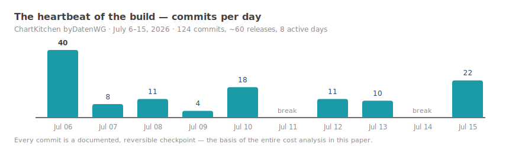
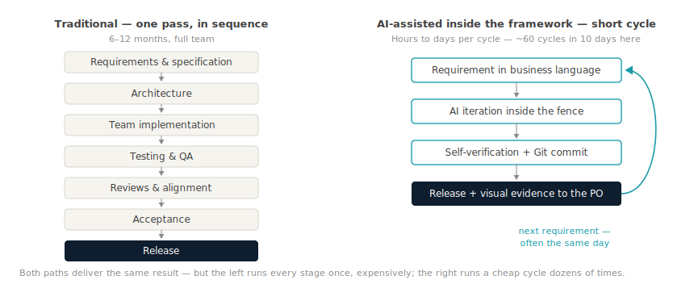
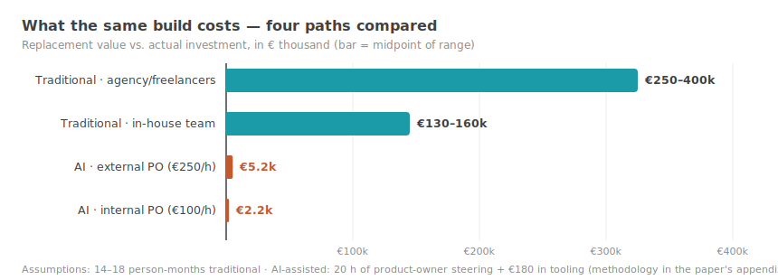
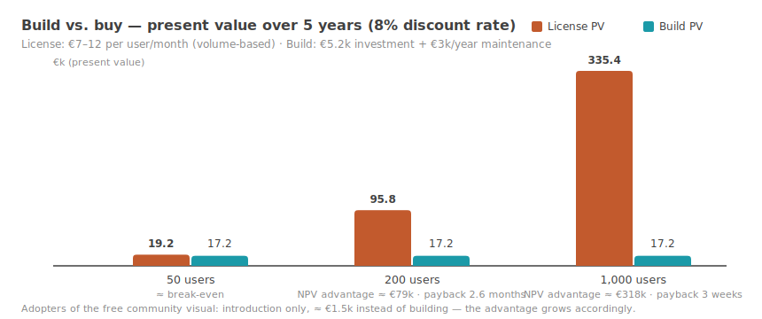
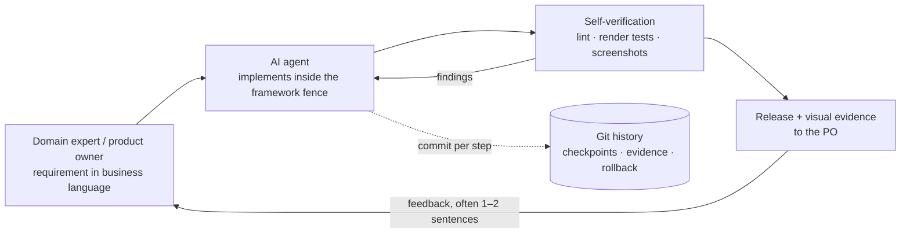
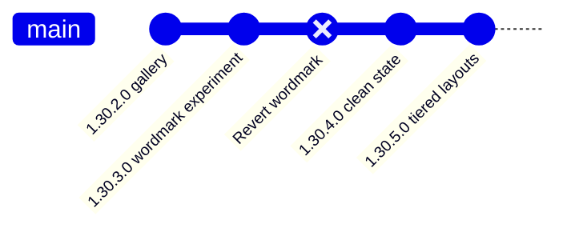

# Ten Days to a Market-Ready Build

## A valuation model for AI-assisted software development in fixed frameworks — calculated transparently on a real case study

**An evidence-based thesis paper · Michael Tenner, Daten-WG · July 2026 · v2.2 (English edition)**

---

## Management Summary

> **The central thesis [M]:** Under five boundary conditions — a fixed
> framework, domain expertise in the steering seat, small iterations, fast
> local verification, consistent version control — the productivity of
> AI-assisted development does not rise by percentages, but by orders of
> magnitude. The formula is not "AI can do this" but **AI × framework ×
> domain expertise × version control**. This paper demonstrates it on a
> fully documented case and provides the valuation model to go with it.
> The real innovation is not the AI itself, but its economic consequence:
> it changes the cost structure of software development — and thereby
> forces a reassessment of build-vs.-buy logic.

*Evidence labels used in this paper: [M] measured · [A] assumption ·
[S] estimate/model calculation · [H] hypothesis — details under "Terms &
Premises".*

**What this is about.** This paper proposes a **valuation model for
AI-assisted software development** and works it through on a fully
documented case study: a single controlling expert — no development team —
built a reporting tool for Microsoft Power BI to a market-ready state in
**ten calendar days**. The same build is appraised — using three recognized
estimation methods — at **14–18 person-months** and **€150,000–350,000**
the traditional way [S]. Case study, history and methodology are fully
public [M].

**What it actually cost.** About **20 hours of documented steering time**
by the domain expert (session logs; thinking and research time outside the
sessions is not captured — which is why the sensitivity calculation in
Chapter 4 runs the numbers up to 120 hours) plus roughly €180 in tooling.
Depending on the hourly rate (€250/h external, €100/h internal), the
investment comes to **~€5,200** or **~€2,200** — a cost leverage of 29 to
161 against the replacement value. Important context: this comparison sets
the achieved as-is state against a full traditional process and is
asymmetric to that extent — a symmetric counter-calculation (Chapter 4)
pushes the leverage down to **13 to 93**, but does not change the order of
magnitude. We deliberately speak of **cost leverage (cost avoidance)**,
not "ROI": an ROI presupposes realized returns; here, avoided replacement
costs are set against the investment (Terms & Premises).

**Why this is more than an anecdote.** The result rests not on luck but on
three reproducible conditions: a fixed software framework with clear rules
(Chapter 7), a domain expert who can state precisely what should be built,
and disciplined version control that keeps every step reviewable and
reversible (Chapter 8). Where these conditions hold, the pattern is
transferable — and then established calculations come under pressure: the
build-or-buy decision, the negotiating position in license talks, and the
pricing power of software vendors. At the same time: the evidence base is
**a single case study**. What is measured on the case and what is a
derived hypothesis about possible market effects is kept strictly separate
throughout the paper.

**Who this is relevant for.** CFOs and heads of controlling (license
costs, negotiating position), IT and BI leads (what becomes feasible
in-house; governance in Chapter 9), software vendors (where their business
model could come under pressure) and consultancies (where the value
migrates). Chapter 12 summarizes the options for action by role.

| Key result | Value | Evidence |
| --- | --- | :-: |
| Actual investment (external expert, €250/h) | **~€5,200** | [M] · [A] |
| Actual investment (internal expert, €100/h) | **~€2,200** | [M] · [A] |
| Traditional replacement value (3 methods, Appendix B) | **€150,000–350,000** | [S] |
| Cost leverage, as-is comparison | **29–67×** (external) · **69–161×** (internal) | [S] |
| Cost leverage, symmetric (same scope, Chapter 4) | **13–39×** (external) · **31–93×** (internal) | [S] |
| Calendar time: **10 days** | vs. an estimated 6–12 months traditionally | [M] · [S] |

**The five core theses:**

1. **AI × framework × domain expertise — not AI alone:** Fixed frameworks
   with defined interfaces, a sandbox and certification rules reduce the
   degrees of freedom until AI development becomes controllable and
   reproducible. This is the central thesis of this paper (Chapter 7). [M]
2. **Git is the underrated foundation:** Without version control, AI
   iteration speed becomes a liability. With it, every step is reversible
   and reviewable — and the entire analysis in this paper becomes possible
   in the first place (Chapter 8). [M]
3. **The build-or-buy calculation shifts** for framework software: on a
   present-value basis, building (or adopting a free community build)
   clearly beats the license model from a moderate user count onward — a
   calculation under disclosed assumptions (Chapter 5). [S]
4. **Negotiating-power hypothesis:** A credible free tool could shift
   license negotiations in the customer's favor without anyone actually
   switching (Chapter 6). [H]
5. **Market hypothesis:** Open source and AI could reinforce each other —
   AI makes community software maintainable, open code makes AI precise —
   and reduce the development-cost advantage of commercial vendors
   (Chapter 10). [H]

*On the evidence status of the theses:* Theses 1 and 2 are demonstrated
directly on the case. Thesis 3 is a calculation under disclosed
assumptions. Theses 4 and 5 extrapolate from the single case to the market
level — they are to be read as **reasoned hypotheses about possible
effects**, not as proven outcomes (context in Chapters 6, 10 and 11).

---

## Terms & Premises — what you need to read this paper

This paper is expressly written for readers without a development
background as well. Eight terms suffice:

| Term | Meaning in this paper |
| --- | --- |
| **Power BI custom visual** | An add-on module for Microsoft's reporting platform Power BI that adds new chart and table types — comparable to an app on a smartphone: it runs only inside the platform, by the platform's rules. |
| **IBCS** | International Business Communication Standards — a widely used notation standard for business reports (uniform scenario patterns, variance displays, "less decoration, more message"). |
| **AI-assisted development ("vibe coding")** | A human describes in plain language what the software should do; an AI agent writes, tests and documents the code. The human reviews results and steers — they do not type code. |
| **Product owner (PO)** | The steering domain expert: formulates requirements, judges results, decides priorities. Here: a controlling/BI expert without a development team. |
| **Open source (Apache 2.0)** | The source code is public and may be used, inspected and modified free of charge. The Apache 2.0 license also permits commercial use. |
| **Git / version control** | A logging system that permanently records every change step ("commit") and keeps it reversible — the logbook and safety net of software development. |
| **Cost leverage (cost avoidance)** | The ratio of avoided costs (replacement value) to the actual investment. "29×" means: the replacement value equals 29 times the investment. Deliberately not called "ROI" — an ROI presupposes realized returns; here, avoided expenditure is compared. |
| **Present value (DCF)** | Future payments (e.g. five years of license fees) discounted to today at an interest rate — the economically correct basis for build-vs.-buy comparisons. |

**Evidence labels:** Major statements in this paper carry a tag:
**[M]** = measured — from the Git history, session logs or invoices.
**[A]** = assumption — set and justified, e.g. hourly rates.
**[S]** = estimate or model calculation — derived from [M] and [A], e.g.
replacement value, cost leverage, present values. **[H]** = hypothesis —
extrapolation beyond the single case. The tags make visible at a glance
what each statement rests on.

**The premises of the calculation — stated upfront in full clarity:**

1. **The case study is exemplary.** Every figure is evidenced on one
   concrete project — a Power BI custom visual for controlling reports.
   The pattern, however, applies to a whole class of software: everything
   that lives inside a fixed framework with defined interfaces (Office
   add-ins, IDE extensions, platform plug-ins, internal line-of-business
   tools). Wherever you read "visual", feel free to think "our tool X".
2. **The project figures are measurements, not estimates:** calendar days,
   commits, releases and code size come from the public Git history; token
   and tooling costs from the session log and invoices (Appendix A).
3. **The hourly rates are assumptions:** €250/h for an experienced
   external consultant (market rate), €100/h as an internal full-cost
   rate. Both calculations are carried side by side throughout.
4. **The traditional comparison costs are an estimate** — bottom-up in
   person-months, deliberately kept as a wide range (€150–350k), with no
   vendor quotes obtained. The core statements survive even the lower end
   of the range.
5. **The license comparison uses public price indications** for commercial
   IBCS visual suites (€7–12 per user per month), discounted over 5 years
   at 8%.
6. **The evidence level is a single case study (n = 1).** Chapters 1–5
   rest on measurements and disclosed calculations for this one project.
   Chapters 6, 10 and parts of 12 derive hypotheses about possible market
   and negotiation effects — they are phrased conditionally and would only
   be substantiated by further, independent cases.
7. **The baseline comparison is deliberately an as-is comparison** — the
   traditional process with full overhead (documentation, QA, acceptance,
   project management) versus the AI build in its achieved state without
   those components. This asymmetry is not merely named; it is
   counter-calculated symmetrically in Chapter 4.
8. **Conflict of interest:** Daten-WG publishes the visual described here
   and provides consulting in the Power BI space. That is precisely why
   the methodology is disclosed and every figure can be recalculated — the
   paper argues with evidence, not authority.

**Reading guide:** Chapters 1–5 contain the documented case and the
calculations (costs, cost leverage, present value). Chapters 6–9 provide
context: negotiating power, why framework and Git tame the risks,
governance and maintainability. Chapter 10 states the market hypotheses;
Chapters 11–12 address transferability, limits and options for action.
Appendix A documents the methodology; Appendix B works through the
valuations using recognized methods (COCOMO II, function points, DCF,
relief from royalty) and places the case in the productivity literature; a
list of sources closes the paper.

---

## 1 · The case: what was built

ChartKitchen byDatenWG is a native Power BI custom visual
(TypeScript/SVG, API 5.11.0, no external runtime dependencies) for
controlling reports in IBCS-inspired notation — open source (Apache 2.0)
and free of charge.

| Scope (as of 2026-07-15, v1.34.1.0) | Value |
| --- | --- |
| Chart modes | 12 (columns, bars, line, waterfall, integrated bridge, category bridge, table/matrix, P&L statement, KPI cards, Pareto, dumbbell, slope) |
| Core code | ~10,200 lines |
| Table/matrix | n-level hierarchy, scrolling with frozen header + Σ, formula rows, collapsible column hierarchy, search, sorting |
| Localization | de, en, es, ja — ~245 UI strings each |
| Quality assurance | 80+ headless render tests, Microsoft lint rules, `npm audit` 0 findings |
| Distribution | buildable source export, AppSource submission package, trademark/legal review |


*Fig. 1 — The visual's mode gallery: 12 clickable previews, font presets, multilingual.*


*Fig. 2 — Controlling table: integrated bars, Δ and Δ% columns, finance convention (negative values in brackets), trend icons ▲▼● at materiality thresholds. Demo data labeled in German.*

---

## 2 · Time, costs and working method — the actuals

The Git history allows an honest delineation: first commit of the visual
on **July 6, 2026**; the state described here on **July 15, 2026**.


*Fig. 3 — 124 commits, ~60 releases in 10 calendar days (8 active days).*

| Metric | Value |
| --- | --- |
| Documented PO steering time (session logs: requirements, tests, feedback) | ~20 h |
| Tooling costs (AI subscription ~$100 + €80 additional budget) | ~€180 |
| Tokens processed | ~1.8 billion (96% cache reads) |
| API list-price equivalent of the compute | ~$2,900 (covered by the flat-rate subscription) |
| CO₂ footprint (methodology: [Daten-WG AI CO₂ simulator](https://datenwgknowledgekitchen.com/ki-co2-simulator.html), middle scenario) | ~0.2–1.1 t CO₂e ≈ one domestic flight |

One important clarification on the steering time: **~20 h is the
documented time** from the session logs. Not captured are thinking,
research and idea collection outside the sessions — honestly, they cannot
be measured. That is why Chapter 4 runs the sensitivity up to six times
the hours.

**Anatomy of a typical iteration** — from a sentence to a release the same
day. In the morning, the product owner reports via screenshot: *"In small
multiples, the bridges scale each tile independently — that should
optionally support a shared scale."* By the afternoon, the option is
built, tested, localized and shipped as a release:


*Fig. 4a — Before: region "Süd" (⅓ of the volume of "Nord") fills its tile just the same. Demo data labeled in German.*


*Fig. 4b — After (same day): optional shared scale — "Süd" is visibly one third, including the Δ% pin scales.*

**Total investment, two valuations:**

- **External product owner** (experienced consultant, €250/h):
  20 h × €250 + €180 = **~€5,200**
- **Internal product owner** (controller/BI lead, €100/h full cost):
  20 h × €100 + €180 = **~€2,200**

Remarkable in both calculations: **tooling is 3–8% of the investment —
over 90% is expert time.** The bottleneck is no longer the development
budget but the person who knows what should be built.

---

## 3 · What the same build would have cost traditionally

Before any numbers, look at the processes themselves — this is where the
cost difference arises, not in the hourly rates:


*Fig. 5 — Why the costs arise so differently: the traditional process runs all stages once, in sequence; the AI-assisted loop runs a short cycle dozens of times — here ~60 times in ten days. [M]*

Estimated bottom-up in person-months (PM) of development:

| Block | PM |
| --- | --- |
| Skeleton, build pipeline, settings model | 0.5–1 |
| Columns/bars/line incl. variance panels, scale sync, YTD | 2–3 |
| Waterfall + two bridge modes | 1–1.5 |
| Table/matrix (hierarchy, scroll freeze, formulas, matrix build-out) | 2.5–4 |
| KPI cards incl. bullet/benchmark | 0.75–1 |
| Small multiples (Σ tile, top-n, zoom, shared scales) | 0.75–1 |
| Landing page, in-chart interactions, persistence/bookmarks | 0.5–1 |
| Localization, accessibility, high-contrast mode | 0.5 |
| Test harness + test cases | 0.75–1 |
| Certification prep, license/trademark, AppSource kit | 0.5–1 |
| **Development** | **10–14 PM** |
| + project reality (specification, reviews, alignment, QA) | **14–18 PM** |

Valued at market rates: **internal ~€130–160k** (senior full cost of
€9k/PM, provided developers with both Power BI visual *and* controlling
experience are available), **external ~€250–400k** (€900–1,200/day). We
conservatively use the range **€150–350k**. [S] An independent
cross-check with two recognized estimation methods (COCOMO II, function
points) confirms the range — calculations in Appendix B.

**Stated openly: this comparison is asymmetric.** The traditional side
includes the full process overhead (specification, reviews, QA, acceptance
tests, end-user documentation, project management); the AI build does
**not yet** include end-user documentation, formal acceptance tests or a
complete external review round (Chapter 11). Comparing only the as-is
state therefore gives the AI side a systematic advantage. That is why the
cost leverage in Chapter 4 is additionally calculated symmetrically — with
both possible corrections (scaling the AI side up to full scope, or
reducing the traditional side by the missing components).


*Fig. 6 — Four paths to the same build. The AI-assisted bars are barely visible at this scale — that is the point.*

---

## 4 · The cost leverage — deliberately not an "ROI"

First, the clarification a critical reader is right to demand: the
following metric is **not an ROI**. A return on investment presupposes
realized returns; here, the actual investment is set against **avoided
replacement costs** (cost avoidance). We therefore consistently call the
metric **cost leverage**: "29×" means the replacement value equals 29
times the investment — not that 29-fold returns have flowed. The value is
realized only through usage, reach and avoided license costs (Chapter 5).
If you need a traditional label: a value-to-investment factor based on the
estimated replacement value. [S]

| Cost leverage | External PO (€5,200) | Internal PO (€2,200) |
| --- | ---: | ---: |
| vs. €150k (conservative) | **29×** | **69×** |
| vs. €250k (middle) | **48×** | **115×** |
| vs. €350k (external) | **67×** | **161×** |

Effective hourly value of the 20 documented steering hours:
**€7,500–17,500** — a 30–70× multiple of the external consulting rate,
75–175× of the internal one. Per release: ~€85 (external) or ~€37
(internal). Per line of code: ~€0.20–0.50 — traditionally, a productive
line runs €15–35.

Two observations: More important than any metric is that a tool **comes
into existence at all** that would never have received a €250k budget.
And: the leverage belongs to the combination "domain expert + tool". AI
replaces the development team here — **not the product owner.**

### Sensitivity: what if it took more hours?

The 20 h are documented session time (Chapter 2) — undocumented thinking
and research time realistically comes on top. The calculation does not
break:

| Steering time | Investment external | Leverage vs. €150–350k | Investment internal | Leverage vs. €150–350k |
| --- | ---: | ---: | ---: | ---: |
| 20 h (documented) | €5.2k | 29–67× | €2.2k | 69–161× |
| 40 h | €10.2k | 15–34× | €4.2k | 36–84× |
| 80 h | €20.2k | 7–17× | €8.2k | 18–43× |
| 120 h | €30.2k | 5–12× | €12.2k | 12–29× |

Even at **six times** the hours, a leverage of at least 5 (external) or
12 (internal) remains. The statement does not hinge on the precision of
the time tracking.

### Symmetry check: cost leverage at comparable scope

The table above compares as-is state against full process (Premise 7).
Two corrections establish symmetry:

**Path A — scale the AI side up to full scope.** End-user documentation,
formal acceptance tests and an external review round would take an
estimated further 15–25 PO hours plus ~€100 in tooling using the same
method (based on the project's documentation and test packages so far —
an estimate, not a measurement):

| | External PO | Internal PO |
| --- | ---: | ---: |
| Investment at full scope | ~€9.0–11.5k | ~€3.8–4.8k |
| Leverage vs. €150–350k | **13–39×** | **31–93×** |

**Path B — reduce the traditional side by the missing components**
(−10–20%, Chapter 3): comparison value €120–315k against the as-is
investment:

| | External PO (€5.2k) | Internal PO (€2.2k) |
| --- | ---: | ---: |
| Leverage vs. €120–315k | **23–61×** | **55–144×** |

**What this changes — and what it does not:** The headline values of
29–161× apply only to the as-is comparison. Calculated symmetrically, the
leverage lands at **13–144×** depending on path and staffing — in the
least favorable scenario (external rate, full scope, conservative
comparison value) a factor of **13** remains. The core statement survives
the correction; the individual values, however, should always be quoted
with this context. Finally, one thing cannot be extrapolated: the
alignment overhead of real multi-stakeholder organizations. This project
was decided by one person — in an organization with committees and
approvals, additional PO hours would push the factor further down
(Chapter 11).

---

## 5 · Build vs. buy as a present-value comparison

Commercial visual suites cost roughly **€7–12 per user per month**.
Discounted over 5 years (8%, annuity factor 3.99), against building with a
€5.2k investment and assumed €3k/year maintenance:


*Fig. 7 — From ~150–200 report users onward, building clearly wins on present value.*

| Company size | License PV (5 y) | Build PV | NPV advantage |
| --- | ---: | ---: | ---: |
| 50 users × €8/m | €19,200 | €17,200 | ~€2,000 |
| 200 users × €10/m | €95,800 | €17,200 | **~€78,600** |
| 1,000 users × €7/m | €335,400 | €17,200 | **~€318,000** |

Payback: 2.6 months (200 users), ~3 weeks (enterprise). Sensitivity: even
at triple the maintenance (€10k/year), the mid-market case stays ~€50k in
the black. The full year-by-year calculation with interest and
maintenance sensitivities is in Appendix B. [S]

**The adopter perspective sharpens the picture:** Whoever deploys the free
community visual instead of building it themselves bears only the
introduction cost (~2 controller days ≈ €1.5k) against €19–335k of license
present value. For small companies — whose real alternative is often "no
IBCS visuals at all" — this is not a saving but **access to a capability
that did not exist in their price class**.

Fairness: the comparison holds where the feature scope suffices.
Commercial vendors additionally sell maturity, SLAs, certification and a
roadmap. In the community model, that gap is addressed by a support
subscription (Chapter 10).

---

## 6 · The game-theoretic dimension

An often overlooked value of a credible free tool is realized **without it
ever being deployed**: it changes the negotiating position (BATNA) toward
commercial vendors. Context first: what follows is a **model-based
consideration** built on negotiation logic — backed by no observed deals;
the amounts named are possible effects, not promised discounts. [H]

- Until now, the alternative in license negotiations was "pay or do
  without". With a credible free option, the mere **possibility** of
  switching suffices: for the 1,000-user enterprise, a 10–20% renewal
  discount corresponds to **€33–67k in present value** — purely through
  the alternative's existence in the procurement comparison.
- **Credibility is the currency:** open, buildable source code ✓, visible
  maintenance (60 releases in 10 days) ✓, certification and documentation
  as next steps. The cheapest credible move for an enterprise: a pilot on
  a single report page.
- **Limits:** Without certification, the card remains formally unplayable
  in many organizations; large existing report estates (switching costs)
  blunt it. It is sharpest for new introductions and expiring framework
  agreements.

---

## 7 · Why the fixed framework is half the success

This chapter contains the paper's central thesis — scientifically more
interesting than any cost factor: **Fixed frameworks reduce the degrees of
freedom of development so strongly that AI work becomes controllable and
reproducible.** The causal chain: framework → sandbox → small iterations →
local verification → Git → controllable risk. Absolute productivity
factors will change with every model generation; this mechanism will not.

The widespread concern about AI-generated code — "fast, but insecure and
buggy" — underestimates how strongly a fixed framework trims the risk
surfaces. Five mechanisms interlock, all demonstrated on the case [M]:

**Mechanism 1 — search-space reduction.** A Power BI visual lives in a
predefined contract: one `update()` interface, declarative capabilities, a
settings model. There is no home-grown network, persistence or threading
layer for AI mistakes to hide in — the most error-prone layers of
traditional projects **simply never exist**. For the AI this means: the
solution space per requirement is small and the variance between two
attempts is low — precisely what makes results reproducible rather than
random.

**Mechanism 2 — deterministic interfaces.** Every requirement translates
mechanically into "which option, which renderer, which persistence" — no
fundamental architecture questions whose wrong answer only becomes visible
months later. Development becomes a sequence of small, decidable steps;
convergence is the norm, not a stroke of luck.

**Mechanism 3 — the sandbox as a damage cap.** The visual runs in an
isolated iframe, with no network access, no file system, no storage APIs.
Microsoft's certification rules additionally prohibit `eval`, `innerHTML`
and external loading — rules that are checked automatically (met across
the project; `npm audit`: 0 findings). The maximum damage radius of an AI
mistake is structurally capped: **it can draw a chart wrong, but it
cannot exfiltrate data.**

**Mechanism 4 — small iterations.** 124 commits for ~60 releases: the
average change is small enough to be read, understood and, if necessary,
discarded as a diff. Experiments become cheap because the way back is
guaranteed (Chapter 8) — which cuts the cost of every single wrong
decision to minutes.

**Mechanism 5 — local verification in minutes.** The headless harness
renders every state as an image; errors are *visible* rather than latent,
and 80+ test cases with known expected values secure the domain logic.
The feedback loop closes locally in minutes — no deployment, no test
environment, no waiting.

Stated as a design rule: **If AI development feels uncontrollable, the
first lever is not a better model — it is a tighter fence.**



*Fig. 8 — The loop: iterate small, self-verify, version everything.*

The generalization: this risk profile is shared by **all** framework
ecosystems with a sandbox and certification — Office add-ins, browser
extensions, app-store apps, dbt packages. There, "vibe coding" is
production-grade not despite but **because of** the constraints.
Greenfield systems without a fence lack this safety net — different
standards apply there (Chapter 11).

---

## 8 · Git: the underrated foundation

The uncomfortable truth first: **Without version control, vibe coding is
garbage.** An AI that produces dozens of changes per day is, without
rollback points, not an accelerator but an uncontrollable risk — every
failed iteration contaminates the state, and nobody knows anymore what was
changed when and why. With Git, this inverts; four mechanisms carried this
build:

**1. Checkpoints & rollback.** Every unit of work ends in a commit (in
this setup even enforced: no work session ends without commit + push). A
real example from the project: a design experiment — a wordmark logo on
the landing page — did not sit well with the product owner. One
`git revert`, released as 1.30.4.0, five minutes, no damage:



*Fig. 9 — Experiments become cheap when the way back is guaranteed.*

**2. Small commits as a review surface.** 124 commits for 60 releases
means: the average change is small enough to be read as a diff. That is
the realistic answer to "who reviews the AI code?" — not everything line
by line, but **bounded diffs with descriptive commit messages**, spot-
checked in depth.

**3. Branch isolation.** The entire development ran on its own branch —
the AI cannot "break" anything that is not explicitly merged. For teams:
AI work thus integrates organizationally exactly like a new developer's,
including the pull-request gate.

**4. History as evidence.** Every figure in this paper — calendar days,
commits per day, release frequency, even the delineation "visual vs.
preliminary work" — comes from `git log`. Version control makes AI
development **auditable**: for auditors, for IT compliance, for one's own
cost accounting. Without Git this paper would be assertion; with Git it
can be recalculated. To our knowledge, this history is among the first
fully public development records of an AI-built production tool — every
one of the 124 steps can be inspected. That is not a by-product of the
case study; it is its central quality feature.

**Git as a governance system.** For organizations, Git is thus more than
a tool — it is the existing control infrastructure for AI work:
*auditability* — every change is attributable to an author, a timestamp
and a rationale, compatible with financial audit and IT compliance.
*Traceability* — the "why" of every decision lives in the history, not in
one person's head. *Reviewability* — pull-request gates work for AI
contributions unchanged. *Compliance fit* — internal control systems dock
onto existing Git processes; no new infrastructure is needed, only
discipline within the existing one. [M]

The practical consequence for any AI development setup: a commit
obligation per unit of work, meaningful messages, a dedicated branch, push
as part of the definition of done. It costs nothing and decides
production-worthiness.

---

## 9 · Governance, maintainability, bus factor — the risk questions

Whoever decides on adopting this pattern asks not about code but about
risk. The four questions that regularly come first — and what this case
answers to them:

**Who reviews AI-generated code?** Three layers, none of them optional:
(1) *Automated gates* — Microsoft lint rules, certification checks (no
`eval`, no `innerHTML`, no external loading), `npm audit`; all ran at zero
findings across the project. (2) *Bounded diffs* — 124 commits for 60
releases mean small, readable changes with descriptive messages; review is
spot-checked in depth rather than uniformly shallow (Chapter 8).
(3) *Domain acceptance on the result* — the product owner checks every
iteration on the rendered image against domain rules ("stock quantities
must not be summed"). For organizations this means: the review process
for AI code already exists — it is the pull-request process for human
code, with stricter automated gates.

**How are hallucinations caught?** In a framework context, an AI mistake
does not manifest as a plausible false claim but as a wrongly drawn chart
or a broken test — it is *visible* (Chapter 7). The headless render
harness produces image evidence for every state; domain correctness is
checked by the domain expert, not by the AI itself. Residual risk remains
with subtle calculation errors that look visually plausible — against
those stand the 80+ test cases with known expected values.

**Who maintains this in three years?** The honest answer: not necessarily
the same person. Maintainability rests on three properties that are
person-independent: open source code (any developer *and* any future AI
can read the entire code base), a complete Git history with descriptive
commits (the "why" of every decision is documented) and the framework
itself (Microsoft API updates are the main maintenance driver and affect
all visuals equally). The DCF calculation (Chapter 5) prices maintenance
at €3k/year and stays robust up to €10k/year — that corresponds to 12–40
PO hours annually using the same method.

**What happens if the product owner leaves?** The classic bus factor of 1
splits in two here: the *technical* knowledge sits entirely in the
repository (code, history, test cases, machine-readable project
documentation) — it is transferable, to humans as to AI agents. The
*steering* knowledge — which domain requirements matter next — remains
person-bound, as with any specialized process. Recommendation for
organizational use: keep requirements and acceptance decisions in the
repository (done here: backlog and changelog are public) and bring a
second person into the steering early.

**Limits of the quality evidence — stated openly:** The available quality
evidence consists of process and audit metrics (tests, lint, audit,
release history). Missing are: formal performance and memory
measurements, structured user feedback at scale, and completed Microsoft
certification (submission is in progress; the submission package is part
of the repo). These gaps are in the public backlog and belong in any
serious adoption decision (Chapter 11).

---

## 10 · The market thesis: open source × AI is multiplicative

> **Context — the reach of this chapter:** From here on, the paper leaves
> the documented single case. The following statements are **hypotheses
> about possible market effects**, derived from one case study (n = 1) and
> historical analogies. They describe what *could* happen if the pattern
> is confirmed in further cases — not what demonstrably happens. Readers
> looking exclusively for evidenced statements can skip this chapter —
> Chapters 1–9 stand without it. [H]

The hypothesis chain, link by link: **AI lowers development costs** in the
fenced application layer (demonstrated on the case, Chapters 2–4) →
**feature replication becomes cheap**, and the price premium for standard
features loses its basis → **open-source alternatives become durably
maintainable** and thus credible for the first time → **the part worth
paying for shifts to support, liability and integration** → **vendors
adjust prices or business models**. Only the first link is evidenced;
every further one is individually plausible but unproven. [H]

Some history: individually, both forces were manageable for software
vendors. Open source often failed in the application layer on the
maintenance argument ("who will maintain this?"); AI development alone
remained at prototype level without open reference code bases. **Our
observation suggests they reinforce each other:**

- AI makes community software **maintainable** — a one-person project
  effectively has a development team; a "bus factor of 1" no longer means
  standstill.
- Open code makes AI **precise** — every open project is immediately
  extensible because the model reads the code base like a well-onboarded
  developer.

If this held broadly, the classic defensive wall of feature-oriented
software vendors ("development is expensive, we paid for it, you rent
it") would come under pressure. Most exposed: single-product vendors with
feature differentiation and per-seat pricing. Little affected: platforms
(Microsoft wins with every good visual), data/network lock-in, liability
as a purchase reason.

The historical pattern exists: open source consolidated the
infrastructure layer (Linux, Postgres); what survived is the **Red Hat
model** — software free, revenue from support and reliability. Our
expectation: the same model is now reaching the application layer.

**Counterforces, named honestly:** (1) Vendors can develop AI-assisted
too — what falls is their pricing latitude against "good enough and
free", not their product. (2) The coming flood of AI-built throwaway
software makes trust signals **more** valuable: certification, release
history, a face behind the product. (3) One market segment will keep
paying for SLAs and liability — it shrinks, it does not disappear.

---

## 11 · Transferability — and limits

Three ingredients explain the result; remove one, and the calculation
breaks:

1. **A fixed framework** (Chapter 7) — bounded bug/security surface,
   local verification.
2. **Domain expertise in the steering seat** — requirements in business
   language with a built-in quality yardstick ("stock quantities must not
   be summed"). The difference between two iterations and twenty.
3. **Self-verification + version control** (Chapter 8) — the loop from
   Fig. 8.

Where the pattern holds and where it does not — judged against the five
mechanisms from Chapter 7 [S]:

| System class | Fit | Reason |
| --- | :-: | --- |
| Power BI visuals, Office add-ins | ✓ | fixed API contract, sandbox, certification rules, local verification |
| Browser and IDE extensions | ✓ | defined manifest/API boundaries, fast local testing |
| dbt packages, analytics artifacts | ✓ | declarative frame, deterministic checks against data |
| Internal domain tools with a clear frame | ✓ | bounded domain logic, domain expert available as product owner |
| Greenfield platforms | ✗ | architectural degrees of freedom are exactly what the fence removes |
| Distributed systems | ✗ | failure modes emerge from interplay; verification is not local |
| Embedded / safety-critical | ✗ | standards and formal proofs demand different processes |
| Legacy monoliths | ✗ | huge context, slow verification — the METR finding points the way (Appendix B.6) |

**Open items of this project** that a €250k project would have included:
end-user documentation, formal acceptance tests with users, a complete
adversarial review round of the most recent packages. They are in the
public backlog — transparency is part of credibility.

---

## 12 · What this can mean for companies

The following derivations stand under the caveat from Chapter 10 and
Premise 6: what is evidenced is the single case; the recommendations
describe **possible consequences** whose weight depends on whether the
pattern is confirmed in further, independent cases. They still work as
low-risk first steps — none of them requires the market thesis to come
true.

**CFO / head of controlling:** Test visual and tool licenses against the
free alternative — as a switching option or a negotiation card. From
~150–200 users, the present-value advantage is substantial (Chapter 5).

**IT / BI leads:** The combination "framework fence + internal domain
expert + AI + Git discipline" is reproducible — and at the internal €100
rate, the entry barrier is four digits, not six. Candidates: everything
currently bought as a per-seat license that is, at its core, bounded
domain logic.

**Software vendors:** Defending feature parity becomes more expensive
than differentiating upward (planning, writeback, enterprise integration)
or moving to a service model. Pricing of the base layer becomes
disciplined.

**Consultancies:** The value migrates from the license to the expertise.
The viable model is the infrastructure world's: software free, revenue
from enablement, support and further development — the subscription as
the formalized answer to the maintenance question.

**The recommendation in one sentence:** Companies should re-evaluate
their build-vs.-buy decisions for framework software under the conditions
of AI-assisted development — not because this single case forces it, but
because the calculations for doing so are now openly available, and
recalculating in-house costs days, not months. [S]

> **This paper does not claim:** that AI replaces developers · that every
> piece of software takes ten days · that every domain achieves the same
> results · that a single case proves a market trend.
>
> **It shows:** a fully documented practical case [M] · a traceable
> economic valuation using recognized methods [S] · plausible consequences
> for the build-vs.-buy decision [S] · reasoned hypotheses for further
> investigation [H].

---

## Invitation: replicate, refute, extend

A case study proves no rule — it asks a precise question. The answer
emerges through repetition: **if you undertake a comparable project — in a
different framework, in a different domain, as a team rather than solo —
document it using the same method** (Appendix A: Git history, time log,
tooling costs, valuation methods from Appendix B) and place your results
next to these. Confirming cases sharpen the boundary conditions;
contradicting ones are at least as valuable — they show where the fence
ends.

Three replication questions strike us as particularly worthwhile: Does
the cost leverage hold in a second framework ecosystem (Office add-in,
dbt package)? How much does it drop when a multi-stakeholder team steers
instead of a single person? And where does it land with a product owner
who has no prior development experience? Repository, methodology and this
paper are public — disagreement is expressly welcome.

**Contact for replications, criticism and questions:**
Michael Tenner · [michael.tenner84@gmail.com](mailto:michael.tenner84@gmail.com)

---

## Appendix A · Methodology and evidence

- **Project data:** Git history of the public repository (first visual
  commit 2026-07-06; 124 commits, ~60 releases through 2026-07-15); code
  size via `wc -l`; test cases in the repo. Figs. 1, 2 and 4 are
  unedited render outputs of the test harness; Figs. 3, 6 and 7 are
  charts built from the raw data; Fig. 5 is a process schematic.
- **Token/cost data:** analysis of the development session log (4,446 API
  calls; output 5.3M, cache write 70.5M, cache read 1,725M tokens); API
  list prices as of June 2026; subscription costs per invoice.
- **Hourly rates:** €250/h external senior consultant (market rate),
  €100/h internal full-cost rate (salary + non-wage costs + overhead of an
  experienced controller/BI lead).
- **CO₂ estimate:** methodology of the Daten-WG AI CO₂ simulator (Wh per
  1,000 output tokens by model class, PUE 1.15–1.56, US grid mix
  300–450 g/kWh); cache reads at a 0.1 factor as a price-analogous
  approximation.
- **Traditional cost estimate:** bottom-up in PM (Chapter 3), valued at
  €9k/PM internal and €900–1,200/day external; no vendor quotes obtained,
  range deliberately wide.
- **DCF assumptions:** license prices €7–12 per user per month (public
  price indications for commercial IBCS visuals, volume-dependent); 8%
  discount rate; 5 years; build maintenance €3k/year (sensitivity tested
  up to €10k/year).
- **Conflict of interest:** Daten-WG publishes the visual described and
  provides consulting services in the Power BI space. All estimates are
  orders of magnitude, not offers or assurances.

## Appendix B · Valuation with recognized methods — the calculations

Valuation standards for intangible assets (IDW S 5 [1], IVS 210 [2]; for
accounting, IAS 38 [3]) know three families of methods: **cost-based**
(replacement cost), **income-based** (discounted future payments,
including relief from royalty) and **market-based** (comparable
transactions). This appendix works through the first two in full; the
market approach is unavailable for lack of observable transactions in
individual visuals — its role is taken by the public license prices that
feed into B.2 and B.3.

### B.1 Cost-based: replacement cost, three estimation methods

**Method 1 — bottom-up expert estimate** (Chapter 3): decomposition into
ten work blocks, each with a PM range. Result: **14–18 PM** including
project reality.

**Method 2 — COCOMO II** (parametric model, Boehm et al. [4]). Base
formula:

```
PM = A × Size^E × ∏EM        with A = 2.94; Size in KSLOC;
E  = B + 0.01 × ΣSF          with B = 0.91; nominal E ≈ 1.10
```

Applied with Size = 10.2 KSLOC (measured core code):

| Scenario | Effort multipliers ∏EM | Result |
| --- | --- | --- |
| Nominal (average team, standard conditions) | 1.0 | **~38 PM** |
| Adjusted: high team/analyst capability, well-worn toolchain, low novelty | 0.4–0.5 | **15–19 PM** |

One PM in COCOMO II equals 152 working hours. The adjusted scenario
corresponds to an experienced specialist team — the realistic staffing for
such a project; the nominal scenario marks the upper bound.

**Method 3 — function point analysis** (ISO/IEC 20926 [5]). As no formal
count exists, the estimate is backfired from the code size (Jones [6]:
JavaScript family ~40–60 LOC per FP):

```
10,200 LOC ÷ 50 LOC/FP ≈ 204 FP   (range 170–255 FP)
```

With typical delivery rates for new business applications of 8–15 hours
per FP (ISBSG benchmarks [7]): 204 FP × 8–15 h = 1,630–3,060 h ≈
**11–20 PM** (full range across both uncertainties: 9–25 PM).

**Triangulation** — valued at €9k/PM internal and €900–1,200/day external
(1 PM ≈ 19 person-days):

| Method | Effort | Internal (€9k/PM) | External (€900–1,200/day) |
| --- | --- | ---: | ---: |
| Bottom-up (Chapter 3) | 14–18 PM | €126–162k | €240–410k |
| COCOMO II, adjusted | 15–19 PM | €135–171k | €255–435k |
| Function points | 11–20 PM | €100–180k | €190–455k |
| *COCOMO II, nominal (upper bound)* | *~38 PM* | *~€340k* | *~€650–870k* |

All three main methods land in the same order of magnitude. The range
used in this paper, **€150–350k**, lies inside the triangulation and is
conservative against its upper bounds; the discount for still-missing
end-user documentation and acceptance tests (−10–20%, Chapter 3) has
already been addressed.

**Why COCOMO II and function points — and not DORA or SPACE?** A
replacement value needs methods that estimate the *effort for a defined
feature scope* — which parametric models (COCOMO II) and functional size
measurement (function points) provide. Modern team-performance frameworks
like DORA/Accelerate [14] or SPACE [15], by contrast, measure delivery
capability and developer experience of running organizations — they answer
a different question and are deliberately not used as a cost yardstick
here. Also important: COCOMO II is calibrated on traditional development
(data through ~2000). In this paper it serves exclusively to
**plausibility-check the traditional comparison costs** — never to value
the AI-assisted path itself.

### B.2 Income-based: DCF, year by year

Present-value formula and annuity factor (standard financial mathematics,
e.g. Brealey/Myers/Allen [8]):

```
PV = Σ CFt / (1+r)^t          AF(r; n) = (1 − (1+r)^−n) / r
AF(8%; 5 y) = (1 − 1.08^−5) / 0.08 = 3.9927
```

**Worked example, mid-market:** 200 report users, license €10 per user
per month = €24,000/year, paid in arrears; building at €5,200 upfront +
€3,000/year maintenance:

| Year | License payment | Discount factor (8%) | PV license | PV maintenance |
| --- | ---: | ---: | ---: | ---: |
| 0 | — | 1.0000 | — | €5,200 (investment) |
| 1 | €24,000 | 0.9259 | €22,222 | €2,778 |
| 2 | €24,000 | 0.8573 | €20,576 | €2,572 |
| 3 | €24,000 | 0.7938 | €19,052 | €2,381 |
| 4 | €24,000 | 0.7350 | €17,641 | €2,205 |
| 5 | €24,000 | 0.6806 | €16,334 | €2,042 |
| **Σ** | **€120,000** | | **€95,825** | **€17,178** |

**NPV advantage of building: 95,825 − 17,178 = ~€78,600.** Payback:
€5,200 ÷ €24,000/year ≈ 2.6 months.

**Sensitivity** (NPV advantage in €k, same case, discount rate ×
maintenance):

| Maintenance \ discount rate | 6% | 8% | 10% |
| --- | ---: | ---: | ---: |
| €3k/year | +83.3 | +78.6 | +74.4 |
| €6k/year | +70.6 | +66.7 | +63.0 |
| €10k/year | +53.8 | +50.7 | +47.9 |

The advantage stays clearly positive in every combination for the
mid-market case — the decision is robust against both parameters.
**Break-even:** the build present value of €17.2k corresponds — depending
on the €8–12 per-user tier — to the license present value of **30–45
users**. Above that, building wins.

### B.3 Relief from royalty

Relief from royalty is the income-based method recognized in IDW S 5 [1]
and IVS 210 [2] for valuing the **asset itself**: the tool's value equals
the discounted license payments its owner does *not* have to make, minus
the costs borne instead.

```
Value ≈ PV(avoided licenses) − PV(maintenance)
200 users:    €95,825 − €11,978 ≈  €84k
1,000 users: €335,400 − €11,978 ≈ €323k
```

The value is usage-dependent — the same visual is roughly four times as
"valuable" to a 1,000-user enterprise as to the mid-market. That explains
precisely why one and the same free tool works sharpest as a negotiation
card (Chapter 6) at the enterprise.

### B.4 Estimating traditional timelines — with sources

The COCOMO II schedule formula [4] gives calendar time independent of
team size:

```
TDEV = 3.67 × PM^0.318
15 PM → ~9 months      19 PM → ~9.5 months      38 PM → ~12 months
```

This matches the simple back-of-the-envelope calculation (14–18 PM with 2
developers ≈ 7–9 months plus staffing, reviews, release cycles) and
justifies the range of **6–12 months** used in the paper. Two empirical
findings suggest this estimate is more likely too optimistic than too
pessimistic: large IT projects exceed their budgets by ~45% on average
(McKinsey/Oxford [9]), and only about a third of software projects finish
on time, on budget and in scope (Standish CHAOS [10]). The 10 calendar
days of the AI-assisted build stand against a traditionally derived
timeline of **9–12 months** — a factor of ~25–35 in calendar time.

### B.5 Method overview

| Method | Family (IDW S 5 / IVS 210) | Result here |
| --- | --- | --- |
| Bottom-up, COCOMO II, function points | cost-based | replacement €150–350k (conservative) |
| DCF build vs. buy | income-based | NPV advantage ~€79k (200 users) to ~€318k (1,000 users) |
| Relief from royalty | income-based | asset value ~€84–323k (usage-dependent) |
| Comparable transactions | market-based | not applicable (no active market for individual visuals) |

All methods tell the same story from different directions: the value
created sits two orders of magnitude above the €2.2–5.2k investment —
regardless of which recognized valuation logic you follow.

### B.6 Placing the case in the productivity literature

Controlled studies of AI tools in software development report markedly
smaller but same-direction effects: **+55.8%** speed on a bounded
programming task in the Copilot experiment (Peng et al. [11]); **20–50%**
time savings depending on task type in practical experiments
(McKinsey [12]); and, as an important counter-result, experienced
open-source developers were on average **~19% slower** with AI tools on
their own large code bases (METR [13]).

The case documented here, with a calendar-time factor of ~25–35, sits far
above these values — it is an **outlier at the upper end**, and precisely
for that reason it demands explanation. This paper's explanation: the
literature predominantly measures AI as an *assistant* within existing
processes, with humans in the typing loop and grown code bases; here, AI
worked as the *executing team* inside a tightly fenced framework, with a
one-person decision structure and a greenfield start — exactly the
conditions from Chapters 7 and 11. The METR finding supports this reading
in mirror image: without a fence and with high context overhead, the
effect can even turn negative. Consequence: this case's factor is **not
an expected value for arbitrary projects**, but a demonstration of the
upper end under favorable, explicitly named conditions.

---

## Sources

1. IDW S 5: *Grundsätze zur Bewertung immaterieller Vermögenswerte.*
   Institut der Wirtschaftsprüfer in Deutschland e. V., Düsseldorf
   (2015 edition). (German standard for the valuation of intangible
   assets.)
2. IVSC: *International Valuation Standards*, IVS 210 *Intangible
   Assets.* International Valuation Standards Council, London (current
   edition).
3. IAS 38: *Intangible Assets.* International Accounting Standards Board
   (IFRS Standards).
4. Boehm, B. W.; Abts, C.; Brown, A. W. et al.: *Software Cost Estimation
   with COCOMO II.* Prentice Hall, Upper Saddle River, 2000.
5. ISO/IEC 20926:2009: *Software and systems engineering — IFPUG
   functional size measurement method.* ISO, Geneva.
6. Jones, C.: *Applied Software Measurement: Global Analysis of
   Productivity and Quality.* 3rd ed., McGraw-Hill, New York, 2008
   (backfiring tables LOC↔FP).
7. ISBSG: *Development & Enhancement Repository* — industry benchmarks
   for project delivery rates (h/FP). International Software Benchmarking
   Standards Group, isbsg.org.
8. Brealey, R. A.; Myers, S. C.; Allen, F.: *Principles of Corporate
   Finance.* McGraw-Hill (present-value and annuity mathematics).
9. Bloch, M.; Blumberg, S.; Laartz, J.: *Delivering large-scale IT
   projects on time, on budget, and on value.* McKinsey & Company in
   collaboration with the University of Oxford, 2012.
10. The Standish Group: *CHAOS Report* (ongoing study series on software
    project success rates).
11. Peng, S.; Kalliamvakou, E.; Cihon, P.; Demirer, M.: *The Impact of AI
    on Developer Productivity: Evidence from GitHub Copilot.*
    arXiv:2302.06590, 2023.
12. McKinsey & Company: *Unleashing developer productivity with
    generative AI.* 2023.
13. METR: *Measuring the Impact of Early-2025 AI on Experienced
    Open-Source Developer Productivity.* 2025.
14. Forsgren, N.; Humble, J.; Kim, G.: *Accelerate — The Science of Lean
    Software and DevOps.* IT Revolution Press, 2018 (DORA metrics).
15. Forsgren, N.; Storey, M.-A.; Maddila, C. et al.: *The SPACE of
    Developer Productivity.* ACM Queue 19(1), 2021.

Note on usage: [4]–[7] are estimation benchmarks, not measurements taken
on this project; they serve as independent plausibility checks of the
project-specific bottom-up estimate. Where literature values come as
ranges, the range — never a point value — is carried through the
calculations.

---

*v2.2 (English edition) — figures as of 2026-07-15. Translated from the
German original; in case of doubt, the German edition governs. Feedback
and replications welcome: Michael Tenner · michael.tenner84@gmail.com*
