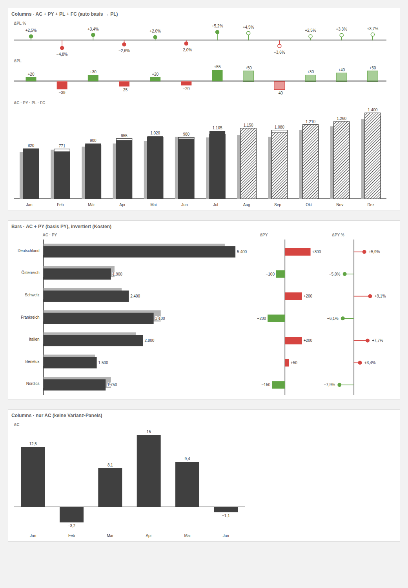

# IBCS Business Chart — Zebra-BI-inspiriertes Custom Visual für Power BI

Ein Custom Visual, das die wichtigsten IBCS-Bausteine in **einem** Visual löst —
inspiriert von Zebra BI Charts:



## Features

- **Szenario-Notation nach IBCS**
  - **AC** (Actual): solide, dunkel
  - **PY** (Previous Year): graue Säule/Balken, versetzt hinter AC
  - **PL** (Plan/Budget): Outline (weiß gefüllt, umrandet)
  - **FC** (Forecast): schraffiert — Monate ohne AC-Wert zeigen automatisch den FC
- **Absolutes Abweichungs-Panel** (ΔPY oder ΔPL): grün/rot gefärbte Balken
- **Relatives Abweichungs-Panel** (ΔPY % / ΔPL %): Pin-Chart (Lollipop), FC-Pins hohl
- **IBCS-Baseline-Notation**: AC = solide schwarze Achse, PY = dicke graue Achse,
  PL = doppelte dünne Linie
- **Columns & Bars**: vertikale Säulen für Zeitreihen, horizontale Balken für
  Struktur-Vergleiche (Panels dann nebeneinander)
- **Invert-Schalter** für Kosten-KPIs (Mehrwert = schlecht = rot)
- Wertelabels mit weißem Halo, kompakte Einheiten (k/M/B, auto), Dezimalstellen einstellbar
- Tooltips (AC/FC/PY/PL/ΔBasis/ΔBasis %), Cross-Filtering per Klick (Strg = Mehrfachauswahl),
  Kontextmenü (Rechtsklick), Landing Page bei leeren Feldern

## Installation in Power BI

1. Fertiges Paket: [`dist/zebraIBCSE73997CF4C7D44978F8112A4E5FA0B4D.1.0.0.0.pbiviz`](dist/)
2. In Power BI Desktop: **Visualisierungen → ⋯ → Visual aus Datei importieren**
   und die `.pbiviz`-Datei auswählen.
3. Felder zuordnen:

| Feld | Rolle | Pflicht |
| --- | --- | --- |
| Category | Monat/Datum oder Struktur (Land, Produkt …) | ✔ |
| Actual (AC) | Ist-Measure | ✔ (oder FC) |
| Previous Year (PY) | Vorjahres-Measure | optional |
| Plan / Budget (PL) | Plan-Measure | optional |
| Forecast (FC) | Forecast-Measure | optional |

**Abweichungsbasis**: Standardmäßig „Auto" — PL, wenn befüllt, sonst PY.
Im Formatbereich unter **Chart → Variance basis** umstellbar.

## Formatbereich

- **Chart**: Orientation (Columns/Bars), Variance basis (Auto/PY/PL),
  Absolute/Relative variance ein-aus, Invert (higher is bad)
- **IBCS colors**: AC, PY, PL-Outline, Good/Bad
- **Data labels**: an/aus, Textgröße, Dezimalstellen, Einheiten (Auto/k/M/B)
- **Category axis**: Textgröße

## Selbst bauen

```bash
cd zebraIBCS
npm install
npx pbiviz package        # erzeugt dist/*.pbiviz
```

Voraussetzungen: Node ≥ 18. Für den Dev-Server (`npx pbiviz start`) zusätzlich
ein Entwickler-Visual-Setup im Power-BI-Dienst
(https://learn.microsoft.com/power-bi/developer/visuals/environment-setup).

## Roadmap-Ideen

- Small Multiples (mehrere Kategorien-Gruppen mit konsistenter Skalierung)
- Waterfall-Modus für Beitragsanalysen
- High-Contrast- und Keyboard-Navigation-Support
- Lokalisierung (DE/EN) der Formatbereich-Labels
- Skalierungs-Synchronisation zwischen mehreren Instanzen (IBCS-Regel „gleiche Skalen")
